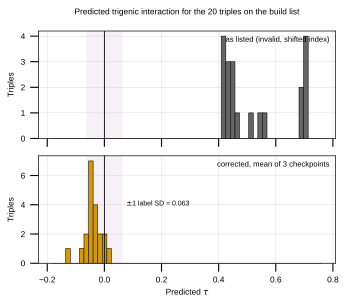
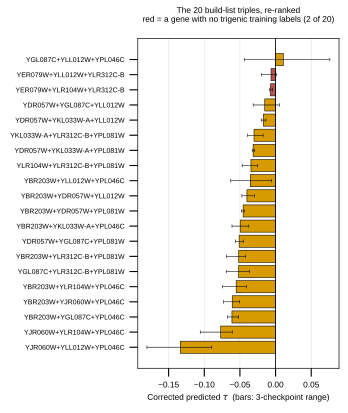

## 2026.09.03 - The 20 build-list triples, rescored

The list is the `capped` strategy of
`experiments/W019-echo-crispr-array/results/triple_design_rank_sampling_selection.csv`,
25 doubles plus 20 triples, and it is what the bench was told to construct. Its
ranking came from `inference_3`, so the numbers it was ordered by are not
predictions of those triples.

### The histogram

Both scorings on one axis. The shaded band is one training-label standard
deviation, 0.0633, which is the scale any prediction has to be read against.

| | range |
|---|---|
| as listed | 0.4092 to 0.7114 |
| corrected, mean of 3 checkpoints | -0.1336 to +0.0108 |

The as-listed values sit six to eleven label standard deviations above zero,
which was the first sign something was wrong: no prediction on a shrunk
regression should land there. The corrected values sit inside one standard
deviation of zero, where the model's predictions actually live.

### The result that matters for construction

**Nineteen of the 20 are predicted negative, and the one positive is not
reliable.** `YGL087C + YLL012W + YPL046C` has a corrected mean of +0.0108 with a
spread of 0.0607 across the three checkpoints, and they do not agree on its sign.
So the list contains no triple the model confidently calls positive.

Seventeen of the 20 do have all three checkpoints agreeing on sign, and every one
of those is negative. The strongest is `YJR060W + YLL012W + YPL046C` at -0.1336,
which was ranked 21st on the original list.

### Why the top six were the top six

Ranks 1 through 6 all contain `YLR312C-B`, and all six scored between 0.683 and
0.711. That gene had no index in the original run, so each of those triples was
scored as the double formed by its other two genes. Their high rank is an
artifact of being scored as doubles, not a prediction about them. `YLR312C-B`
resolves to `YLR313C`, one verified gene with `Alias: ['SPH1', 'YLR312C-B']`, and
under the correct index the six land between -0.007 and -0.052.

### What this does not say

The checkpoints trained on a split that is random over records, where an additive
null reaches 0.400 and a model ignoring the third gene reaches 0.390. On a
query-pair-disjoint split the additive null falls to 0.127 +/- 0.033, and the
transformer has not been refit there. These are the model's predictions computed
correctly, not evidence that the model ranks novel triples well.
