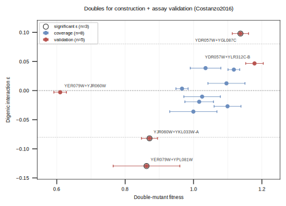
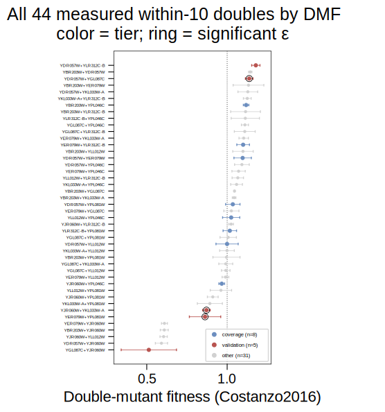

## 2026.07.20 - Doubles for BOTH Triple Reconstruction and Assay Validation

Script: `experiments/010-kuzmin-tmi/scripts/construction_validation_doubles.py`
Data:   `experiments/010-kuzmin-tmi/results/construction_validation_doubles.csv`

### Why the pure set-cover was the wrong objective

The essential wet-lab task is a small set of double mutants that (a) reconstructs many
top-ranked triples AND (b) has **variance in DMF / interaction** to validate the new
echo-plating assay against (vs plate-stamping). The triple-coverage set-cover
([[experiments.010-kuzmin-tmi.scripts.optimized_doubles_setcover_constructed_10]]) does
(a) with 8 doubles but fails (b): those 8 are all **near-neutral** — Costanzo DMF span
0.15, `|ε| ≤ 0.039`, and **zero significant interactions** — so the assay would have almost
nothing to discriminate. An assay validated only on near-1.0 fitness and null interactions
has not been shown to detect signal.

### Two tiers, unioned (13 doubles)

- **coverage (8)** — the greedy set-cover doubles; reconstruct **all 31** within-10 top-k
  triples.
- **validation (5)** — added for dynamic range + real signal: the doubles with a
  **significant Costanzo interaction** (`P<0.05 & |ε|>0.08`, both signs), the **highest-DMF**
  double, and a **low-DMF anchor chosen for quality** — among low-DMF (<0.75) doubles, the one
  that also reconstructs triples with the tightest SD (YER079W+YJR060W: DMF 0.610 ± **0.018**,
  covers 3 triples), NOT the noisy DMF-minimum (YGL087C+YJR060W was 0.513 ± **0.172**).
- **novel (1, separate)** — **YPL046C+YPL081W (ELC1+RPS9A)**, the one within-10 pair with
  **no DMF in Costanzo OR Kuzmin** — a construction candidate to fill the last cell (see below).

Result: 31/31 triples still reconstructed, DMF range **0.610–1.178**, ε from **−0.130 to
+0.098**, **3 significant interactions**.

| tier | double | DMF ± SD | ε | p | sig | # triples |
|------|--------|----------|--:|--:|:---:|:---:|
| validation | YER079W+YJR060W | 0.610 ± 0.018 | −0.003 | 0.45 | | **3** |
| validation | YER079W+YPL081W | 0.863 ± 0.098 | **−0.130** | 0.035 | ✓ | 0 |
| validation | YJR060W+YKL033W-A | 0.871 ± 0.023 | **−0.082** | 0.007 | ✓ | 0 |
| coverage | YJR060W+YPL046C | 0.966 ± 0.018 | +0.003 | 0.45 | | 4 |
| coverage | YDR057W+YLL012W | 1.000 ± 0.069 | −0.036 | 0.30 | | 5 |
| coverage | YLR312C-B+YPL081W | 1.017 ± 0.042 | −0.019 | 0.36 | | 3 |
| coverage | YLL012W+YPL046C | 1.025 ± 0.053 | −0.010 | 0.43 | | 5 |
| coverage | YDR057W+YPL081W | 1.035 ± 0.045 | +0.039 | 0.26 | | 3 |
| coverage | YDR057W+YER079W | 1.096 ± 0.054 | +0.012 | 0.44 | | 5 |
| coverage | YER079W+YLR312C-B | 1.099 ± 0.039 | −0.027 | 0.29 | | 5 |
| coverage | YBR203W+YPL046C | 1.118 ± 0.017 | +0.036 | 0.077 | | 5 |
| validation | YDR057W+YGL087C | 1.137 ± 0.024 | **+0.098** | 0.001 | ✓ | 3 |
| validation | YDR057W+YLR312C-B | 1.178 ± 0.026 | +0.047 | 0.12 | | 1 |

All 44 measured within-10 doubles ranked by DMF, colored by tier (coverage = blue,
validation = red, unused = gray; significant ε ringed) — the tiered companion to
`constructed_10_dmf_forest` (which predates the validation tier and marks only the 8 set-cover
doubles). The 45th pair, YPL046C+YPL081W, is unmeasured and so absent here (see novel candidate below):

Notes: DMF/SD/SE and ε/p are the published Costanzo values (SD = sample SD over 4 colonies,
directly comparable to the assay's colony SD — see
[[experiments.010-kuzmin-tmi.scripts.constructed_10_dmf_reference]]). The low-DMF end is
dominated by CBF1/YJR060W (its single defect), so a low DMF there is a fitness effect, not
an interaction. Two of the three significant doubles (YER079W+YPL081W, YJR060W+YKL033W-A)
enable no top-k triple — they are pure validation targets; the low anchor YER079W+YJR060W
and the strongest-positive-ε YDR057W+YGL087C each also rebuild triples. The set is tunable:
drop the two triple-less validation doubles for an 11-double set, or add more near-significant ε.

### There are only 3 significant interactions in the whole panel

Surveyed across all 66 panel-12 doubles and all three sources: exactly **3** clear
Costanzo's bar (`P<0.05 & |ε|>0.08`), and all 3 are within-10 and already in the
validation tier — YDR057W+YGL087C (+0.098), YJR060W+YKL033W-A (−0.082),
YER079W+YPL081W (−0.130). None hide in the dropped-gene doubles; Kuzmin2018/2020 have
too few measured pairs to reach significance. So "construct the significant ones" = these
3, already selected. The panel is near-neutral by design, so strong interactions are scarce.

**Why a big interaction can still be "not significant" — and why that is fixable.** A
double's ε is a point estimate; whether it counts as significant depends on how big it is
*relative to its error bar*. The error bar on ε is driven by the colony-to-colony scatter of
the double AND of the two singles it is compared against (all n=4 colonies in Costanzo). So a
double sitting on a noisy strain (CBF1, RPS9A) can show a sizable ε that is still inside its
own error bar — insignificant. The reverse also happens: YBR203W+YDR057W has a tiny ε (+0.062)
that IS significant (p=1.4e-5) only because its colonies were very tight (SD 0.010).

The key point for us: **that error bar is set by how many colonies we plate, and that is our
choice.** More colonies → smaller error bar (it shrinks with the square root of the count). So
a "noisy but interesting" double is not disqualified — it just needs to be plated deeper. Our
goal is depth (measure a few predicted doubles precisely), not breadth (screen many strains
shallowly), which is exactly what echo dispensing is good at. So we pick the validation doubles
for *interesting values* (fitness extremes, large ε) and drive each to a tight measurement at
the bench. One caveat: deeper plating tightens *our* error bar, but Costanzo's stays at n=4 —
once ours is tighter, a disagreement may be the reference's noise, not ours.

### Cross-dataset check — Costanzo vs Kuzmin DMF (a real caveat)

The DMF values above are **Costanzo only**. Where Kuzmin also measured a within-10 double, the
two references sometimes **disagree sharply**, especially for the low-DMF CBF1 doubles:

| double | Costanzo DMF | Kuzmin DMF |
|--------|-------------:|-----------:|
| YJR060W+YLL012W | 0.605 | **1.119** (K2020) |
| YJR060W+YPL046C | 0.966 | 0.738 (K2018) |
| YBR203W+YJR060W | 0.609 | 0.768 (K2018) |
| YGL087C+YPL046C | 1.111 | 0.998 (K2018) |

CBF1/YJR060W's low DMF is largely a *Costanzo* phenomenon — Kuzmin reads those pairs higher
(YJR060W+YLL012W disagrees by ~0.5). So the low-DMF "signal" our assay would validate against
is reference-dependent; treat the low-DMF anchor's target loosely and, where a Kuzmin value
exists, report both. The full per-double Costanzo+Kuzmin comparison is in the SI table below.

### Novel construction candidate — the one unmeasured pair

Of C(10,2)=45 pairs, **44 have a Costanzo DMF; 1 does not: YPL046C+YPL081W (ELC1+RPS9A)** — and
it is also absent from Kuzmin2018/2020. Missing ≠ synthetic-lethal (an SL pair would show as a
measured low fitness or an explicit flag, not a blank); a NaN just means the pair was never in a
scored query×array orientation. **SL check (SynthLethDB `Yeast_SL.csv`): NOT synthetic-lethal** —
ELC1/YPL046C appears in **zero** SL records, and RPS9A/YPL081W is SL only with its paralog **RPS9B**
(the classic redundant-duplicate case), not with ELC1. **BioGRID / SGD second source (checked
via SGD's aggregated interaction API):** ELC1 has **97** recorded genetic-interaction partners
and **RPS9A is not among them** — no interaction of any type (SL, negative/positive genetic,
synthetic growth defect). ELC1 is well-studied (97 partners), so RPS9A's absence is a real gap,
not sparse coverage. **Recommendation: construct it** — the one cell of the 10×10 matrix with no
value in Costanzo, Kuzmin, SynthLethDB, or BioGRID; not synthetic-lethal, so it should be
buildable. Tagged `novel` in the SI table.

### Supplementary table — all 45 within-10 doubles

`experiments/010-kuzmin-tmi/results/construction_validation_doubles.csv` is the full SI table:
**every** within-10 pair, `tier` blank when not selected (coverage / validation / novel
otherwise), with Costanzo DMF ± SD, derived SE, ε, p, the **Kuzmin2018/2020 DMF ± SD** columns,
and the strain id. 45 rows = C(10,2); kept as a CSV (not inlined) because its ~15 columns are
too wide to render in the note PDF.

Related: [[experiments.010-kuzmin-tmi.scripts.topk_triples_from_constructed_10]],
[[experiments.010-kuzmin-tmi.scripts.optimized_doubles_setcover_constructed_10]],
[[experiments.010-kuzmin-tmi.scripts.constructed_10_dmf_reference]].
