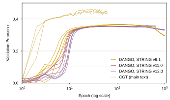
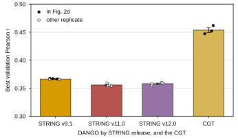
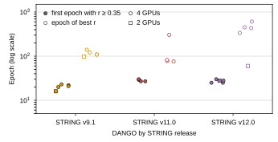
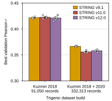

## 2026.09.03 - The runs behind the main-text DANGO baseline

`experiments/010-kuzmin-tmi/scripts/dango_full_dataset_si.py` pulls every run of the wandb project `zhao-group/torchcell_006-kuzmin2018-tmi_dango` (DANGO trained on the 006 trigenic dataset by `experiments/006-kuzmin-tmi/scripts/dango.py`) plus the three CGT replicate training runs of `zhao-group/torchcell_010-kuzmin-tmi_equivariant_cell_graph_transformer`, freezes them to CSV, and renders the panels of `FigS-dango-full-dataset` and the table `paper/nature-biotech/sections/tab-dango-full-runs.tex` for Supplementary Note `note:dango-full`. Re-render offline with `--from-csv`.

Frozen results (`experiments/010-kuzmin-tmi/results/`):

- `dango_full_dataset_runs.csv` -- one row per run (17: 14 DANGO, 3 CGT), with config, epochs logged, wall-clock, best validation Pearson and its epoch, Pearson at the min-MSE epoch, first epoch reaching r >= 0.35.
- `dango_full_dataset_history.csv` -- validation Pearson and MSE per epoch (7,639 rows).
- `dango_full_dataset_summary.csv` -- mean, SD, SEM per group.

Scoring rule: maximum over epochs of `val/gene_interaction/Pearson` (torchmetrics `PearsonCorrCoef` over the whole validation split, synced across DDP ranks), an upward-biased order statistic reported with its epoch. A DDP job shows up as one wandb run per rank; only the rank that logs the synced validation metrics is kept, and the number of runs sharing a name gives the GPU count. Smoke tests with fewer than 100 validation epochs and the one-epoch profile run (`559e2wmh`) are dropped.

### Matching the three hardcoded replicate values

`trigenic_tau_model_comparison.py` hardcodes `0.36759, 0.36708, 0.36637` as "DANGO (repro best)". They match exactly, to five decimals, the maximum validation Pearson of three STRING v9.1 runs:

| value | run | STRING | GPUs | epoch of max | epochs logged | wall (h) | cluster |
| --- | --- | --- | --- | --- | --- | --- | --- |
| 0.36759 | `014mprap` | v9.1 | 2 | 98 | 1000 | 59.5 | IGB compute-3-3, 2025-09-25 |
| 0.36708 | `x3savllr` | v9.1 | 4 | 109 | 446 | 47.9 | Delta gpuA40x4, 2025-07-31 |
| 0.36637 | `6q08iign` | v9.1 | 4 | 121 | 448 | 47.9 | Delta gpuA40x4, 2025-07-31 |

They are three separate runs (not checkpoints of one run). `dango.py` seeds only the split (`seed = 42`); there is no `seed_everything`, so the replicates differ in initialization and DDP nondeterminism, not in an explicit seed. Two more v9.1 runs exist (`cbi441o8` 0.36583, `p6urax0a` 0.36518, both Delta, 2025-10-16); the mean over all five is 0.3664 +/- 0.0004 (SEM) against 0.3670 for the three in the paper.

### All runs

| group | n | best val Pearson, mean +/- SEM | range | epoch of max | first epoch r >= 0.35 |
| --- | --- | --- | --- | --- | --- |
| DANGO STRING v9.1 | 5 | 0.3664 +/- 0.0004 | 0.3652 to 0.3676 | 98 to 140 | 16 to 23 |
| DANGO STRING v11.0 | 4 | 0.3557 +/- 0.0012 | 0.3536 to 0.3592 | 76 to 304 | 27 to 30 |
| DANGO STRING v12.0 | 5 | 0.3581 +/- 0.0010 | 0.3545 to 0.3602 | 60 to 608 | 25 to 30 |
| CGT (010 dataset) | 3 | 0.4537 +/- 0.0043 | 0.4472 to 0.4619 | 24 to 25 | 2 |

Setup shared by all 14 DANGO runs (from the wandb configs): hidden 64, 4 heads, DANGO loss with `LinearUntilUniform` schedule (transition epoch 10), AdamW lr 1e-5 / wd 1e-6, batch 64 per GPU, clip norm 10, ReduceLROnPlateau, `max_epochs` 1000. Twelve are 4-GPU DDP jobs on Delta (`delta_dango-ddp_string*.slurm`, 48 h limit, killed at 259 to 655 epochs, wandb state `failed`/`crashed`); two are 2-GPU IGB jobs that finished 1000 epochs (`014mprap` v9.1 59.5 h, `9jpfy547` v12.0 65.2 h). The trainer checkpoints on min validation MSE; Pearson at that epoch is within 0.0023 of the max for every DANGO run.

### Dataset caveat for the main-text comparison

The DANGO runs use the 006 query (`experiments/006-kuzmin-tmi/queries/001_small_build.cql`): TmiKuzmin2018 with any perturbation type + TmiKuzmin2020 deletions only, n = 332,313 ([[experiments.011-kuzmin-tmi.scripts.query-comparison-006-009-010-011]]). The CGT replicates use the 010 query (all perturbation types, n = 376,732). Same splitter and seed, different validation sets. No DANGO run on the 010 build exists in any zhao-group wandb project (checked `torchcell-experiments_010-kuzmin-tmi_scripts` too; those are CGT runs). A like-for-like baseline needs DANGO retrained on the 010 query.

### "Slower convergence on STRING 12.0" (access report 2025.10.31)

Measured on these runs: the rise to r >= 0.35 takes 16 to 23 epochs (v9.1), 27 to 30 (v11.0), 25 to 30 (v12.0), so the release delays the rise by at most about 10 epochs. What differs is the plateau: v9.1 peaks at epochs 98 to 140 and then declines (`014mprap` ends at 0.297 after 1000 epochs); the 4-GPU v12.0 runs creep from 0.354 to 0.355 at epoch 100 to maxima of 0.3577 to 0.3602 at epochs 336 to 608 (gain 0.002 to 0.006), while the 2-GPU v12.0 run peaks at epoch 60 (0.3545) and declines to 0.331. So the claim holds only as "later and lower maximum", not as a slower initial rise. The mechanism offered in the access report (10x more edges, lower signal to noise) is untested.

### Panels

Panel deviations from the house rules, on purpose: (b) zooms the y-axis to 0.30 to 0.50 so the between-run spread of a few thousandths is visible; (a) and (c) use log epoch axes.

## 2026.09.03 - Table caption carries the run configuration

During the SI reconciliation the `tab-dango-full-runs` caption absorbed the training configuration that
left the Note prose (hidden width 64, four heads, linear-to-uniform schedule with transition at epoch 10,
AdamW at learning rate 1e-5, per-GPU batch 64; 4-GPU Delta A40 jobs stopped at the 48 h queue limit,
2-GPU IGB jobs ran to 1,000 epochs; DANGO on the experiment-006 build, CGT on the experiment-010 build)
and the observation that the Pearson at the min-MSE checkpoint is within 0.0023 of the maximum for every
DANGO run. `note:dango-full` is the canonical statement of the 006-vs-010 build mismatch; the lambda
fall-through of `note:dango-repro` applies to the v11.0/v12.0 runs here too, read from
`experiments/006-kuzmin-tmi/scripts/dango.py` (line ~258) + `torchcell/losses/dango.py`
(`lambda_values.get(edge_type, 1.0)`) + the `string11_0_*`/`string12_0_*` graph names in the configs;
not measured in training.

## 2026.09.04 - Data-effect panel and a narrower convergence panel

Author review asked for a measured data-size comparison. New `panel_data_effect` (wide width,
118.9 mm): best validation Pearson (max over epochs) of the same DANGO implementation on the
Kuzmin 2018-only build of experiment 005 (91,050 records, from `results/dango_dataset_split.csv`)
against the experiment-006 build (332,313 records, count from
[[experiments.011-kuzmin-tmi.scripts.query-comparison-006-009-010-011]]), grouped by build with one
bar per STRING release; bar = mean, whisker = SEM where n > 1, open circles = runs; y zoomed to
0.30 to 0.45 like panel b. The 005 runs are read from
`experiments/005-kuzmin2018-tmi/results/dango_string_version_sweep.csv` (no new wandb pull) and
pool the three loss schedules. Frozen to `results/dango_full_dataset_data_effect.csv` (one row per
build x release with n, mean, SD, SEM, range, run ids):

| build | records | STRING | n | best val Pearson, mean +/- SEM | range | runs |
| --- | --- | --- | --- | --- | --- | --- |
| 005 | 91,050 | v9.1 | 4 | 0.4216 +/- 0.0009 | 0.4197 to 0.4239 | jpckzn4x, zzbcgu54, q67k56m4, ytkjmgvs |
| 005 | 91,050 | v11.0 | 5 | 0.4225 +/- 0.0013 | 0.4193 to 0.4268 | mx8kt0p1, 8pxowi2e, mbyn8rim, xo6uq9sa, g34rn9ti |
| 005 | 91,050 | v12.0 | 10 | 0.4213 +/- 0.0011 | 0.4149 to 0.4267 | qea56nbl, sv0fsgng, ekebm9y1, ltspf20w, 5me1tgmt, 6m5wqiju, pfm9qtlj, d0i1sbc6, r0zhujxc, 26tx2hj1 |
| 006 | 332,313 | v9.1 | 5 | 0.3664 +/- 0.0004 | 0.3652 to 0.3676 | 6q08iign, x3savllr, 014mprap, cbi441o8, p6urax0a |
| 006 | 332,313 | v11.0 | 4 | 0.3557 +/- 0.0012 | 0.3536 to 0.3592 | ok8k5e6z, mj7paqg8, jo24cfpf, 3f9sh91s |
| 006 | 332,313 | v12.0 | 5 | 0.3581 +/- 0.0010 | 0.3545 to 0.3602 | vqnrz2le, 5akd0qwt, 9jpfy547, xxtxdu3y, jww4tblb |

What this is and is not: the two builds are split separately (same splitter and seed, different
membership), the 005 runs used batch 32 on one GPU and the 006 runs batch 64 per GPU on 2 to 4 GPUs
with the linear-to-uniform schedule only, so it is the only measured data-size comparison for
DANGO and not a controlled ablation; no like-for-like split can be claimed. The drop (0.42 to
0.36) is the same for every release.

The convergence panel (c) is now third width (57.8 mm x 52 mm) with short release tick labels and a
one-column legend; its caption states the message explicitly: the release moves the epoch of the
maximum (98 to 140 with v9.1, up to 608 with v12.0), not the epoch of the rise (16 to 30 in every
run). Values unchanged.

