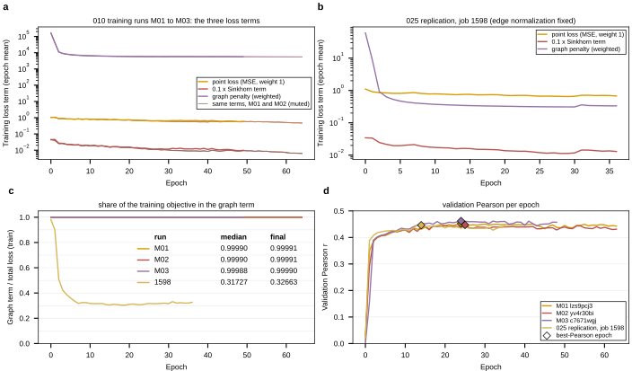

## 2026.09.09 - The Graph Penalty Against the Fit Terms, Epoch by Epoch

Pulls the per-step training history of the three 010 checkpoints' training runs
(`zhao-group/torchcell_010-kuzmin-tmi_equivariant_cell_graph_transformer`, runs
`lzs9pcj3` M01, `yv4r30bi` M02, `c7671wgj` M03) and of the 025 replication on the
same config (GilaHyper job 1598, `torchcell_025-solid-growth_...`, run `0yw7moue`,
rank 0 of four) from W&B, caches it to
`results/graph_penalty_vs_loss_history.csv`, and draws the three terms of the
training objective, the share of the objective carried by the graph term, and
validation Pearson per epoch. The logged identity
`total = point + 0.1 * dist + weighted_graph_reg` holds on every row to 6e-7. The
share is recomputed as `weighted_graph_reg / total_loss` rather than read from
`norm_weighted_graph_reg`, because on the 4-GPU job the logged share is a mean of
per-rank ratios and differs from the ratio of the means by up to 0.08 on a step;
on the single-GPU 010 runs the two agree to 6e-7.

Measured (train rows are epoch means over optimizer steps; val rows are per epoch):

| run | epochs | graph share, train median | graph term, train median | point loss, train median | best val Pearson (epoch) | val point loss at best | val graph term at best | val share at best |
|---|---|---|---|---|---|---|---|---|
| M01 | 64 | 0.99990 | 5,685 | 0.597 | 0.4520 (24) | 0.810 | 5,740.5 | 0.99986 |
| M02 | 64 | 0.99990 | 5,690 | 0.588 | 0.4472 (25) | 0.814 | 5,736.7 | 0.99986 |
| M03 | 49 | 0.99988 | 5,809 | 0.680 | 0.4619 (24) | 0.790 | 5,772.5 | 0.99986 |
| 1598 | 36 | 0.317 | 0.339 | 0.734 | 0.4463 (14) | 0.801 | 0.342 | 0.294 |

The numbers the additive-baselines report quotes ("point loss 0.81, graph term
5,740, `norm_weighted_graph_reg` 0.99986") are the VALIDATION row of M01 at its
best-Pearson epoch 24; the share 0.99986 is the val share at the best epoch for
all three 010 runs, and the train share never drops below 0.99987 in any of them.
The graph term starts at about 164,000 at epoch 0 and settles between 5,500 and
5,800 from epoch 5 onward, three to four orders of magnitude above the fit term.

Job 1598 ran the same config on the 025 build after the edge-normalization defect
was fixed (`len(A.nonzero()[0])` is now the edge count, so the per-graph coefficient
is 1/367 of what 010 applied). Its graph term is 0.33 to 0.34 from epoch 5 onward
and carries 30 to 33 percent of the objective, and it reached val Pearson 0.4463 at
epoch 14. So the 010 accuracy did not depend on the penalty dominating: with the
penalty at a third of the objective the same model reaches the same validation
Pearson. Whether the penalty at zero also does is a separate question the 025
mask arms and the `cabbi_007` pair address, not this figure.



Rerun (reads the cached CSV; `--refresh` re-pulls from W&B):

```bash
python experiments/010-kuzmin-tmi/scripts/graph_penalty_vs_loss.py
```
