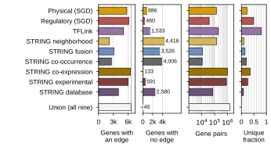
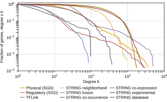
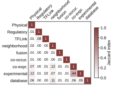
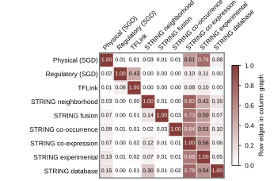
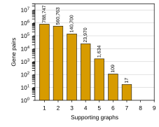
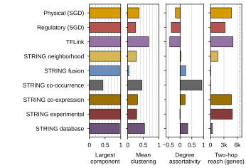
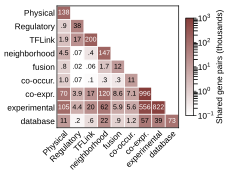
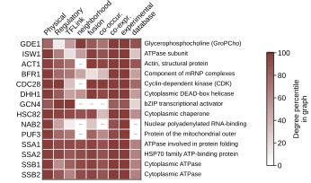
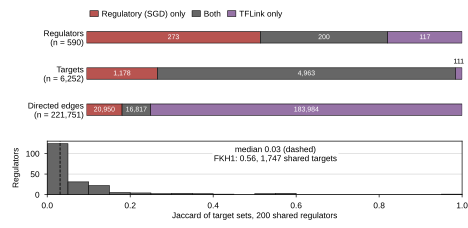
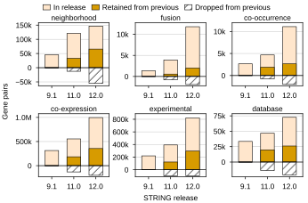

## 2026.09.03 - Statistics for the nine attention-prior graphs

Script: `experiments/010-kuzmin-tmi/scripts/graph_statistics.py`. Rebuilds the nine graphs every
experiment-010 config regularizes (physical, regulatory, TFLink, six STRING v12.0 channels) from the
cached `SCerevisiaeGraph` pickles under `$DATA_ROOT/data/{sgd,string,tflink}`, plus the STRING v9.1
and v11.0 channels, and writes:

- `experiments/010-kuzmin-tmi/results/graphs/graph_sizes.csv`, `pairwise_overlap.csv`,
  `edge_multiplicity.csv`, `degree_distribution.csv`, `string_version_sizes.csv`, `string_version_drift.csv`
- `paper/nature-biotech/sections/tab-graphs.tex` (replaces the hand-transcribed `tab:databases`) and
  `tab-string-versions.tex`
- true-size panels below (`notes/assets/images/010-kuzmin-tmi/graphs_*.svg`), composed into
  `notes/assets/drawio/FigS-graph-attention-priors.drawio` and `FigS-dango-string-versions.drawio` by
  [[experiments.010-kuzmin-tmi.scripts.compose_graph_si_figures]].

Directed graphs (regulatory, TFLink) are compared as undirected gene pairs; self-loops are dropped.
Node counts are genes with at least one edge.

**The counts match what training used.** Run `3co0xrdg` in wandb project
`torchcell_010-kuzmin-tmi_equivariant_cell_graph_transformer` logs `graph_regularization_info/summary`
at model init with the same nodes/edges per graph (physical 5,721/139,463; regulatory 6,582/39,636;
co-expression 6,474/996,199; ...). The previous SI table, transcribed from
`notes/scratch.2025.05.16.142344-network-sums.md`, was stale: it listed regulatory as 3,632/9,753 and
slightly different STRING/TFLink counts. The regulatory pickle (`G_regulatory.pkl`, 2025.04.29) holds
all 39,636 SGD regulation records: 38,677 transcription, 37,890 high-throughput (24,199 ChIP), 511
regulators, 6,546 targets. I did not find what build produced the 9,753 figure.

Measured (this run, 6,607-gene vocabulary):

| graph | nodes | pairs | mean degree | unique |
|---|---|---|---|---|
| Physical (SGD) | 5,721 | 137,604 | 48.1 | 23% |
| Regulatory (SGD) | 6,582 | 39,546 | 12.0 | 51% |
| TFLink | 5,074 | 199,551 | 78.7 | 80% |
| STRING neighborhood | 2,191 | 146,713 | 133.9 | 10% |
| STRING fusion | 3,081 | 11,787 | 7.7 | 14% |
| STRING co-occurrence | 2,601 | 11,085 | 8.5 | 20% |
| STRING co-expression | 6,474 | 996,199 | 307.8 | 35% |
| STRING experimental | 6,016 | 822,094 | 273.3 | 25% |
| STRING database | 4,027 | 72,617 | 36.1 | 8% |

Union of pairs 1,515,940 (sum 2,437,196): 52.0% of pairs sit in exactly one graph, 37.0% in two, no
pair in more than seven. Largest Jaccard is co-expression vs experimental (0.44); every other pair is
at or below 0.12. Containment is asymmetric: 76% of physical pairs are in STRING experimental, 43% of
regulatory pairs in TFLink, 82% of neighborhood pairs in co-expression.

STRING releases: v9.1 to v12.0 edges grow 2.2x (database) to 8.7x (fusion); Jaccard between
consecutive releases 0.12 to 0.35; only 42% (fusion) to 72% (neighborhood) of a v9.1 channel's
pairs persist in v11.0.

Environment note: on the Mac this ran from a uv venv (Python 3.12) because the base interpreter
cannot parse the package; the `torchcell` conda env rebuilt 2026.09.03 (Python 3.13) should work too.

The sixth panel of this pass, `graphs_string_versions.svg` (pairwise Jaccard bars between STRING releases), was superseded by `graphs_string_releases.svg` in the section below and is no longer written or kept on disk.

## 2026.09.03 - Structure, hubs, transcription-factor overlap, chronological STRING releases

Author feedback on the first pass: panel b sat low and far right of panel a, the bottom row was
mostly empty, and the pairwise-Jaccard bars for STRING releases looped in time. The script now
computes five more dimensions of the same nine graphs, all from the cached pickles (loads in about
10 s on the Mac; the dense 6,607 x 6,607 matmuls add another 10 s), and lays every panel out with
explicit mm margins so rows and columns align in the composed figure (shared `TOP_MM`, a
`LABEL_LEFT_MM` axes-left for every panel with graph names, one height per row).

New CSVs in `experiments/010-kuzmin-tmi/results/graphs/`:

- `graph_structure.csv`: largest-component fraction, mean clustering (nx.average_clustering
  semantics, via diag(A^3)/2), degree assortativity, mean and median two-hop reach.
- `hub_genes.csv` (top-10 by undirected degree per graph), `hub_recurrence.csv` (how many genes are
  top-10 / top-1% hubs of exactly n graphs), `hub_matrix.csv` (percentile rank of the recurring
  hubs in every graph).
- `tf_overlap.csv`, `tf_overlap_per_regulator.csv`: SGD regulatory vs TFLink as directed graphs.
- `string_version_drift.csv` gained `consecutive`, `added`, `dropped`, `retained_frac_of_b`.

Measured (this run):

| graph | largest component | mean clustering | assortativity | two-hop reach (mean genes) | top hub (degree) |
|---|---|---|---|---|---|
| Physical (SGD) | 1.000 | 0.36 | -0.20 | 4,686 | DHH1 (3,606) |
| Regulatory (SGD) | 1.000 | 0.26 | -0.37 | 3,365 | FKH1 (2,991) |
| TFLink | 1.000 | 0.67 | -0.44 | 5,038 | GCN4 (4,908) |
| STRING neighborhood | 1.000 | 0.27 | 0.04 | 1,646 | DUR12 (936) |
| STRING fusion | 0.962 (43 components) | 0.03 | 0.24 | 78 | CDC28 (84) |
| STRING co-occurrence | 0.432 (486 components) | 0.46 | 0.93 | 22 | SPS1 (97) |
| STRING co-expression | 0.9997 | 0.31 | 0.21 | 4,682 | SSA1 (1,770) |
| STRING experimental | 0.9997 | 0.28 | -0.01 | 4,895 | NAB2 (2,696) |
| STRING database | 0.962 (46 components) | 0.54 | 0.33 | 404 | HFD1 (374) |

Hub recurrence: the nine top-10 lists name 74 genes; 12 are in two lists, 2 (GDE1, ISW1) in three.
At the top 1% (66 genes per graph): 353 genes are hubs of one graph, 79 of two, 22 of three, 3 of
four, 1 (CDC28) of five.

Transcription-factor graphs (directed, self-regulation kept): regulators 511 (regulatory) vs 317
(TFLink), 200 shared; targets 6,546 vs 5,074, 4,963 shared; directed edges 39,636 vs 200,801, 16,817
shared (Jaccard 0.075). Per shared regulator the Jaccard of the two target sets has median 0.03;
FKH1 is the best case at 0.53 with 1,747 shared targets.

Shared pairs (undirected): co-expression and experimental 556,106; neighborhood and co-expression
119,758; physical and experimental 104,771; regulatory and TFLink 16,885.

STRING releases, consecutive steps (retained of previous / added / dropped): neighborhood
32,981 / 87,984 / 12,620 then 65,678 / 81,035 / 55,287; fusion 565 / 3,349 / 793 then
2,001 / 9,786 / 1,913; co-occurrence 1,893 / 2,775 / 766 then 2,654 / 8,431 / 2,014; co-expression
183,849 / 370,984 / 129,839 then 355,122 / 641,077 / 199,711; experimental
121,984 / 270,788 / 97,466 then 295,506 / 526,588 / 97,266; database 19,776 / 27,040 / 13,710 then
26,042 / 46,575 / 20,774. Of a v12.0 channel's pairs, 17% (fusion) to 45% (neighborhood) were
already in v11.0 and 4% (fusion) to 21% (co-expression) in v9.1.

`graphs_string_versions.svg` (pairwise Jaccard bars) is superseded by `graphs_string_releases.svg`
and is no longer written; the DANGO release sweep panel moved to the DANGO note. Panels now
written, in figure order:

## 2026.09.03 - Deterministic ordering of the hub and per-regulator tables

Rerunning the script on the Mac changed three committed CSVs without any input change: `hub_genes.csv`
(KSP1 and SPS1 are tied at degree 97 in co-occurrence, and `sort_values` left ties in arbitrary order),
`tf_overlap_per_regulator.csv` (the 200 shared regulators were iterated from a Python `set`, so the row
order among equal `shared_targets` followed the per-process string hash seed), and `graph_structure.csv`
(assortativity and two-hop means differed in the last floating-point digit between BLAS builds). Fixes:
degree sorts now break ties by systematic name (`by_degree`), the per-regulator table is built from
`sorted(shared)` and sorted on `(shared_targets desc, regulator asc)`, and `graph_structure.csv` is written
with `float_format="%.10g"`. Verified stable across two runs with different `PYTHONHASHSEED`. The SI
figure caption now says SPS1 and KSP1 are tied in co-occurrence. No panel or table changed.

The Supplementary Note `note:graphs` prose was compressed on the same day; the hub degrees, shared-pair
counts, two-hop reach, assortativity values, and release growth factors that left the prose are now in
the two figure captions, and everything else is in the sections above.
