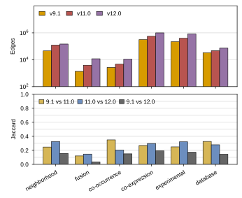

## 2026.09.03 - Statistics for the nine attention-prior graphs

Script: `experiments/010-kuzmin-tmi/scripts/graph_statistics.py`. Rebuilds the nine graphs every
experiment-010 config regularizes (physical, regulatory, TFLink, six STRING v12.0 channels) from the
cached `SCerevisiaeGraph` pickles under `$DATA_ROOT/data/{sgd,string,tflink}`, plus the STRING v9.1
and v11.0 channels, and writes:

- `experiments/010-kuzmin-tmi/results/graphs/graph_sizes.csv`, `pairwise_overlap.csv`,
  `edge_multiplicity.csv`, `degree_distribution.csv`, `string_version_sizes.csv`, `string_version_drift.csv`
- `paper/nature-biotech/sections/tab-graphs.tex` (replaces the hand-transcribed `tab:databases`) and
  `tab-string-versions.tex`
- true-size panels below (`notes/assets/images/010-kuzmin-tmi/graphs_*.svg`), composed into
  `notes/assets/drawio/FigS-graph-attention-priors.drawio` and `FigS-dango-string-versions.drawio` by
  [[experiments.010-kuzmin-tmi.scripts.compose_graph_si_figures]].

Directed graphs (regulatory, TFLink) are compared as undirected gene pairs; self-loops are dropped.
Node counts are genes with at least one edge.

**The counts match what training used.** Run `3co0xrdg` in wandb project
`torchcell_010-kuzmin-tmi_equivariant_cell_graph_transformer` logs `graph_regularization_info/summary`
at model init with the same nodes/edges per graph (physical 5,721/139,463; regulatory 6,582/39,636;
co-expression 6,474/996,199; ...). The previous SI table, transcribed from
`notes/scratch.2025.05.16.142344-network-sums.md`, was stale: it listed regulatory as 3,632/9,753 and
slightly different STRING/TFLink counts. The regulatory pickle (`G_regulatory.pkl`, 2025.04.29) holds
all 39,636 SGD regulation records: 38,677 transcription, 37,890 high-throughput (24,199 ChIP), 511
regulators, 6,546 targets. I did not find what build produced the 9,753 figure.

Measured (this run, 6,607-gene vocabulary):

| graph | nodes | pairs | mean degree | unique |
|---|---|---|---|---|
| Physical (SGD) | 5,721 | 137,604 | 48.1 | 23% |
| Regulatory (SGD) | 6,582 | 39,546 | 12.0 | 51% |
| TFLink | 5,074 | 199,551 | 78.7 | 80% |
| STRING neighborhood | 2,191 | 146,713 | 133.9 | 10% |
| STRING fusion | 3,081 | 11,787 | 7.7 | 14% |
| STRING co-occurrence | 2,601 | 11,085 | 8.5 | 20% |
| STRING co-expression | 6,474 | 996,199 | 307.8 | 35% |
| STRING experimental | 6,016 | 822,094 | 273.3 | 25% |
| STRING database | 4,027 | 72,617 | 36.1 | 8% |

Union of pairs 1,515,940 (sum 2,437,196): 52.0% of pairs sit in exactly one graph, 37.0% in two, no
pair in more than seven. Largest Jaccard is co-expression vs experimental (0.44); every other pair is
at or below 0.12. Containment is asymmetric: 76% of physical pairs are in STRING experimental, 43% of
regulatory pairs in TFLink, 82% of neighborhood pairs in co-expression.

STRING releases: v9.1 to v12.0 edges grow 2.2x (database) to 8.7x (fusion); Jaccard between
consecutive releases 0.12 to 0.35; only 42% (fusion) to 72% (neighborhood) of a v9.1 channel's
pairs persist in v11.0.

Environment note: on the Mac this ran from a uv venv (Python 3.12) because the base interpreter
cannot parse the package; the `torchcell` conda env rebuilt 2026.09.03 (Python 3.13) should work too.

