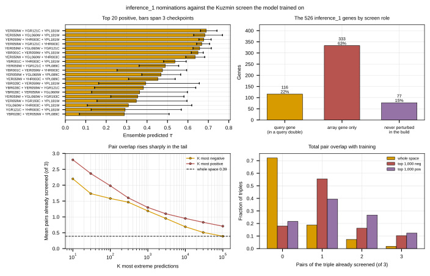

## 2026.09.03 - The nominations are novel at the query-double level and enriched at the pair level

Follows the ensembled review in
[[experiments.010-kuzmin-tmi.scripts.review_inference_1_top_triples]], which ranked
`inference_1` by the mean of three checkpoints but reported only the negative tail
and said nothing about how much of each nominated triple the screen had already
measured.

Script: `experiments/010-kuzmin-tmi/scripts/inference_1_training_overlap.py`.

### The screen has two roles, and the 526 genes sit mostly in one

Kuzmin crosses a query double mutant against an array of single mutants, so a
training record is a query pair plus one array gene. On this build that reading is
exact: 420 pairs occur five or more times and cover 376,733 pair-instances against
376,732 records. Those 420 doubles involve 835 query genes; 4,263 genes appear as
array genes.

| role of the 526 inference_1 genes | genes | share |
|---|---|---|
| query gene, member of a query double | 116 | 22% |
| array gene only | 333 | 63% |
| never perturbed in the build | 77 | 15% |

### Query-double overlap is essentially zero, and structurally so

Only 2,430 of 4,370,595 triples carry one of the 420 query doubles, 0.056 percent.
Of the top 200 positive predictions, zero do. Of the 100,000 most negative, one does.

That is not the ranking avoiding them. Only **22 of the 420 query doubles have both
members inside the 526-gene space at all**, so almost no inference triple could carry
one. The gene selection for `inference_1` was built from morphology, expression and
metabolic criteria, not from the trigenic screen's query list, and the two barely
intersect.

The consequence is the important part. `inference_1` is very nearly a
query-pair-disjoint space by construction, which is the regime where the additive
null falls from 0.400 to 0.127 plus or minus 0.033 and the nonlinear baseline drops
below it. Every nomination here lives in that regime, and the transformer has not
been measured in it.

### Pair overlap is low overall but rises steeply in both tails

Counting how many of a triple's three gene pairs ever co-occur in any training
record, recurring or not:

| pairs already screened, of 3 | triples | share |
|---|---|---|
| 0 | 3,153,484 | 72.2% |
| 1 | 816,705 | 18.7% |
| 2 | 319,381 | 7.3% |
| 3 | 81,025 | 1.9% |

The whole-space mean is 0.389 of 3. In the tails it is far higher: 2.20 for the ten
most negative and 2.80 for the ten most positive, a 5.7 and 7.2 times enrichment,
decaying smoothly back to the baseline by K = 100,000.

So the extreme predictions are not indiscriminate extrapolations. They concentrate on
triples whose constituent pairs the screen actually co-measured, even though the query
double itself is novel. **Hypothesis (untested):** the model is composing measured
pairwise structure rather than recalling a screen, which would be the favorable
reading. Distinguishing that from a pair-frequency artifact needs the disjoint-split
retrain, since a model that scores partly on pair familiarity would produce this same
enrichment.

### The highest predictions

Top 200 positive run +0.690 down to +0.082, against a training-label standard
deviation of 0.0633. They are more concentrated than the negative tail: 65 distinct
genes across the top 200, with `YER059W` in 123 of them. The negative tail's
comparable figures are 113 distinct genes and `YHL029C` in 110.

Across-checkpoint spreads on the leaders are 0.024 to 0.062, tighter in relative
terms than the negatives, whose median spread is 0.0694. Positives remain the
direction with no retrieval validation, since the published Kuzmin call is one-sided
negative.

### Outputs

- `experiments/010-kuzmin-tmi/results/inference_1_overlap_summary.json`
- `experiments/010-kuzmin-tmi/results/inference_1_overlap_by_k.csv`
- `experiments/010-kuzmin-tmi/results/inference_1_top_positive.csv`
