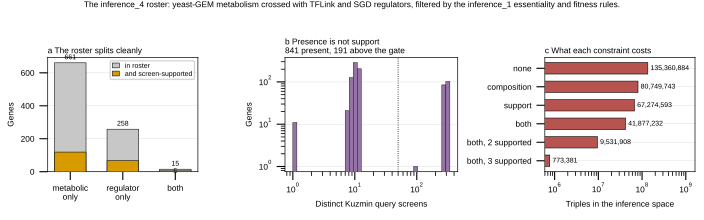

## 2026.09.04 - The inference_4 roster, and why presence is not support

Scripts: `experiments/010-kuzmin-tmi/scripts/inference_4_gene_selection.py`,
`experiments/010-kuzmin-tmi/scripts/inference_4_generate_triples.py`

### What changes from inference_1

inference_1 scored genes on overlap across four source lists and covered 324 of the
1,161 yeast-GEM genes, 28 percent, with no constraint on how a triple mixed its
sources. Two things go differently.

**The axes are named.** A triple must carry 1 to 2 metabolic genes and 1 to 2
regulators, so every prediction is about regulation acting on metabolism. yeast-GEM
9.0.2 supplies metabolism (1,161 genes); TFLink (317 regulators) plus the SGD
regulatory graph (476) supply regulation. They overlap in 25 genes, so the
stratification is close to a real partition.

**Support is a screen count, not presence.** This is the correction to the original
idea of requiring a gene to "show up in the Kuzmin triples". Measured:

| gate | genes kept of 934 | triples |
|---|---|---|
| present in Kuzmin at all | 841 | 80,685,941 |
| composition only, no support gate | 934 | 80,749,743 |
| >= 50 distinct query screens | 191 | 41,877,232 |

Requiring presence removes **0.08 percent** of the space. It is very close to a no-op,
because an array gene appears under hundreds of query screens while a query gene
appears under one, and both satisfy presence. The one-screen genes are exactly what
produced inference_1's positive tail, and gating them shrank the best predicted effect
by 9.6x. So the gate is distinct query screens.

### Roster

934 genes survive the inference_1 filters (drop SGD-essential, drop min single-mutant
fitness < 0.9 across Kuzmin2018/2020 and Costanzo2016, drop Q-prefix mitochondrial).
676 metabolic, 273 regulator, 15 both. 191 clear the 50-screen gate.

Dropped: 287 essential, 7 mitochondrial, 793 for fitness below 0.9 or absent.

### Space and cost

| constraint | triples | GPU-hours at 1,505/s | on 4 GPUs |
|---|---|---|---|
| none | 135,360,884 | 25.0 | 6.2 h |
| composition | 80,749,743 | 14.9 | 3.7 h |
| composition + >=1 supported | 41,877,232 | 7.7 | 1.9 h |
| composition + >=2 supported | 9,531,908 | 1.8 | 0.44 h |
| composition + all 3 supported | 773,381 | 0.14 | 0.04 h |

Per checkpoint, and there are three. The stricter tiers are **subsets**, so one run at
>= 1 answers 2 and 3 by filtering the index. Nothing needs re-running to tighten.

The generator's independent enumeration reproduced 41,877,232 exactly, matching the
closed-form count over class multisets. Two derivations agreeing is the check that the
constraint logic is the same in both places.

### Two stale-schema breaks found in inference_dataset_1.py

Neither affects the already-built inference_1 LMDB, which is read and not rebuilt, but
both blocked constructing any new inference space.

1. `Media` gained a required `is_synthetic` field after inference_1 was written, so
   `create_experiment_from_triple` raised a ValidationError. Set to YEPD, solid, 30 C,
   `is_synthetic=False`, matching the environment the 010 training records carry.
   The 010 build's YEPD label is itself an approximation: SGA double and triple mutant
   fitness is read on a selection medium, not plain YEPD. Correcting that is a
   build-side change.
2. `Phenotype.validate_label_fields` now checks `label_name` and
   `label_statistic_name` against `type(self).__annotations__`, the subclass's OWN
   field set, which excludes inherited fields. `InferencePhenotype` inherits
   `label_statistic_name = "fitness_se"` from `FitnessPhenotype` but did not redeclare
   `fitness_se`, so every construction raised. Redeclared.

### Figure

### Outputs

- `experiments/010-kuzmin-tmi/results/inference_4/gene_candidates.csv`
- `experiments/010-kuzmin-tmi/results/inference_4/gene_list.txt`
- `experiments/010-kuzmin-tmi/results/inference_4/sizing.json`
