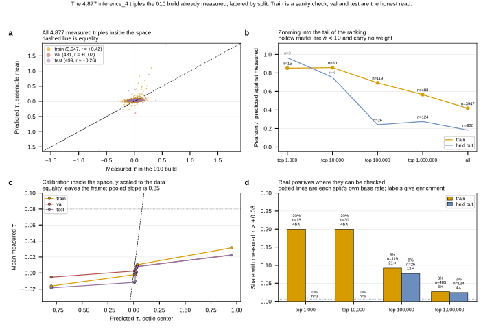

## 2026.09.06 - The measured overlap as a probe: the ordering generalizes, the numbers do not

Script: `experiments/010-kuzmin-tmi/scripts/inference_4_measured_diagnostic.py`
Slurm: `gh_inference_4_measured_diagnostic.slurm` (job 1605, **CPU only, no `--gres`**)

**Why not filter.** Dropping the 4,877 already-measured triples from the nomination
list is one line and throws away the only triples in this space carrying BOTH a
prediction and a measurement. Labeling them by 010 split turns the overlap into the
check the space otherwise cannot run. No GPU and no new inference: predictions for
all 41,877,232 triples already existed, so this is a join.

### Whole set

| subset | n | Pearson r | Spearman | calib slope | mean signed err | real positives |
|---|---|---|---|---|---|---|
| train | 3,947 | +0.417 | +0.226 | 0.36 | +0.0195 | 17 |
| val | 431 | +0.073 | +0.088 | 0.13 | +0.0174 | 1 |
| test | 499 | +0.258 | +0.221 | 0.28 | +0.0251 | 5 |
| **held out** | **930** | **+0.182** | +0.160 | 0.24 | +0.0215 | 6 |
| pooled | 4,877 | +0.378 | +0.212 | 0.35 | +0.0199 | 23 |

Calibration slope regresses MEASURED on PREDICTED, so 1 is calibrated and below 1
is inflation. Real positive = tau > +0.08 at p < 0.05.

- **Train agrees**: r = +0.417 sits in the range of the checkpoints' own validation
  Pearson (0.452 / 0.447 / 0.462). A low value here would have meant a broken
  scoring path. The machinery is sound.
- **Held out agrees about half as well**: r = +0.182. val and test disagree with
  each other (+0.073 vs +0.258) at similar n, so quote the pooled value, not either.
- **Range restriction does NOT explain the gap.** Measured tau SD inside the space
  is **0.0499** against **0.0633** over the whole build, ratio 0.79. That cannot
  turn 0.417 into 0.182.

### Zooming into the tail (the population a panel is drawn from)

| window | train n | train prec | train enrich | held-out n | held-out prec | held-out enrich |
|---|---|---|---|---|---|---|
| top 1,000 | 15 | 20.0% | 46x | **3** | 0% | - |
| top 10,000 | 30 | 20.0% | 46x | **6** | 0% | - |
| top 100,000 | 119 | 9.2% | 21.5x | 26 | **7.7%** | **11.9x** |
| top 1,000,000 | 483 | 2.7% | 6.2x | 124 | 2.4% | 3.8x |

- **The tail cannot be validated.** The top 10,000 holds SIX held-out measured
  triples. A panel is drawn from exactly that window. Any statistic quoted there, in
  either direction, is noise. This is the real limitation, not a bad result.
- **Where they accumulate, the ordering DOES generalize**: at top 100,000, 7.7% of
  held-out measured triples are real positive calls against a 0.65% base rate,
  **11.9x**. Train over the same window is 21.5x. So it finds real interactions it
  never trained on, at roughly half the rate it resurfaces ones it did.

### The magnitudes fail, and not only on training data

Pooled calibration slope **0.35**, held out **0.24**, so a predicted tau overstates
by 3-4x. Inside the top 1,000 the mean signed error is **+0.452 on train and +0.482
on test**, so this is not a training artifact. Across the whole predicted range,
which spans -0.8 to +1.0, the mean measured tau moves only from **-0.02 to +0.03**.

### Verdict

**Use the ordering, distrust the numbers.** Nominating from the ranking is
defensible. A predicted tau is not an estimate of tau, and the panel's predicted
fitnesses above wild type are the top of an ordering, not forecasts.

Caution when reusing: val correlations in the tail windows (n = 3 and n = 12) come
out at -1.00 and -0.49. Those are noise at that n, not findings; the figure draws
n < 10 hollow for this reason.

### Outputs

- `experiments/010-kuzmin-tmi/results/inference_4/measured_in_space.csv`
- `experiments/010-kuzmin-tmi/results/inference_4/measured_agreement_by_split.csv`
- `experiments/010-kuzmin-tmi/results/inference_4/measured_diagnostic.json`

How the overlap was found: [[experiments.010-kuzmin-tmi.scripts.inference_4_panel_overlap]].

