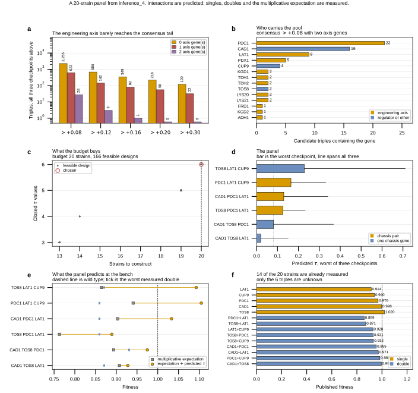

## 2026.09.04 - A 20-strain panel against the industrial question

Script: `experiments/010-kuzmin-tmi/scripts/inference_4_panel_design.py`

The question is the one a strain engineer has rather than a model-diagnostic one.
Flux-rechanneling deletions cost growth; a third deletion that restores it is a
positive trigenic interaction worth building. Hard budget of 20 constructed
strains, wild type excluded because it sits on every plate as the normalizer.

### The engineering axis is derived, not hand-picked

Marquez-Zavala 2026 (DOI 10.1016/j.ymben.2026.03.017, mirrored as
`marquez-zavalaDatabase15000Strain2026`, `paper.md` sha256
`952805b4205164dbf43d350eacf48e1c02f9aaad8fe9bc5529d4da358e1d8c68`) mined over
15,000 strain-design articles and reports the frequently targeted genes
concentrating in central carbon metabolism, naming four areas: the pyruvate node,
the upper-glycolysis / pentose-phosphate branch point, TCA entry and the
fermentative pathways.

Those four map onto yeast-GEM 9.0.2 subsystems, so `ENGINEERING_SUBSYSTEMS` turns
a prose claim into a reproducible gene set: 118 yeast-GEM genes, **84 of the 934
roster genes**. It recovers PDC1, PDC5, PDC6, ADH1, ADH2, ALD4, ALD6, PYC1, PYC2,
PCK1, TAL1, TKL1, RPE1, GRE3. Pathway membership is not the same as a validated
intervention, so this is a proxy for the survey's pathway-level claim, not a
curated target list.

### The strong predictions AVOID the engineering axis

The finding runs against the panel's interest and constrains everything else. A
triple holds at most two axis genes, since the space requires a regulator.

| axis genes | triples | share | >+0.08 | >+0.12 | >+0.16 | >+0.20 | >+0.30 |
|---|---|---|---|---|---|---|---|
| 0 | 33,318,318 | 79.6% | 2,255 | 686 | 349 | 216 | 120 |
| 1 | 8,094,624 | 19.3% | 623 | 142 | 82 | 56 | 32 |
| 2 | 464,290 | 1.11% | 28 | 3 | 1 | 0 | 0 |

Columns are consensus counts, every checkpoint above the cut, so rows sum to the
2,906 / 831 / 432 / 272 / 152 of `inference_4_rank.py`. The two-axis stratum is
proportional at the ordinary tier (0.96% of 2,906) then collapses: 0.23% at
+0.16, **zero above +0.20**. Its best consensus prediction is +0.164 against
+2.08 for the axis-free stratum. The one-axis stratum tracks its share at every
cut, so the depletion is specific to carrying two.

This reproduces on a sharper axis what `metabolic_positive_predictions.py` found
on inference_1, where no all-metabolic triple cleared the call anywhere. Two
readings stay open and these counts separate neither: the combinations may carry
less three-way effect, or the model may have learned less about them.

Head overlap, same top 500 the ranking figure uses: **3 of the 79 head genes are
on the axis (3.8% against the roster's 9.0%)**: LAT1 in 80 of the top 500, PDX1
in 19, PDC1 in 1.

### Strain budget: 6 closed tau is the proven optimum

Closing tau costs `|genes| + |doubles| + |triples|`. Read the design as a graph,
genes as vertices and built doubles as edges: a closed triple is a triangle.
Complete block on k genes costs `k + C(k,2) + C(k,3)`, so 14 at k=4 and 25 at
k=5. The k=5 block does not fit and the k=4 block wastes 6 strains.

**At most 6 tau can be closed in 20 strains, only on 5 genes with 9 of the 10
doubles built.** K5 minus one edge leaves 9 edges and 7 triangles, and 6 of them
cost 5+9+6=20; 8 edges hold at most 5 triangles; 7 triangles need 9 edges and
cost 21. Six genes need 10 edges for 6 triangles (22). The search confirms it
empirically: 166 feasible designs, max `n_triples` = 6.

### The chassis pair is the pyruvate node

28 triples have two axis genes and clear +0.08 on every checkpoint. PDC1 carries
22, CAD1 16, LAT1 9. The axis pair co-occurring most is **PDC1 + LAT1** (4
triples); ties break on screen support, decisive here at 608 distinct Kuzmin
query screens against 309 for PDX1 + LAT1.

yeast-GEM says the biochemistry directly: PDC1 carries `r_0959` (pyruvate
decarboxylase, the fermentative exit to acetaldehyde) and LAT1 carries `r_0961`
(pyruvate dehydrogenase, the exit to acetyl-CoA). Those are the two reactions
consuming pyruvate, so deleting both restricts exactly the branch point the survey
names first. PDX1 shares `r_0961` with LAT1, which is why the two compete for the
same slot. The growth cost is already published: **the double measures 0.8593 with
epsilon = -0.0273** (Costanzo 2016, 30 C) against singles 0.9695 and 0.9145.

### The panel

Five genes, nine doubles, six triples, 20 strains. Unbuilt double is CAD1 + CUP9.

| gene | role | fitness | screens | trigenic records | top-500 |
|---|---|---|---|---|---|
| PDC1 (YLR044C) | chassis, glycolysis | 0.9695 | 309 | 319 | 1 |
| LAT1 (YNL071W) | chassis, glycolysis | 0.9145 | 299 | 309 | 80 |
| CAD1 (YDR423C) | regulator | 0.9979 | 10 | 1,050 | 2 |
| TOS8 (YGL096W) | regulator | 1.0204 | 11 | 1,074 | 44 |
| CUP9 (YPL177C) | regulator | 0.9402 | 11 | 1,074 | 99 |

The two support columns disagree by design. The regulators fail the 50-screen
gate but each carries over a thousand trigenic training records, well above the
200-record floor the previous panel used.

| triple | arm | worst | across checkpoints | expected f | predicted f |
|---|---|---|---|---|---|
| TOS8 LAT1 CUP9 | one chassis | +0.229 | +0.229 to +0.711 | 0.864 | 1.093 |
| PDC1 LAT1 CUP9 | chassis pair | +0.164 | +0.164 to +0.331 | 0.941 | 1.105 |
| CAD1 PDC1 LAT1 | chassis pair | +0.130 | +0.130 to +0.340 | 0.903 | 1.033 |
| TOS8 PDC1 LAT1 | chassis pair | +0.126 | +0.126 to +0.232 | 0.763 | 0.889 |
| CAD1 TOS8 PDC1 | one chassis | +0.081 | +0.081 to +0.368 | 0.894 | 0.975 |
| CAD1 TOS8 LAT1 | one chassis | +0.020 | +0.020 to +0.151 | 0.908 | 0.928 |

`expected f` is the multiplicative trigenic expectation
`f_ab*f_c + f_ac*f_b + f_bc*f_a - 2*f_a*f_b*f_c` built entirely from published
singles and doubles; `predicted f` adds the worst-checkpoint tau. That inversion
is the point of the table: it converts an uncalibrated interaction score into the
quantity the bench reads.

### The rescue ordering is the readable experiment

The three chassis-pair triples share their first two deletions, so the comparison
is within-chassis. Against the measured chassis double at 0.8593 the predicted
recoveries are **+0.246 for CUP9, +0.174 for CAD1, +0.030 for TOS8**. Shrinkage
of the tau scale is monotone, so it moves the levels and not the order.

The highest prediction in the pool, TOS8 LAT1 CUP9 at +0.229, carries only ONE
chassis gene, so the model does not say both pyruvate exits must be blocked. The
arm contrast is what separates a branch-point result from a regulator result.
CAD1 TOS8 LAT1 at +0.020 is a near-null internal control, forced by the
six-triple optimum rather than chosen.

### Fourteen of the twenty strains are already measured

All 5 singles and all 9 doubles carry published fitness (5 from Costanzo 2016 at
30 C, 9 from the Kuzmin screens). Only the 6 triples are unknown. The build is
still all 20, because tau is a difference and a carried-forward reference costs
up to 1.46x the standard error, but the 14 known rungs become a plate-level
calibration set. That is exactly the overlap that would have caught the previous
round's normalization artifact (singles reproduced Costanzo at r = 0.706, doubles
at r = 0.255).

### Where the magnitudes stop being credible

Two predicted triple fitnesses land above wild type, 1.105 and 1.093. The
genome-wide deletion ceiling is 1.1118, only 2.7% of singles are significantly
above wild type, and in Kuzmin the fraction above wild type FALLS with order
(23.0 to 13.8 to 6.9%). Read those two as the ranking saturating, not as a
forecast. See [[019-ladder-not-reachable-on-growth]].

The widest checkpoint disagreement sits on the leader: TOS8 LAT1 CUP9 spans
+0.229 to +0.711.

### Two tests that cost no strains

- **Score the Xue 2025 free-fatty-acid panel with the same model.** It already has
  the structure this panel is being built to create, a flux chassis (POX1 FAA1
  FAA4) crossed against ten TF deletions, with all 720 orders measured. Asking
  whether growth tau predicts the rank of titer tau costs one inference pass.
  See [[ffa-titer-ladder-valley]] and
  [[experiments.008-xue-ffa.scripts.ffa_epistatic_path_panels]].
- **Rank the rescue rather than the interaction.** For a fixed chassis double,
  rank third genes by predicted `f_abc - f_ab` instead of by tau. It answers the
  engineer's question directly and uses published fitness wherever it exists.

### Outputs

- `experiments/010-kuzmin-tmi/results/inference_4/engineering_axis_genes.csv`
- `experiments/010-kuzmin-tmi/results/inference_4/engineering_strata.csv`
- `experiments/010-kuzmin-tmi/results/inference_4/panel20_candidates.csv`
- `experiments/010-kuzmin-tmi/results/inference_4/panel20_designs.csv`
- `experiments/010-kuzmin-tmi/results/inference_4/panel20_triples.csv`
- `experiments/010-kuzmin-tmi/results/inference_4/panel20_strains.csv`
- `experiments/010-kuzmin-tmi/results/inference_4/panel20_summary.json`

Written up as sections 10 and 12 of `notes-tex/010-positive-panel`.

