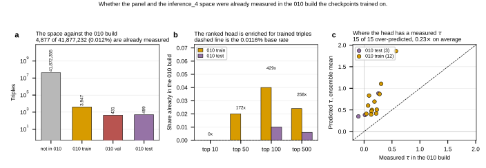

## 2026.09.05 - The panel's top triple is in the 010 TRAINING set

Script: `experiments/010-kuzmin-tmi/scripts/inference_4_panel_overlap.py`

`inference_4_generate_triples.py` enumerates the roster and **never removes
combinations Kuzmin already measured**, so "unmeasured space" was an assumption.
Identity = sorted gene set (same key `transfer_010_tmi_splits.py` uses); split read
from 010's own `data_module_cache/index_seed_42.json`.

### The space is 99.99% genuinely unmeasured

**4,877 of 41,877,232 (0.012%)** are in the 010 build: 3,947 train, 431 val, 499
test. So the premise is mostly right.

### But the RANKED HEAD concentrates them

| window | in 010 | share | enrichment | train / val / test |
|---|---|---|---|---|
| top 10 | 0 | 0.0% | - | 0 / 0 / 0 |
| top 50 | 1 | 2.0% | 172x | 1 / 0 / 0 |
| top 100 | 5 | 5.0% | **429x** | 4 / 0 / 1 |
| top 500 | 15 | 3.0% | 258x | 12 / 0 / 3 |

Mechanism is obvious in hindsight: ranking on prediction selects for points the
model fits, and it fits its training set.

### The panel's leader is one of them

**TOS8+LAT1+CUP9 is in the 010 TRAIN split**, measured tau = **+0.2280**, a called
positive. Worst-checkpoint prediction = **+0.2286**. The model reproduces its own
training label to four decimals, so that entry is RECALL, not prediction.

It is also the only panel strain carrying a trained Kuzmin **query double**
(TOS8+CUP9 = YGL096W+YPL177C). That is why it is in the training data: Kuzmin
crosses a query double against an array, so this triple is that screen's record for
array gene LAT1.

No single or double is in 010 (the build is 3-gene throughout).

**Resolution: keep it and relabel it as a POSITIVE CONTROL** with a known answer
riding the same plate. Panel becomes **15 known rungs and 5 unknown triples**. The
arm contrast is unaffected since it sits in the one-chassis arm either way.

### Every measured head triple is over-predicted

All **15 of 15** top-500 triples with a measured tau are predicted above it;
measured is **0.23x predicted** on average. Extremes: rank 12 predicted +1.86 vs
measured +0.572; rank 500 predicted +0.350 vs measured **-0.102**.

Selection explains part of this: taking the top of a 41.9M ranking selects for
positive error, so winners overstate by construction. What it does not explain is
the SIZE, ~4x at this operating point, and it is the same direction as the
zero-shot over-prediction on doubles (+0.138) in
[[experiments.010-kuzmin-tmi.scripts.inference_4_panel_score]].

### The only held-out evidence at the operating point

Three of the 15 sit in 010's TEST split: predicted +0.883, +0.384, +0.350 against
measured +0.258, +0.015, **-0.102**. One of three is a called positive. Small n,
but it is the closest thing to a precision estimate for this ranking's head.

### Outputs

- `experiments/010-kuzmin-tmi/results/inference_4/panel20_overlap.csv`
- `experiments/010-kuzmin-tmi/results/inference_4/panel20_overlap.json`

Panel design: [[experiments.010-kuzmin-tmi.scripts.inference_4_panel_design]].
Scoring: [[experiments.010-kuzmin-tmi.scripts.inference_4_panel_score]].

