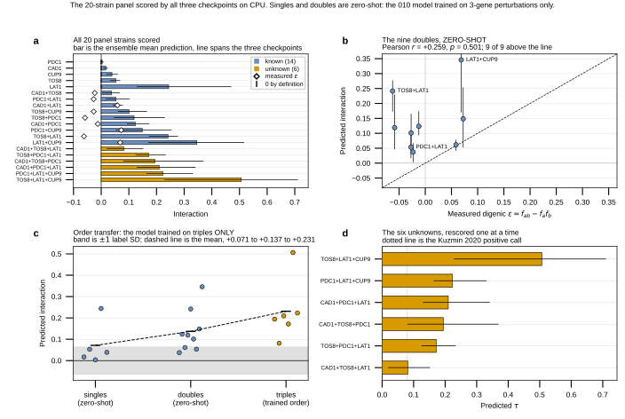

## 2026.09.05 - Scoring the whole 20-strain panel, and the model fails the known rungs

Script: `experiments/010-kuzmin-tmi/scripts/inference_4_panel_score.py`

The panel's 6 triples are unknown but its 5 singles and 9 doubles are already
published, so the model can be asked about all 20 and CHECKED on 14, before a
single strain is built. Run on CPU because all four GPUs were on the 025 training
job (1598); 20 records is minutes.

### Orders: what is and is not in distribution

Read back from the training LMDB: **the 010 build is 376,732 records and every one
is a 3-gene perturbation.** So singles and doubles are strictly ZERO-SHOT. The
model has one output head and no conditioning on perturbation order, so what it
emits for a 1- or 2-gene input is its interaction estimate for that set, compared
against digenic `eps = f_ab - f_a*f_b`, the measured counterpart on a comparable
scale.

### Parity guard: the CPU path is verified against the GPU run

The 6 triples are members of the inference_4 space, so the GPU run already scored
them. The CPU path reproduces all 18 values (6 triples x 3 checkpoints) to a
largest absolute difference of **0.0012** on a prediction of 0.58.

Exact equality is NOT the right bar: `use_amp = device.type == "cuda"` in
`equivariant_cell_graph_transformer_inference_4.py`, so the GPU run scored under
autocast while this path is float32. My first threshold of 1e-3 tripped on exactly
that; the guard is now 5e-3 absolute AND Pearson r > 0.9999, with the reason
written down. This also settles the scary-looking load warning: the checkpoints
carry the OLD `perturbation_transform.cross_attn` / `ffn` / `norm1` / `norm2`
names, which the current module keeps as ALIASES of `*_layers.0`, so the tensors
are shared and the missing-key warning is cosmetic.

### The result, and it is not favorable

| order | strains | mean predicted interaction | truth |
|---|---|---|---|
| 1, singles | 5 | +0.0714 | 0 by definition |
| 2, doubles | 9 | +0.1369 | measured eps, 6 of 9 NEGATIVE |
| 3, triples | 6 | +0.2311 | unknown, the trained order |

- **Singles.** A single gene has no interaction term, yet the mean is +0.0714,
  above the training-label SD of 0.0633. **LAT1 alone scores +0.2441.**
- **Doubles.** The model puts every one ABOVE its measured eps, **9 of 9**, sign
  test p = 0.004, mean signed error **+0.138**. It predicts NO negative
  interaction anywhere although 6 of 9 measured values are negative. Rank
  agreement is absent at this size: Spearman rho = +0.200, p = 0.61.
- **The mean grows close to proportionally with the number of deleted genes**
  (0.071 -> 0.137 -> 0.231), which is what a model with no order awareness does
  when taken below the order it trained on.

### Two objections, both answered

**Selection.** The 6 triples were chosen for being consensus-positive, so their
sign carries no information. The singles and doubles were NOT chosen at all: they
are forced by tau closure once the triples are fixed, and no prediction of theirs
entered the design. The finding is about the model, not the selection.

**Source mixing.** The 9 eps are reconstructed from singles and doubles that do not
all come from one screen, and mixing normalizations across screens is what flipped
a sign in the pcl6 census. Three of the 9 pairs also carry a published Costanzo
eps, and the reconstruction matches to within **0.007** on all three (PDC1+LAT1 is
exact at -0.0273), an order of magnitude below the +0.138 error.

### One result in the panel's favor: the rescue ordering is NOT the gene ordering

The three chassis-pair triples share their first two deletions, so only the third
gene varies and the comparison is within-chassis. Against the measured chassis
double at 0.8593:

| third gene | predicted rescue | its own single-gene score |
|---|---|---|
| CUP9 | +0.2457 | +0.0389 |
| CAD1 | +0.1739 | +0.0171 |
| TOS8 | +0.0299 | +0.0532 |

By rescue: CUP9 > CAD1 > TOS8. By single-gene score: TOS8 > CUP9 > CAD1. **The two
orderings disagree**, and TOS8 is the extreme case, carrying the LARGEST single-gene
score and the SMALLEST predicted rescue. So this particular ranking is not a
restatement of the per-gene scores, which is the only evidence the panel has on that
question before it is built.

### What it licenses

It does NOT measure the triples. Everything above is out of distribution and a
model can be wrong below its trained order and right at it. What it establishes is
that the output carries no constraint forcing interaction to vanish at order 1, and
that it grows with the count of deleted genes.

That makes a null concrete rather than a worry: **LAT1 alone (+0.2441) outscores
five of the six triples the panel is built to test**, so "the model reports a
per-gene score summed over the perturbation set" has to be stated as a hypothesis
and separated by the arm contrast before the plate is read. Connects directly to
the clique concern in [[experiments.010-kuzmin-tmi.scripts.inference_4_rank]] and
to the S6 zero-shot order-transfer arm in
[[experiments.025-solid-growth.training-plan]].

### Outputs

- `experiments/010-kuzmin-tmi/results/inference_4/panel20_scored.csv`
- `experiments/010-kuzmin-tmi/results/inference_4/panel20_scored.json`
- 20-record LMDB at `$DATA_ROOT/data/torchcell/experiments/010-kuzmin-tmi/panel20/`

Written up as "The model scored on the fourteen known rungs" in the "A 20-strain
panel" section of `notes-tex/010-positive-panel`. Panel design and the
strain list: [[experiments.010-kuzmin-tmi.scripts.inference_4_panel_design]].

