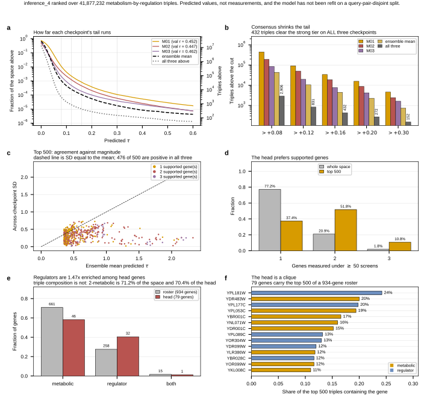

## 2026.09.04 - Ranking inference_4, and what the head actually is

Script: `experiments/010-kuzmin-tmi/scripts/inference_4_rank.py`

All twelve SLURM jobs (1585 to 1596) COMPLETED, about 2 h 40 min per shard, four
GPUs at a time. Every shard verified complete, strictly ordered and correctly
offset, so the four files per checkpoint concatenate into dataset order.

### The checkpoints disagree fivefold

| predicted tau > | M01 | M02 | M03 | ensemble mean | all three |
|---|---|---|---|---|---|
| +0.08 | 449,239 | 192,355 | 86,280 | 43,663 | 2,906 |
| +0.12 | 92,127 | 50,443 | 19,656 | 10,518 | 831 |
| +0.16 | 33,969 | 18,794 | 7,710 | 4,495 | 432 |
| +0.20 | 15,844 | 8,746 | 4,231 | 2,284 | 272 |
| +0.30 | 4,611 | 2,441 | 1,633 | 739 | 152 |

Validation Pearson is 0.4520, 0.4472, 0.4619, so these are comparably good models
that differ fivefold on the tail. Requiring all three to clear +0.08 removes 99.3
percent of M01's list. No single checkpoint's tail is reportable, so the ranking
statistic is the ensemble mean with the across-checkpoint sd carried beside it.

### The support gate worked

This is the clear win over inference_1.

| genes with >= 50 screens | share of space | share of top 500 |
|---|---|---|
| 1 | 77.2% | 37.4% |
| 2 | 20.9% | 51.8% |
| 3 | 1.8% | 10.8% |

Fully supported triples are 6x enriched in the head. The ranking prefers evidence
rather than avoiding it, the reverse of inference_1 where the tail concentrated on
single-screen genes and collapsed 9.6x once they were gated. 476 of the top 500
are positive under all three checkpoints.

### What survives consensus

Counts, not rates, because a fraction of 41.9 million is not holdable.

| cut | ensemble mean | all three above |
|---|---|---|
| +0.08 | 43,663 | 2,906 |
| +0.12 | 10,518 | 831 |
| +0.16 | 4,495 | **432** |
| +0.20 | 2,284 | 272 |
| +0.30 | 739 | 152 |

432 triples clear the strong tier at +0.16 on all three checkpoints, and 152 clear
+0.30. That is the only pool a panel should be drawn from.

### The head is regulatory, not metabolic

Triple composition says nothing: 2-metabolic triples are 71.2 percent of the space
and 70.4 percent of the top 500. The compositional constraint is satisfied
identically inside and outside the head.

The genes carrying the head do differ. Of the 79 genes appearing in the top 500,
46 are metabolic, 32 regulator, 1 both. Against a roster of 661 metabolic, 258
regulator and 15 both, regulators are **1.47x enriched** among head genes, 40.5
percent against 27.6 percent.

So the ranking is not preferring metabolic triples over regulatory ones. It is
picking particular regulators to pair with metabolism, and which ones is the
concern below.

### Two reasons not to build from the list

**The head is a clique.** 79 distinct genes carry the top 500 out of a 934-gene
roster, and 76.4 percent of those triples contain one of six genes. `YPL181W`
alone is in 24 percent, then `YDR483W` 20, `YPL177C` 20, `YPL053C` 19, `YBR001C`
17, `YNL071W` 16. A ranked list that is really a claim about six genes is not a
claim about 41.9 million triples, and that is the shape that produced the previous
panel.

Worth noting: `YPL181W` is `CTI6`, which carried the largest measured tau (+0.799)
in the pcl6 screen walked earlier, and it has 295 distinct screens. So the model's
attachment to it is not obviously unsupported. **Hypothesis (untested):** the
clique reflects genes with genuinely broad trigenic behavior rather than a data
artifact. Separating that from an attention-concentration artifact needs held-out
measurements on these genes, which do not exist for this space.

**The magnitudes are extrapolation.** Top ensemble mean is +2.33 against a
training label range of [-1.08, +1.13] and label sd 0.063, so the leader sits at
37 label sd and about twice the largest value ever observed. Predicted sd across
the space is 0.021, a third of the label spread, the ordinary regression-to-the-mean
signature. These are ranks, not calibrated tau.

Neither point says the ordering is wrong. Both say the magnitudes carry no weight.

### Still conditional

Every number is conditional on a split the model has not been refit on. The
additive null falls from 0.400 to 0.127 +/- 0.033 under a query-pair-disjoint
split and the transformer has never been retrained there.

### Figure

### Outputs

- `experiments/010-kuzmin-tmi/results/inference_4/top_triples.csv`
- `experiments/010-kuzmin-tmi/results/inference_4/checkpoint_agreement.csv`
- `experiments/010-kuzmin-tmi/results/inference_4/rank_summary.json`
