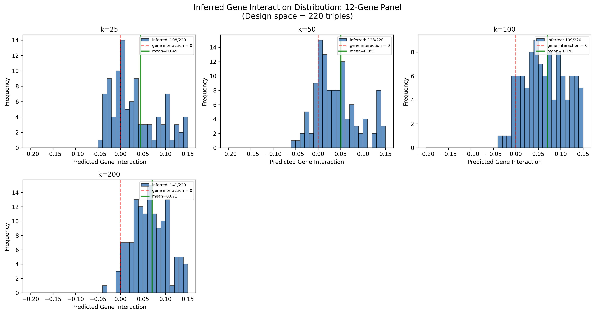
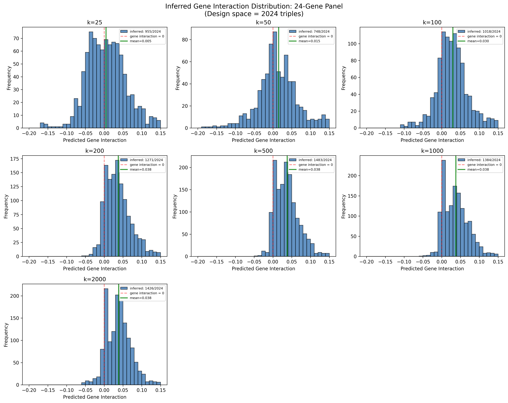

## Overview

Plots histograms of inferred gene interaction scores for ALL possible triples constructible from selected gene panels (12 and 24 genes).

This script answers: "What does the distribution of predicted interactions look like for strains we could actually build?"

## Design Space

| Panel Size | Possible Triples | Formula |
|------------|------------------|---------|
| 12 genes   | 220              | C(12,3) |
| 24 genes   | 2024             | C(24,3) |

## Algorithm

1. Load inference predictions from best model (Pearson=0.4619)
2. Load gene selection results to get selected panels
3. Create triple lookup: `frozenset({gene1, gene2, gene3}) → prediction`
4. For each panel and k-value:
   - Generate all C(n,3) possible triples
   - Look up inferred predictions
   - Plot histogram with mean and zero reference lines

## Outputs

### Visualizations

**12-Gene Panel Histograms:**

**24-Gene Panel Histograms:**

## Interpretation

- **Blue bars**: Distribution of inferred gene interactions for panel triples
- **Red dashed line**: Gene interaction = 0 (neutral)
- **Green solid line**: Mean of all inferred values
- **Legend**: Shows how many triples have predictions vs. design space total

## Dependencies

- Requires `gene_selection_results.csv` from [[select_12_and_24_genes_top_triples|experiments.010-kuzmin-tmi.scripts.select_12_and_24_genes_top_triples]]
- Requires inference parquet file with Pearson=0.4619 predictions

## Related Scripts

- [[select_12_and_24_genes_top_triples|experiments.010-kuzmin-tmi.scripts.select_12_and_24_genes_top_triples]] - Produces the gene selection results this script consumes
- [[select_12_k200_tables_hist|experiments.010-kuzmin-tmi.scripts.select_12_k200_tables_hist]] - Focused analysis on k=200 with overlay histograms
