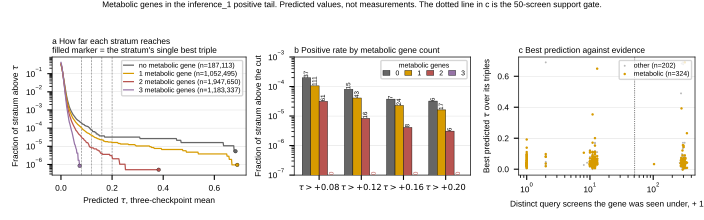

## 2026.09.04 - Are there zero positive predictions for metabolic genes?

Script: `experiments/010-kuzmin-tmi/scripts/metabolic_positive_predictions.py`

Short answer: no, and yes, depending on the level you ask at. Metabolic genes are
all over the positive tail. All-metabolic triples are completely absent from it.

### Setup

The metabolic flag is `in_expanded_metabolic` in
`experiments/006-kuzmin-tmi/results/inference_preprocessing_expansion/expanded_genes_analysis.csv`,
the same table that decided the 601-gene roster. 1,316 of the 3,169 genes
considered are flagged, 369 of them made the roster, and 324 appear in the 526
genes the `inference_1` space actually realizes. So 61.6 percent of the space's
genes are metabolic and 95.7 percent of its 4,370,595 triples carry at least one.

Predicted tau is the three-checkpoint mean, the same ensemble used elsewhere in
010. These are predictions. Nothing below says an interaction exists.

### The counts

| Metabolic genes in the triple | Triples | Share | Best predicted tau | > +0.08 | > +0.16 | > +0.20 |
|---|---|---|---|---|---|---|
| 0 | 187,113 | 4.3% | +0.683 | 37 | 7 | 6 |
| 1 | 1,052,495 | 24.1% | +0.690 | 111 | 24 | 17 |
| 2 | 1,947,650 | 44.6% | +0.382 | 61 | 8 | 6 |
| 3 | 1,183,337 | 27.1% | +0.073 | 0 | 0 | 0 |

Three things fall out.

1. **The tail is not metabolic-free.** 172 of the 209 triples above +0.08 carry a
   metabolic gene, and the single highest prediction in the whole space, +0.690
   on `YGR121C`, is one.
2. **The all-metabolic stratum is empty above the call.** Not one of 1,183,337
   triples clears +0.08. Their maximum is +0.073, just under it.
3. **Predicted positive interaction falls monotonically with metabolic content.**
   The zero-metabolic stratum is 4.3 percent of the space and 17.7 percent of the
   hits above +0.08, an enrichment of 4.1 times, rising to 4.8 at +0.20.

### After the support gate

Applying the 50-distinct-screen floor leaves 73,789 triples. 8 of those clear
+0.08 while carrying a metabolic gene, the best at +0.293. The gated metabolic
tail is small but not empty, and it is the part with enough screen structure to
be worth building.

### What this licenses

Measured: the model does not put an all-metabolic triple above the call threshold
anywhere in this space, and its positive predictions concentrate where metabolic
content is lower.

**Hypothesis (untested):** the metabolic subset is enriched for genes whose
deletions are buffered by pathway redundancy, so a three-way effect large enough
to clear +0.08 is genuinely rarer there. Not tested here. The competing reading,
that the model has learned less about this subset, fits these numbers equally
well, and separating them needs held-out metabolic triples with measurements.

### Figure

Panel a is a survival curve rather than a histogram, because every stratum piles
up at zero and the decisive part is a few dozen triples. The all-metabolic curve
terminates left of the first cut. Panel b labels every count including the zeros,
so a missing bar does not read as a plotting fault.

### Outputs

- `experiments/010-kuzmin-tmi/results/metabolic_positive_predictions.csv`
- `experiments/010-kuzmin-tmi/results/metabolic_positive_gene_ranks.csv`
- `experiments/010-kuzmin-tmi/results/metabolic_positive_predictions.json`
