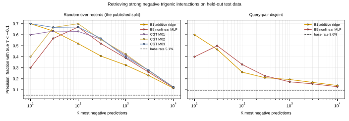

## 2026.09.03 - The model is a usable retriever of negative interactions

Every confident prediction the model makes about the construction panel is
negative, which invites using it to find negative interactions rather than
positive ones. That needs testing rather than assuming, because the label is
already skewed negative: 59.4 percent of the 376,732 records have tau below zero
and the mean is -0.0080, so a squared-error fit that had learned nothing beyond
the mean would still emit mostly negative predictions.

The test is retrieval. Among the K records a model calls most negative, what
fraction really are strong negatives, and does that beat the base rate and the
additive null.

### On the published split it works, and the transformer beats the null

Held-out test, 37,673 records. Precision at K = 100, with enrichment over the
base rate in parentheses.

| model | tau < -0.08 (base 8.3%) | tau < -0.10 (base 5.1%) | tau < -0.20 (base 0.88%) |
|---|---|---|---|
| B1 additive ridge | 0.560 (6.8x) | 0.520 (10.1x) | 0.240 (27x) |
| B5 nonlinear MLP | 0.700 (8.5x) | 0.670 (13.1x) | 0.400 (45x) |
| CGT M01 | 0.670 (8.1x) | 0.630 (12.3x) | 0.400 (45x) |
| CGT M02 | 0.750 (9.1x) | 0.700 (13.7x) | 0.420 (48x) |
| CGT M03 | 0.710 (8.6x) | 0.670 (13.1x) | 0.450 (51x) |

Average precision at tau < -0.20 is 0.096 for B1 against 0.182 to 0.191 for the
three checkpoints, so the transformer's advantage over the additive null is
proportionally larger on this task than on Pearson, where it was 0.400 against
0.438 to 0.455. Retrieval of the extreme tail is what the architecture buys.

### It survives the disjoint split, weakened, for the models measured there

The transformer has not been retrained on the query-pair-disjoint split, so only
the baselines have a row. At tau < -0.10 the disjoint test base rate is 9.6
percent, and precision at 100 is 0.26 for B1 (2.7x) and 0.33 for B5 (3.4x),
against 10.1x and 13.1x on the random split. So retrieval is real but several
times weaker once query doubles cannot be shared, and the absolute precisions are
not comparable across splits because the base rates differ.

### What this supports

Using the model to nominate candidate negative trigenic interactions is defensible
on the evidence, and is a better fit to what it can do than nominating positives:
on the build list 17 of 20 triples have all three checkpoints agreeing and every
one of those is negative, while the single positive is not agreed.

What is not established is the enrichment a transformer would retain on a
query-pair-disjoint split, since it has not been refit there. The baseline drop
from roughly 10x to 3x is the honest prior for what to expect.

## 2026.09.03 - Correction: rerun at the published significance call

The section above used bare magnitude cuts on tau. That is not how Kuzmin defines
an interaction, and the difference is large enough to change the conclusion.

### The published definition

Kuzmin 2018 SI, both in the Materials and Methods preamble and in the Additional
Data S2 description: "we used an established interaction magnitude cut-off for
digenic interactions $(p < 0.05, |\varepsilon| > 0.08)$ and trigenic interactions
$(p < 0.05, \tau < -0.08)$."

Three things follow. It is a **conjunction**, magnitude and significance together.
The trigenic form is **one-sided negative**, and deliberately so: "We focused
exclusively on the analysis of deleterious negative trigenic interactions." And
the symmetric $|\tau| > 0.08$ appears only in Kuzmin 2020 and the 2021 protocol,
which do score positives. Baryshnikova 2010 adds a stringent tier, sign-asymmetric
for digenic at $\varepsilon < -0.12$ and $\varepsilon > 0.16$.

On this build the p-value conjunct is not cosmetic: 29,712 records have
tau < -0.08 but only 5,675 also have p < 0.05, so the magnitude cut alone is
about five times more permissive than the published call.

The p-value is read from the LMDB, which stores `gene_interaction_p_value` on
every phenotype; `label_df.parquet` carries only the score. One caveat from the
protocol paper's output format: that p-value is the significance of the
unadjusted triple-mutant epsilon computed at the digenic scoring stage, not a
test on tau itself. It is usable as the published filter and is not a statistic
about tau.

### What changes

Precision at K = 100, held-out test, published call, base rate 1.707 percent:

| model | P@100 | enrichment | AP |
|---|---|---|---|
| B1 additive ridge | 0.240 | 14.1x | 0.0731 |
| B5 nonlinear MLP | 0.290 | 17.0x | 0.0920 |
| CGT M01 | 0.320 | 18.7x | 0.1258 |
| CGT M02 | 0.380 | 22.3x | 0.1362 |
| CGT M03 | 0.340 | 19.9x | 0.1304 |

The qualitative claim survives on the published split. Retrieval works, and the
transformer still beats the additive null by more in proportion than it does on
correlation: average precision 0.136 against 0.073, against 0.438 to 0.455 versus
0.400 on Pearson. The absolute precisions are lower than the magnitude-only
version reported, 0.38 rather than 0.70, because the target is five times rarer.

### What does not survive

The disjoint-split result is much worse than the magnitude-only numbers implied.
At the published call the disjoint test base rate is 2.739 percent and precision
at 100 is 0.050 for the additive ridge and 0.040 for the nonlinear baseline,
enrichments of 1.8 and 1.5. The earlier magnitude-only reading gave 2.7 and 3.4.

So on the models measured there, retrieval of published negative interactions is
close to gone once query doubles are disjoint. The earlier phrasing, that
retrieval "survives the leak removal, several times weaker," was too generous.
At the published definition it is barely above chance.

The stringent tier behaves the same way: 29.3x on the random split for the best
checkpoint, 1.7 to 2.3x for the baselines on the disjoint one.

### What this leaves

Using the model to nominate negative interactions is defensible on the published
split, where the panel-selection use case does not live. On combinations whose
query double was never screened, which is the design case, the baselines retain
almost nothing and the transformer is unmeasured. That measurement is the same
one every other open claim here is waiting on.
