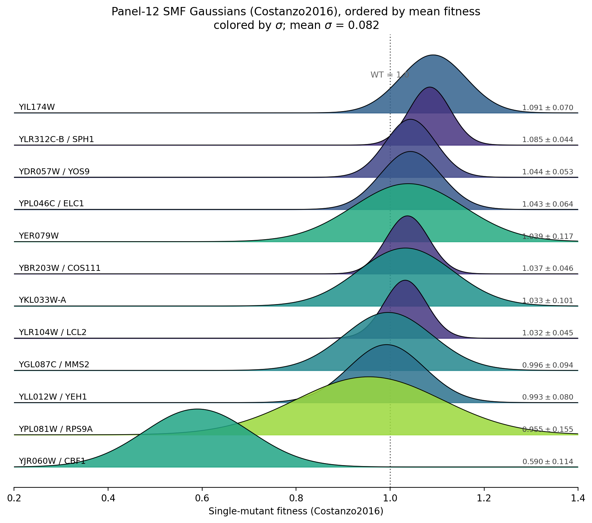

## 2026.07.17 - Ridgeline of Panel-12 SMF Gaussians (Costanzo2016)

Script: `experiments/010-kuzmin-tmi/scripts/panel12_smf_gaussian_ridgeline.py`

Built to make the per-gene single-mutant-fitness **width** (s.d.) visually comparable
across the panel — the existing small-multiples overlay
(`smf_gaussian_overlay_panel12_inference_3.png`) gives each subplot its own y-scale,
so σ can't be read gene-to-gene. This draws all 12 Costanzo2016 Gaussians
`N(mean, std)` on one shared fitness axis, peak-normalized and stacked by increasing
mean, colored by σ, with `μ±σ` labeled per ridge and a WT=1.0 reference line. Reads
`results/inference_3/singles_table_panel12_k200_queried.csv`.

Takeaway: **YJR060W/CBF1** (μ=0.590) is the only clearly separated ridge; the wide,
green ridges (**YPL081W/RPS9A** σ=0.155, **YER079W** σ=0.117) reach up to WT despite
their lower means — the least-certain dips. Panel mean σ = 0.082.

Related: [[experiments.010-kuzmin-tmi.scripts.validation_panel_smf_reference]].
