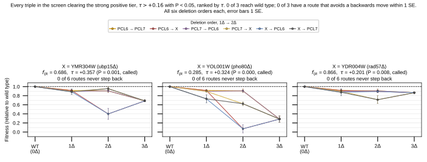
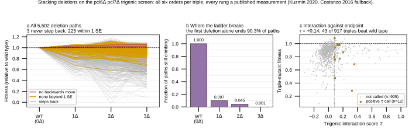
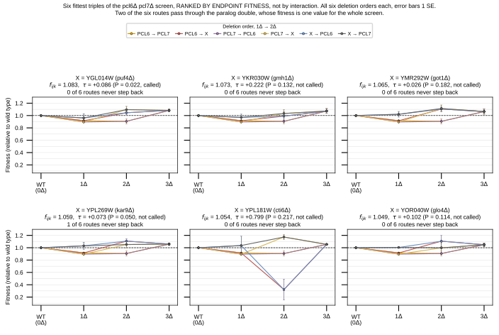

## 2026.09.03 - Every measured 1 to 2 to 3 deletion path through the pcl6 pcl7 screen

Script: `experiments/010-kuzmin-tmi/scripts/pcl6_deletion_paths.py`

### Why this screen is the one that can be walked

`YER059W` (PCL6) is the hub behind the positive-interaction signal in `inference_1`,
and every `YER059W` record in the 010 build comes from one Kuzmin 2020 query double,
`YER059W` + `YIL050W` (PCL7), its whole genome duplication paralog. So every triple in
that screen is `{PCL6, PCL7, X}` for an array gene X, and the whole 1 to 2 to 3
lattice is measured rather than predicted. That is the difference between this and the
`inference_1` triples, whose endpoints exist only as model output.

The screen holds 1,097 trigenic records, 919 with a deletion array and 178 with a
temperature-sensitive allele. Deletions are the primary set here, because the question
is about removing genes. After requiring all three singles and all three doubles,
917 triples survive with a complete lattice, giving 5,502 paths at six orderings each.

### Where each rung comes from

Mixing normalizations is how a ladder gets corrupted, so the source is recorded per
rung rather than assumed.

| Rung | Source | Note |
|---|---|---|
| triple `{PCL6,PCL7,X}` | `TmfKuzmin2020` combined-mutant fitness | in screen |
| double `{PCL6,PCL7}` | `TmfKuzmin2020` query fitness, 0.9063 | one value for the whole screen |
| doubles `{PCL6,X}`, `{PCL7,X}` | `DmfKuzmin2020` (3,668 paths), `DmfCostanzo2016` at 30 C otherwise | |
| singles | `SmfKuzmin2020`, `SmfCostanzo2016` at 30 C otherwise | |

The two single-mutant sources disagree on the query genes, and the disagreement is
load bearing. Kuzmin's own table gives pcl6 0.9153 and pcl7 0.8956; Costanzo gives
1.0245 and 0.9950. The paralog double's digenic term is +0.0866 on the first pair and
-0.1131 on the second, so the sign of that interaction depends on which screen you
believe. Kuzmin's singles are used because they share a normalization with the double
and the triple that sit above them in the same ladder.

### The ladder does not climb

A path is scored as having no backwards move when every deletion leaves fitness at
least as high as the strain before it, starting from wild type at 1.0.

| Criterion | Paths of 5,502 | Triples of 917 |
|---|---|---|
| no backwards move | 3 | 3 |
| no step below 1 SE | 228 | 188 |
| no backwards move after the first deletion | 428 | |

The first deletion alone ends 90.3 percent of paths, because the median array single
sits at 0.973 and both query singles sit near 0.90. Of the survivors the second
deletion removes another 54 percent. Three paths out of 5,502 clear all three steps,
and all three begin with the array gene rather than a query gene, since pcl6 and pcl7
both cost fitness on their own.

The three are `kar9` (`YPL269W`) then `pcl7` then `pcl6` reaching 1.0587, `nuc1`
(`YJL208C`) then `pcl6` then `pcl7` reaching 1.0258, and `chs7` (`YHR142W`) then
`pcl7` then `pcl6` reaching 1.0260. None of the three is a called interaction at
P < 0.05; the closest, `kar9`, sits at P = 0.0502.

### A positive interaction is not a fitter strain

43 of 917 triples finish above wild type, the best at 1.0834. Twelve triples carry a
called positive interaction at tau > +0.08 with P < 0.05, and exactly one of those
twelve also finishes above wild type: `puf4` (`YGL014W`), tau +0.086 at P = 0.022,
endpoint 1.0834. It is both the best endpoint in the screen and the only called
positive interaction that beats wild type, and two of its six routes stay within 1 SE
of never stepping back.

The rest of the called set runs the other way. `pho80` (`YOL001W`) carries the second
largest tau in the screen at +0.324 with P = 0.0004 and finishes at 0.2852. PHO80 is
the cyclin partner of Pho85p, of which PCL6 and PCL7 are two other cyclins, so the
interaction is exactly where a mechanism would put it. Positive tau there means the
triple is less sick than the multiplicative expectation, not that it is healthy.
Across all 917 triples tau and endpoint fitness correlate at r = +0.14.

This is the part that matters for panel design. Selecting on predicted trigenic
interaction and selecting on fitness are close to independent in this screen, so a
panel picked on interaction alone will mostly return sick strains.

## 2026.09.04 - The strong tier and the fitness goal are disjoint

The six-panel figure below is ranked by **endpoint fitness**, not by interaction,
which is why a panel can carry a tau of +0.026 that clears no threshold. Naming
the ranking matters, so the figure now says so and a second figure ranks by tau
at the strong cut instead.

Raising the cut does not reconcile the two objectives, it separates them further,
and the crossover happens below the strong tier.

| tau cut | Criterion | Triples | Best f | Above WT | With a route |
|---|---|---|---|---|---|
| +0.08 | called (P<0.05) | 12 | 1.0834 | 1 | 4 |
| +0.08 | magnitude only | 152 | 1.0834 | 12 | 48 |
| +0.12 | called (P<0.05) | 7 | 0.9822 | 0 | 2 |
| +0.12 | magnitude only | 96 | 1.0734 | 7 | 25 |
| +0.16 | called (P<0.05) | 3 | 0.8662 | 0 | 0 |
| +0.16 | magnitude only | 69 | 1.0734 | 7 | 17 |
| +0.20 | called (P<0.05) | 3 | 0.8662 | 0 | 0 |
| +0.20 | magnitude only | 58 | 1.0734 | 4 | 11 |

"With a route" counts triples having at least one of six orderings that never
steps back by more than 1 SE.

Every triple clearing the strong tier at tau > +0.16 with P < 0.05 finishes below
wild type, and none has a route that avoids a backwards move even with 1 SE of
slack. The three are `ubp15` at tau +0.357 finishing at 0.686, `pho80` at +0.324
finishing at 0.285, and `rad57` at +0.201 finishing at 0.866. Dropping the
significance requirement recovers fitness but abandons the call: 69 triples clear
+0.16 on magnitude alone and 7 of those beat wild type, none at P < 0.05.

### Figures

All 5,502 deletion paths, where the ladder breaks, and interaction against endpoint.

The six highest-fitness triples, all six deletion orders each.

### Outputs

- `experiments/010-kuzmin-tmi/results/pcl6_deletion_paths.csv`
- `experiments/010-kuzmin-tmi/results/pcl6_deletion_paths_triples.csv`
- `experiments/010-kuzmin-tmi/results/pcl6_deletion_paths_summary.json`

### One incidental defect worth carrying forward

Constructing any `torchcell.datasets.scerevisiae` dataset resets matplotlib's
rcParams to 16 pt DejaVu Sans. A script that sets the figure style at module level,
which is the usual pattern, silently produces a figure with 16 pt ticks. The style is
therefore applied inside each plotting function here. This is the same class of defect
as commit 31d6fcc7.
