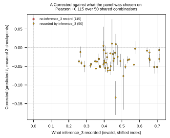
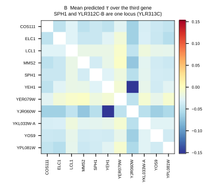
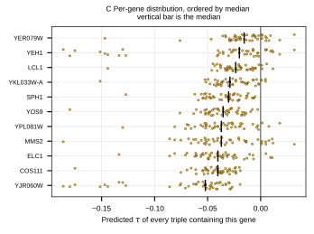
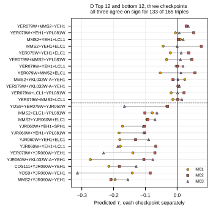

## 2026.09.03 - Four figures over the corrected plate predictions

All 165 triples over the 11 distinct loci on the wet-lab plate, scored with the
three checkpoints under the correct 6,607-gene index space. Predicted tau spans
-0.1862 to +0.0317, against a training-label standard deviation of 0.063.

Panels answer one question each, and the two that decide anything are A and D.

### A. Corrected against what the panel was chosen on

Fifty of the 165 plate combinations appear in the stored inference_3 files, and
across those the corrected values correlate with the recorded ones at
Pearson +0.115. The recorded values run 0.25 to 0.72; the corrected values run
-0.18 to +0.01. The old ranking carries essentially no information about the
corrected one, so it cannot be reused for selection.

The join is on systematic name, so the YLR312C-B and SPH1 rename lines up. An
earlier attempt reconstructed the old prediction by re-scoring under the shifted
6,579-gene index map, keyed on plate labels. That was wrong: the plate labels are
standard names like COS111 while the index map holds systematic names, so it
reported 161 of 165 as having been scored as doubles. The stored file is the
historical record and needs no reconstruction.

### B. Which pair drives the prediction

Mean predicted tau over the third gene, for every pair. The dominant cell is
YJR060W with YEH1. YER079W is the mildest partner. The color scale is symmetric
about zero and the warm half goes unused, which is itself the finding: at the
pair level nothing on this plate is predicted positive.

### C. Which gene drives it

Every triple containing each gene, ordered by median. YJR060W separates from the
rest, and YEH1 follows it. The rest sit close to zero.

### D. How far down the ranking is worth reading

The three checkpoints shown separately for the top 12 and the bottom 12. This is
the panel that governs what to build.

The top of the ranking is not resolved. Most of the top 12 straddle zero, and
several have one checkpoint positive and another negative on the same triple.
Only YER079W with MMS2 and YEH1 has all three checkpoints clearly on the same
side, at +0.032 with a 0.0035 spread.

The bottom is resolved. Every one of the bottom 12 is negative in all three
checkpoints, and the most negative, MMS2 with YJR060W and YEH1, sits near -0.19.
Across all 165 triples the checkpoints agree on sign for 133.

So the model has a reproducible opinion about which triples are strongly
negative and almost none about which are positive. If the design goal is a
positive trigenic interaction, this panel does not supply a confident candidate
beyond the single top triple.

### What these figures do not establish

The checkpoints trained on a split that is random over records, where an
additive null reaches 0.400 and a model that ignores the third gene entirely
reaches 0.390. On a query-pair-disjoint split the additive null falls to
0.127 +/- 0.033. The transformer has not been refit on that split, so its
accuracy on combinations nobody has screened is unmeasured. These figures show
what the model says, computed correctly, not that it is right.
