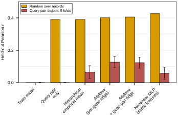

## 2026.09.02 - Query-Pair-Grouped Cross-Validation of the Additive Nulls

One query-pair-disjoint split is a single draw of 68 held-out query doubles, and
the same model scored 0.135 on that split's validation part and 0.174 on its test
part. This script replaces the single draw with five folds grouped on the Kuzmin
query double: every fold holds out a disjoint set of query pairs, the ridge
penalty is chosen on an inner validation set of held-out query pairs drawn from
the fold's training groups, and B5 early-stops on that same inner set. The same
folds serve every baseline, so the comparison between models is paired.

Outputs `results/query_pair_disjoint_cv.csv` (one row per fold, model, and seed),
`results/query_pair_disjoint_cv_summary.json`, and the comparison panel below,
which puts the published random-over-records test Pearson from
[[experiments.010-kuzmin-tmi.scripts.additive_baseline_gene_interaction]] beside
the fold mean with its standard deviation.



Findings and interpretation:
[[experiments.010-kuzmin-tmi.additive-baseline-analysis]]

## 2026.09.09 - Panel Restyled to the Repo Figure Standard

Series colors now follow palette order (random split orange, disjoint folds
red), the legend is framed, and the rcParams come from
`torchcell.utils.apply_paper_style`. A `--plot-only` flag redraws the panel from
the CSV without refitting the five folds:

```bash
python experiments/010-kuzmin-tmi/scripts/query_pair_disjoint_cv.py --plot-only
```
