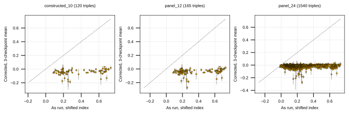

## 2026.09.02 - Rescoring the construction panel under the correct gene index

### Why this was needed

The panel-12 and panel-24 selections came from `inference_3`, whose gene indices
were wrong in two independent ways. Strain construction had already started on 10
of those genes, so the question was not which genes to pick but which triples
among the picked genes the model actually favors.

### The two defects, both confirmed

**1. A uniform 28-position index shift.** The checkpoint's embedding table has
6,607 rows, read straight from the checkpoint
(`model.gene_embedding.weight` is `(6607, 180)`), and the eval config pins
`gene_num: 6607`. The `inference_2` and `inference_3` dataset builds logged
`Genome gene set size: 6579`. The 28 genes present in the 6,607 set and absent
from the 6,579 set are the mitochondrial ORFs `Q0010` through `Q0297`, which
occupy sorted positions 0 through 27. Every one of the 6,579 shared genes shifts
by exactly 28 and not one keeps its index.

Decisive test, run against the validated direct-scoring path: two independent
384-triple samples per run, taken at different file offsets.

| run | map A, 6,607 genes | map B, 6,579 genes |
|---|---|---|
| `inference_1` head | **r = 0.999998**, mean abs diff 2.8e-05 | r = 0.115 |
| `inference_1` mid | **r = 0.999999**, mean abs diff 1.8e-05 | r = -0.252 |
| `inference_3` head | r = 0.074 | **r = 0.999999**, mean abs diff 2.1e-05 |
| `inference_3` mid | r = -0.003 | **r = 0.999998**, mean abs diff 1.6e-05 |

Each run is exactly reproducible under one map and only one. The residual is the
runs' half-precision autocast. `inference_1` is correct; `inference_2` and
`inference_3` are not.

**2. Triples silently scored as doubles and singles.** The triple generator drew
candidate genes from `SmfCostanzo2016Dataset`, which was never intersected with
the model's gene space. `Perturbation.process` builds indices with a set
comprehension over the cell graph's node list, so a gene with no node contributes
no index and the record simply has fewer perturbations. No error is raised.

Of the 432 distinct stored panel triples: 160 had all three genes indexable, 266
had two, and 6 had one. They carry only 220 distinct prediction values. The
collapse is visible without running anything:

```
YIL174W   + YKL033W-A + YPL081W  ->  0.711426
YJL017W   + YKL033W-A + YPL081W  ->  0.711426
YKL033W-A + YLR312C-B + YPL081W  ->  0.711426
```

Three different triples, one value, because all three of `YIL174W`, `YJL017W` and
`YLR312C-B` have no index and each triple collapsed to the double
`{YKL033W-A, YPL081W}`.

### The five unindexable panel genes

`SCerevisiaeGenome.resolve_gene_name` splits them cleanly.

| panel name | status | outcome |
|---|---|---|
| `YJL017W` | renamed, alias of `YJL016W` | scoreable under the current name |
| `YKL200C` | renamed, alias of `YKL201C` | scoreable under the current name |
| `YLR312C-B` | renamed, alias of `YLR313C` | scoreable, and this one is **constructed** |
| `YIL174W` | R64 pseudogene, not a gene feature | no embedding row, never scoreable |
| `YLL017W` | R64 pseudogene, not a gene feature | no embedding row, never scoreable |

The three renamed genes were only ever a stale-name problem. The two pseudogenes
should not have been deletion candidates.

### Corrected ranking

All triples over the scoreable panel genes, scored with all three checkpoints
under the 6,607 index space. Three checkpoints rather than one because two
training runs share only 0.39 to 0.47 of their top 100.

| panel | triples | corrected vs as-run Pearson | top-10 overlap |
|---|---|---|---|
| constructed_10 | 120 | +0.227 | 4/10 |
| panel_12 | 165 | +0.239 | 2/10 |
| panel_24 | 1540 | +0.121 | 0/10 |

The magnitudes moved as much as the order. As-run values for the selected
triples ran 0.18 to 0.73; corrected values over the same triples run about
-0.13 to +0.03. The inflated as-run values were mostly doubles.

Best corrected triple over the constructed 10 is `YER079W+YGL087C+YLL012W` at
+0.0317, and its 0.0035 spread across checkpoints is unusually tight. Most other
triples have a checkpoint spread comparable to their mean, so the ordering below
the top few is not resolved by three checkpoints.

### What this means for construction

Of the 31 triples the set-cover plan enables, only 2 fall in the corrected top 10
and the median corrected rank is 49 of 120. The doubles already built are not
wasted, since they are a function of the gene panel rather than of the ranking,
but the triples to prioritize change.

### Caveat that does not go away with a rerun

These corrected numbers come from checkpoints trained on the random-over-records
split, which measures screen identity more than trigenic biology: refitting the
additive null on a query-pair-disjoint split drops it from 0.400 to 0.127 +/-
0.033. The corrected ranking is the model's honest output. Whether this model
ranks unseen triples well is a separate question and is not established.


