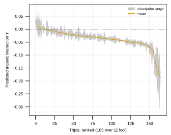
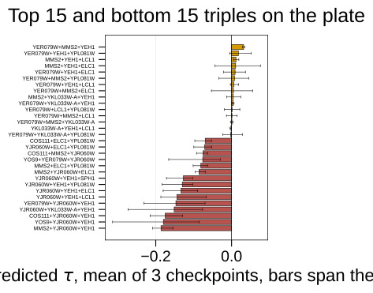
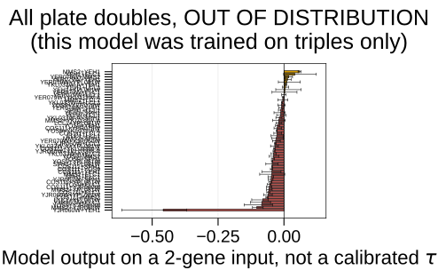

## 2026.09.02 - Rescoring the plate the bench is actually running

### Two things to fix before the model can say anything

**The plate carries one locus twice.** The Echo transfer report for the 2026-07-21
plating run lists 12 strain labels besides BY4741 and blanks:

```
COS111  ELC1  LCL1  MMS2  SPH1  YEH1
YER079W  YJR060W  YKL033W-A  YLR312C-B  YOS9  YPL081W
```

`YLR312C-B` and `SPH1` are separate wells, and R64 records them as one gene:

```
YLR313C  gene  chrXII 760750..762342 (-)
  gene:  ['SPH1']
  Alias: ['SPH1', 'YLR312C-B']
  dbxref: ['SGD:S000004305']
  orf_classification: ['Verified']
```

Twelve labels are eleven distinct loci. This needs checking at the bench: either
the same deletion is present twice under two names, or one of the two wells is a
different strain than its label says.

**The predictions the panel was chosen from are invalid.** They came from
`inference_3`, which had a uniform 28-position gene index shift and silently
scored triples containing an unindexable gene as doubles. See
[[experiments.010-kuzmin-tmi.scripts.rescore_panel_triples_corrected]].

### The rerun

All 165 triples over the 11 loci, scored with all three checkpoints under the
6,607-gene index space the checkpoints were trained on. Three checkpoints rather
than one because two training runs share only 0.39 to 0.47 of their top 100.

The predictions are small. Every triple falls within about -0.19 to +0.03,
against a training-label standard deviation of 0.063, so the model puts nothing
on this plate far from the mean.

Top of the ranking, mean over three checkpoints with the spread across them:

| rank | triple | mean | sd | checkpoints agree on sign |
|---|---|---|---|---|
| 1 | YER079W+MMS2+YEH1 | +0.0317 | 0.0035 | yes |
| 2 | YER079W+YEH1+YPL081W | +0.0179 | 0.0303 | no |
| 3 | MMS2+YEH1+LCL1 | +0.0116 | 0.0072 | yes |
| 4 | MMS2+YEH1+ELC1 | +0.0108 | 0.0607 | no |
| 5 | YER079W+YEH1+ELC1 | +0.0093 | 0.0291 | no |

The three checkpoints agree on the SIGN of the interaction for 133 of 165 triples
(81 percent). Among the positive triples the ranking is not resolved: only ranks
1, 3 and 10 have all three checkpoints on the same side of zero, and several
have a checkpoint spread larger than their own mean.

The negative end is better separated and is dominated by CBF1 (`YJR060W`). The
most negative triples are `MMS2+YJR060W+YEH1` (-0.19), `YOS9+YJR060W+YEH1`,
`COS111+YJR060W+YEH1` and `YJR060W+YKL033W-A+YEH1`.





### Doubles are out of distribution

The 010 model was trained on 3-perturbation records only. A 2-perturbation input
is outside its training distribution and its output there is not a calibrated
tau. The doubles are written to the CSV with `in_training_distribution = False`
and plotted with that warning in the title, for diagnosis rather than for
selection.

This is also the explanation for the inflated numbers the panel was chosen on.
The collapsed triples in `inference_3` scored around 0.71, more than ten times
the label's own standard deviation, because they were being scored as doubles.



### What this does and does not establish

It establishes what the model says about this plate, computed correctly.

It does not establish that the model is right. These checkpoints trained on a
split that is random over records, and the Kuzmin screen crosses one query double
against an array, so triples sharing a query double are not independent draws:
the tau formula reuses the same two single-mutant fitness values and the same two
measured digenic profiles for every array gene of that query. On a
query-pair-disjoint split the additive null falls from 0.400 to 0.127 +/- 0.033.
The transformer has not been retrained on that split, so its accuracy on genuinely
novel combinations is unmeasured in either direction.
