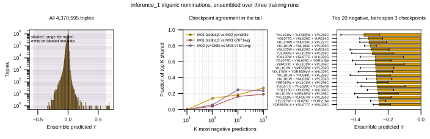

## 2026.09.03 - inference_1 is valid, and its top triples are not reproducible across training runs

`inference_2` and `inference_3` are invalid for two compounding reasons, written up
in [[010-index-defect|notes-tex/010-index-defect]]. `inference_1` was reported as
unaffected by both. This re-derives that rather than taking it on trust, then reads
the nominations the run actually makes.

Script: `experiments/010-kuzmin-tmi/scripts/review_inference_1_top_triples.py`.
It reads the three stored prediction files under
`$DATA_ROOT/data/torchcell/experiments/010-kuzmin-tmi/inference_1/inferred/`,
4,370,595 triples scored by each of the three checkpoints.

### Both defect checks pass

**Defect two, collapsed triples.** Every distinct gene name in the space is resolved
through the shared reconciler and checked against the model's gene set. All 526
resolve, none needs alias resolution, so no name was dropped and no triple was
silently scored as a double. That is the direct test, since a shortened index list
is what produced the 266 collapsed combinations on the panel.

**Defect one, the shifted index.** A fresh random sample of 3,000 stored triples was
re-scored through the validated direct path. Under the 6,607-gene genome map it
reproduces the stored predictions at Pearson 0.9999983, maximum absolute difference
3.2e-4, which is the runs' half-precision autocast. The 6,579-gene build map can no
longer be tested at all: the guard added after the defect refuses it, raising rather
than scoring the wrong genes. The refusal is recorded as the outcome.

So the `inference_1` predictions are the model's answer for the genes they name.

### The tail is not reproducible, and this is worse than on the test split

| pair | Pearson, all 4.37M | top 10 | top 100 | top 1,000 | top 10,000 |
|---|---|---|---|---|---|
| M01 vs M02 | 0.531 | 0.00 | 0.14 | 0.185 | 0.269 |
| M01 vs M03 | 0.500 | 0.00 | 0.04 | 0.164 | 0.193 |
| M02 vs M03 | 0.544 | 0.00 | 0.06 | 0.248 | 0.236 |

No two checkpoints share a single triple in their ten most negative predictions.
On the labeled 37,673-record test split the same comparison gives 0.10 to 0.30 at
K = 10 and 0.39 to 0.47 at K = 100, so agreement in the design space is roughly a
third of what it is on held-out labels. **Hypothesis (untested):** the gap is a
quantile effect, since the top 100 of 4.37M is a far more extreme order statistic
than the top 100 of 37,673. Separating that from a genuine architecture instability
would need the same K-over-N ratio measured on both.

The practical consequence is that a selection taken from one checkpoint's tail is
not the model's opinion. Ranking here is the mean of all three.

### The nominations

Top 200 negative by ensemble mean, spanning -0.347 to -0.177 against a
training-label standard deviation of 0.0633. All three checkpoints agree on sign for
200 of 200, which is the one strong property of this list. The median spread across
the three checkpoints is 0.0694, larger than the label standard deviation itself and
a median 33 percent of the nomination's own magnitude, so the ordering within the
list carries much less information than the membership of it.

Two structural cautions on the list:

- **One gene carries the tail.** `YHL029C` appears in 4,402 of the 10,000 most
  negative triples and in 110 of the top 200. Only 113 distinct genes appear in the
  top 200 of a 526-gene space.
- **44 of the top 200 contain a gene with zero trigenic training labels.** Every such
  gene has a trained embedding row, since the graph penalty reached all 6,607 rows,
  but no trigenic label ever involved it.

Positives were checked for completeness and behave differently. The top 50 positive
predictions run to +0.690, with across-checkpoint spreads of 0.024 to 0.062 and sign
agreement on 46 of 50, so they are more reproducible than the negatives. They carry
no retrieval validation: the published Kuzmin call is one-sided negative, and the
measured retrieval result covers negatives only.

### Calibration, and a correction

An earlier reading of this suspected the extreme nominations were outside the range
the model produces on labeled data. They are not. Averaged over three checkpoints the
test-split predictions span -0.576 to +0.631, against -0.347 to +0.690 here, and only
7 triples of 4,370,595 fall outside the test range. The nominations sit inside the
model's demonstrated output range.

What the comparison does show is that the `inference_1` prediction distribution is
narrower than the test one, standard deviation 0.0139 against 0.0350. The filters that
built this space kept viable, healthy triples, so it holds less of the strong-effect
mass the test split contains.

### What this supports

Reviewing and ensembling the `inference_1` nominations is defensible. Reading a single
checkpoint's top ten is not, and neither is treating the within-list ordering as
meaningful.

The unresolved question is the same one everything else in 010 is waiting on. These
checkpoints trained on a split that is random over records, so a query double seen in
training also appears in validation and test. On that split the additive null reaches
0.400 and drops to 0.127 plus or minus 0.033 once query pairs are disjoint. Whether
the transformer's margin survives is not measured, in either direction, and
`inference_1` combinations whose query double was never screened are exactly the case
that measurement would cover.

### Outputs

- `experiments/010-kuzmin-tmi/results/inference_1_validity.json`
- `experiments/010-kuzmin-tmi/results/inference_1_checkpoint_agreement.csv`
- `experiments/010-kuzmin-tmi/results/inference_1_top_triples.csv`
- `experiments/010-kuzmin-tmi/results/inference_1_gene_frequency.csv`
