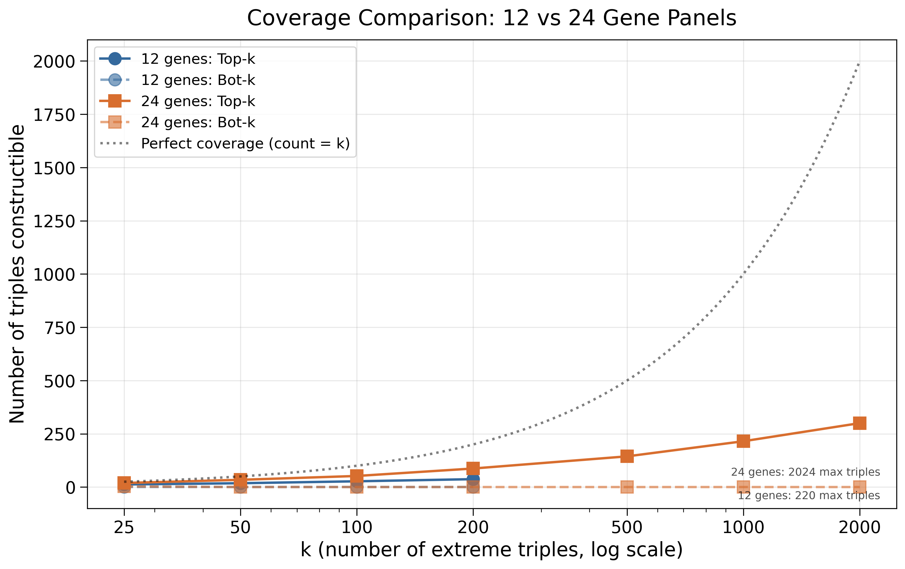
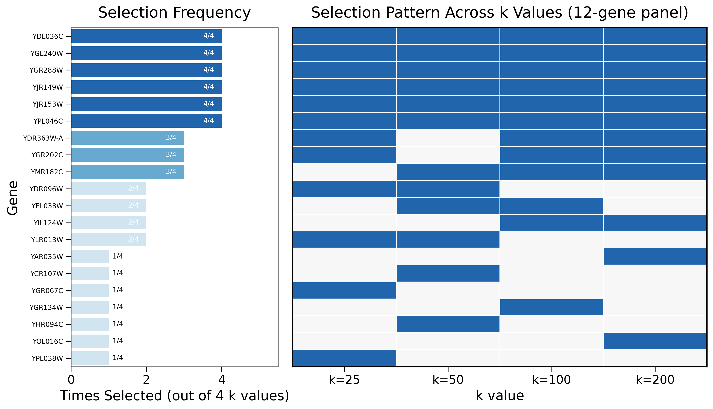
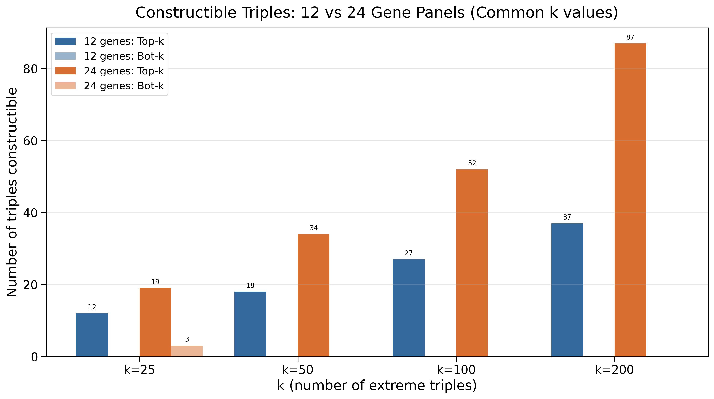
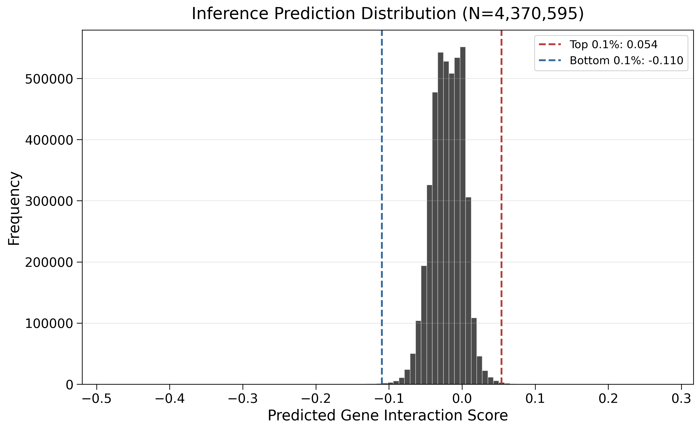
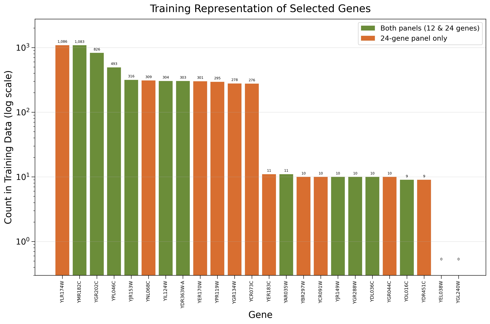
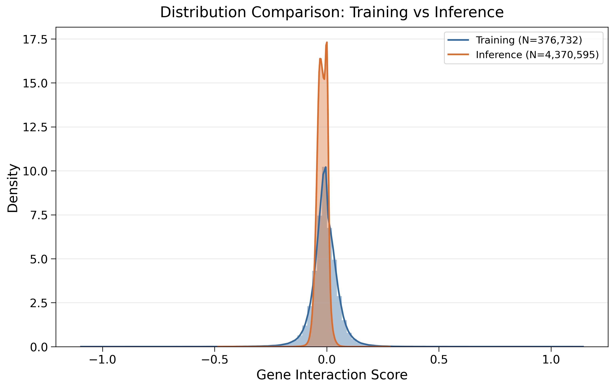

## Overview

Selects optimal gene panels (12 or 24 genes) for wetlab strain construction by maximizing coverage of extreme triple interactions predicted by the best CellGraphTransformer model (Pearson=0.4619).

## Data Source

**Inference predictions from best model:**

```
$DATA_ROOT/data/torchcell/experiments/010-kuzmin-tmi/inference_1/inferred/models-checkpoints-compute-3-3-2036902_bd9e6c666ea1c0e7d1bbb6321fbc4d3bd5f60f100d6dc0e0288cd97e366fc15e-c7671wgj-best-pearson-epoch=24-val-gene_interaction-Pearson=0.4619.parquet
```

**Model checkpoint:**

```
$DATA_ROOT/models/checkpoints/compute-3-3-2036902_bd9e6c666ea1c0e7d1bbb6321fbc4d3bd5f60f100d6dc0e0288cd97e366fc15e/c7671wgj-best-pearson-epoch=24-val/gene_interaction/Pearson=0.4619.ckpt
```

- Model: CellGraphTransformer with graph regularization (010-kuzmin-tmi experiment)
- Trained on: IGB cluster (compute-3-3-2036902)
- Validation Pearson: 0.4619 at epoch 24
- Contains predictions for all ~37M possible triple gene interactions

## Algorithm

1. Load inference predictions from best model checkpoint
2. For each `panel_size` in {12, 24} and `k` in {25, 50, 100, 200, ...}:
   - Extract top-k and bottom-k extreme triples
   - Greedy gene selection maximizing top-k coverage
   - Local swap refinement
   - Report coverage statistics
3. Generate visualizations comparing 12 vs 24 gene panels

### Design Space

- **12 genes**: C(12,3) = 220 possible triples (constrained regime)
- **24 genes**: C(24,3) = 2024 possible triples (expansive regime)

## Outputs

### CSV Results

| File                                   | Description                                                         |
|----------------------------------------|---------------------------------------------------------------------|
| `gene_selection_results.csv`           | Summary of selected genes per panel and k-value with coverage stats |
| `gene_representation_training.csv`     | How often each selected gene appears in training data               |
| `gene_representation_009_deletion.csv` | How often each selected gene appears in deletion-only dataset       |

### Parquet Results

| File                                                              | Description                                                     |
|-------------------------------------------------------------------|-----------------------------------------------------------------|
| `constructible_triples_panel{12,24}_k{25,50,100,200,...}.parquet` | Constructible triples within each panel at various k thresholds |

## Visualizations

### Coverage Comparison (12 vs 24 Panels)

Shows how coverage scales with k-value for both panel sizes.



### Gene Stability Across k Values

Shows which genes are consistently selected across different k thresholds.

**12-Gene Panel:**


**24-Gene Panel:**


### Coverage Bar Charts

Combined view of top-k coverage for both panels.



Extended k values (24-panel only):


### Prediction Distribution

Distribution of model predictions for all triples.



### Gene Representation Analysis

How well-represented are selected genes in the data?

**Training Dataset (010):**


**Deletion Dataset (009):**


### Distribution Comparison

Comparing prediction distributions between training and inference data.



## Related Scripts

- [[select_12_experimental_table_reference|experiments.010-kuzmin-tmi.scripts.select_12_experimental_table_reference]] - Generates experimental reference tables
- [[select_12_k200_tables_hist|experiments.010-kuzmin-tmi.scripts.select_12_k200_tables_hist]] - Generates k=200 tables and histograms
- [[inferred_triple_interaction_histogram_from_gene_selection|experiments.010-kuzmin-tmi.scripts.inferred_triple_interaction_histogram_from_gene_selection]] - Visualizes inferred triple interactions
