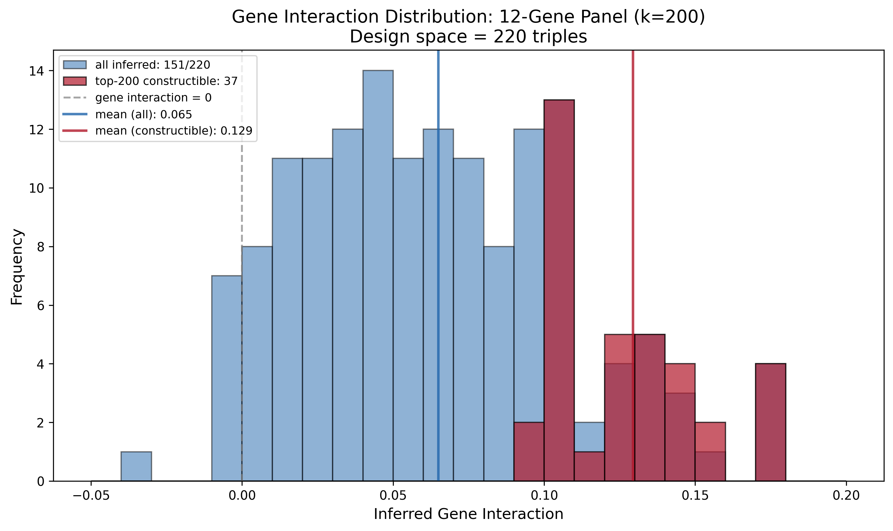

## Overview

Generates wetlab-ready tables and overlay histogram for the 12-gene panel at k=200. This is the primary output for guiding strain construction prioritization.

## Design Space

| Panel Size | Possible Triples | Possible Doubles | Formula |
|------------|------------------|------------------|---------|
| 12 genes   | **220**          | 66               | C(12,3) and C(12,2) |

The 220 triples represent ALL possible triple mutant strains constructible from the selected 12-gene panel. This is the complete experimental design space for wetlab work.

## Outputs

### Table 1: Singles (`singles_table_panel12_k200.csv`)

Lists the 12 single gene deletion strains needed as starting material.

| Column      | Description                        |
|-------------|------------------------------------|
| `index`     | 1-12 numbering                     |
| `gene`      | Systematic gene name (e.g., YGR288W) |
| `mutant_type` | Always "single"                  |

### Table 2: Doubles (`doubles_table_panel12_k200.csv`)

**66 double mutant pairs** (C(12,2)) sorted by how many top-k triples they enable.

| Column                       | Description                                              |
|------------------------------|----------------------------------------------------------|
| `rank`                       | Priority rank for construction                           |
| `gene1`, `gene2`             | Gene pair                                                |
| `enables_triple_in_top_k`    | How many TOP-K triples contain this pair                 |
| `cumulative_triples_in_top_k`| If building in order, how many top-k triples are reachable |
| `triples_enabled`            | Total panel triples containing this pair                 |
| `max_possible`               | Maximum possible (n-2 = 10)                              |

**Key insight**: Build doubles in rank order to maximize coverage of extreme triples efficiently.

### Table 3: Triples (`triples_table_panel12_k200.csv`)

All 220 panel triples (that have inferred predictions) sorted by predicted gene interaction.

| Column                      | Description                    |
|-----------------------------|--------------------------------|
| `rank`                      | Rank by prediction (1 = most extreme) |
| `gene1`, `gene2`, `gene3`   | Triple genes                   |
| `inferred_gene_interaction` | Model prediction value         |

### Overlay Histogram

Compares the distribution of ALL 220 panel triples (what you *could* build) vs. the subset that overlap with the top-k most extreme predictions from the full ~37M inference space (what you *should* prioritize).

- **Blue**: All 220 panel triples (C(12,3) = complete design space)
- **Red**: Top-k constructible triples (extreme predictions from ~37M AND constructible from panel)
- **Vertical lines**: Means of each distribution

**Interpretation**: The red distribution is shifted toward extremes because those triples were specifically selected to maximize coverage of the most positive/negative predictions. The blue shows what a "random" selection from the panel would look like.

## Dependencies

- Requires `gene_selection_results.csv` from [[select_12_and_24_genes_top_triples|experiments.010-kuzmin-tmi.scripts.select_12_and_24_genes_top_triples]]
- Requires `top_k_constructible_panel12_k200.csv` for overlay histogram
- Requires inference parquet file with Pearson=0.4619 predictions

## Related Scripts

- [[select_12_and_24_genes_top_triples|experiments.010-kuzmin-tmi.scripts.select_12_and_24_genes_top_triples]] - Main gene selection algorithm
- [[select_12_experimental_table_reference|experiments.010-kuzmin-tmi.scripts.select_12_experimental_table_reference]] - Adds Sameith overlap and detailed annotations
