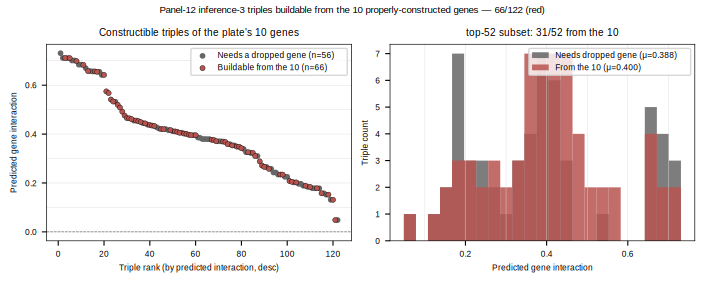
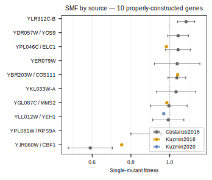
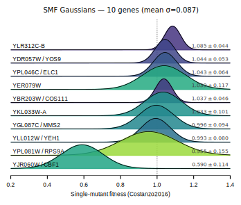
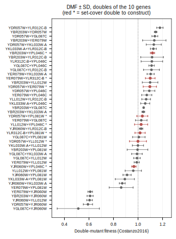

## 2026.07.17 - Top-k Triples Buildable From the 10 Properly-Constructed Genes

Script: `experiments/010-kuzmin-tmi/scripts/topk_triples_from_constructed_10.py`
Reference figure: [[experiments.010-kuzmin-tmi.scripts.investigate_YLR313C_smf_and_interactions]]
(`plot_predictions` — same rank-vs-prediction scatter + histogram, recolored here).

### Question

The wet-lab plate (exp-019) kept **10** of the inference_3 panel-12 genes and swapped
out two — **YIL174W** and **LCL2/YLR104W** — for SPH1/YLR313C and LCL1/YPL056C. Of the
model's ranked constructible triples, how many can still be built from just those 10
**properly-constructed** genes (RED) versus how many need one of the two dropped genes
(GRAY)?

The 10 genes: YBR203W, YDR057W, YER079W, YGL087C, YJR060W, YKL033W-A, YLL012W,
YLR312C-B, YPL046C, YPL081W. (= inference_3 panel-12 minus YIL174W and YLR104W.)

### Result

| set | total | buildable from the 10 (red) | needs a dropped gene (gray) |
|-----|------:|----------------------------:|----------------------------:|
| all ranked constructible (`triples_table_panel12_k200.csv`) | 122 | **66** | 56 (YIL174W 38, YLR104W 26) |
| top-52 constructible (`top_k_constructible_panel12_k200.csv`) | 52 | **31** | 21 (YIL174W 13, YLR104W 10) |

**Just over half survive the swap, and the red triples span the whole ranking —
including the very top.** So dropping YIL174W and LCL2 does not gut the high-scoring
triples: 66/122 (and 31/52 of the top-k) remain buildable from the plate's 10 genes,
with the red and gray predicted-interaction distributions nearly identical
(μ 0.400 vs 0.388). The 56 lost triples are gated mostly by YIL174W (38), less by
YLR104W (26). This is the constructibility picture *before* accounting for the two
added genes (SPH1/YLR313C, LCL1/YPL056C), which have no model predictions yet.

Colors from the repo `torchcell.utils.PLOT_PALETTE` (red `#B85450` = buildable from
the 10; gray `#666666` = needs a dropped gene).

### Optimized doubles for the 10 (set-cover)

Same greedy minimum set-cover as [[experiments.010-kuzmin-tmi.scripts.optimized_doubles_setcover]],
but restricted to the **31 within-10 top-k triples** above.
Script: `experiments/010-kuzmin-tmi/scripts/optimized_doubles_setcover_constructed_10.py`;
data: `results/optimized_doubles_setcover_constructed_10.csv`.

**8 doubles** build all 31 constructible triples of the 10 genes — **82% fewer** than the
full C(10,2)=45, and 3 fewer than the 11-double cover of the original 12-gene panel (the
two dropped genes took their doubles with them). Genes ordered `gene1 < gene2`.

| rank | double (ORF) | double (gene) | # triples enabled |
|-----:|--------------|---------------|:-----------------:|
| 1 | YBR203W + YPL046C | COS111 + ELC1 | 5 |
| 2 | YDR057W + YER079W | YOS9 + YER079W | 5 |
| 3 | YDR057W + YLL012W | YOS9 + YEH1 | 5 |
| 4 | YER079W + YLR312C-B | YER079W + YLR312C-B | 5 |
| 5 | YLL012W + YPL046C | YEH1 + ELC1 | 5 |
| 6 | YJR060W + YPL046C | CBF1 + ELC1 | 4 |
| 7 | YDR057W + YPL081W | YOS9 + RPS9A | 3 |
| 8 | YLR312C-B + YPL081W | YLR312C-B + RPS9A | 3 |

Hubs: **YPL046C/ELC1** (3 of 8 doubles) and **YDR057W/YOS9** (3 of 8) carry the cover.
These 8 double-KOs are the buildable-now analog of the original 11 — construct these
(plus the 10 singles) to reach every high-ranking triple that survives the plate's swap.
Caveat: this ignores the two added genes (SPH1/YLR313C, LCL1/YPL056C), which have no model
predictions; a full plate-panel cover needs inference re-run on those.

Related: [[experiments.010-kuzmin-tmi.scripts.optimized_doubles_setcover]],
[[experiments.010-kuzmin-tmi.scripts.validation_panel_smf_reference]].

## 2026.07.18 - Figure set + double-mutant fitness reference for the 10

Characterization figures for the 10 properly-constructed genes, plus a published
double-mutant fitness (DMF) reference so constructed doubles can be compared.

### SMF figure set

Script: `experiments/010-kuzmin-tmi/scripts/constructed_10_smf_figures.py`
(source `results/inference_3/singles_table_panel12_k200_queried.csv`, filtered to the 10).
Costanzo fitness range 0.590–1.085, mean σ = 0.087.

**Forest — SMF by source (Costanzo2016 / Kuzmin2018 / Kuzmin2020), fitness ± SD:**

**Ridgeline — Costanzo Gaussians on a shared axis, ordered by mean, colored by σ:**

Only **CBF1/YJR060W** (0.590) is a real defect; the other 9 sit near WT=1.0.
RPS9A/YPL081W is the widest (σ=0.155). Colors from `torchcell.utils.PLOT_PALETTE`.

### Double-mutant fitness reference (compare against constructed doubles)

Script: `experiments/010-kuzmin-tmi/scripts/constructed_10_dmf_reference.py`
Data:   `results/constructed_10_dmf_costanzo_kuzmin.csv`
(source `results/inference_3/doubles_table_panel12_k200_queried.csv`, filtered to the 10).

Published DMF ± SD (+ digenic interaction ε + p-value) for **all 45 doubles** among the
10 genes — Costanzo2016 covers **44/45** (Kuzmin2018 4, Kuzmin2020 2). The CSV flags the
**8 set-cover doubles to construct** (`is_optimized_double`), so each wet-lab double has a
reference fitness to compare against on build. Forest below orders doubles by Costanzo DMF;
red `*` = the 8 to construct.

The low-fitness doubles all contain **CBF1/YJR060W** (its single defect dominates the pair);
the highest is YDR057W+YLR312C-B (~1.18). The 8 construction doubles span ~0.97–1.12 — near
neutral, as expected since their singles are near-WT — so any measured departure on
construction is the signal to watch.

### Triple-predictions figure

The triple-predictions (highlighted) figure for the 10 is the one above in the 2026.07.17
section (`topk_triples_from_constructed_10.svg`); it completes the set.
