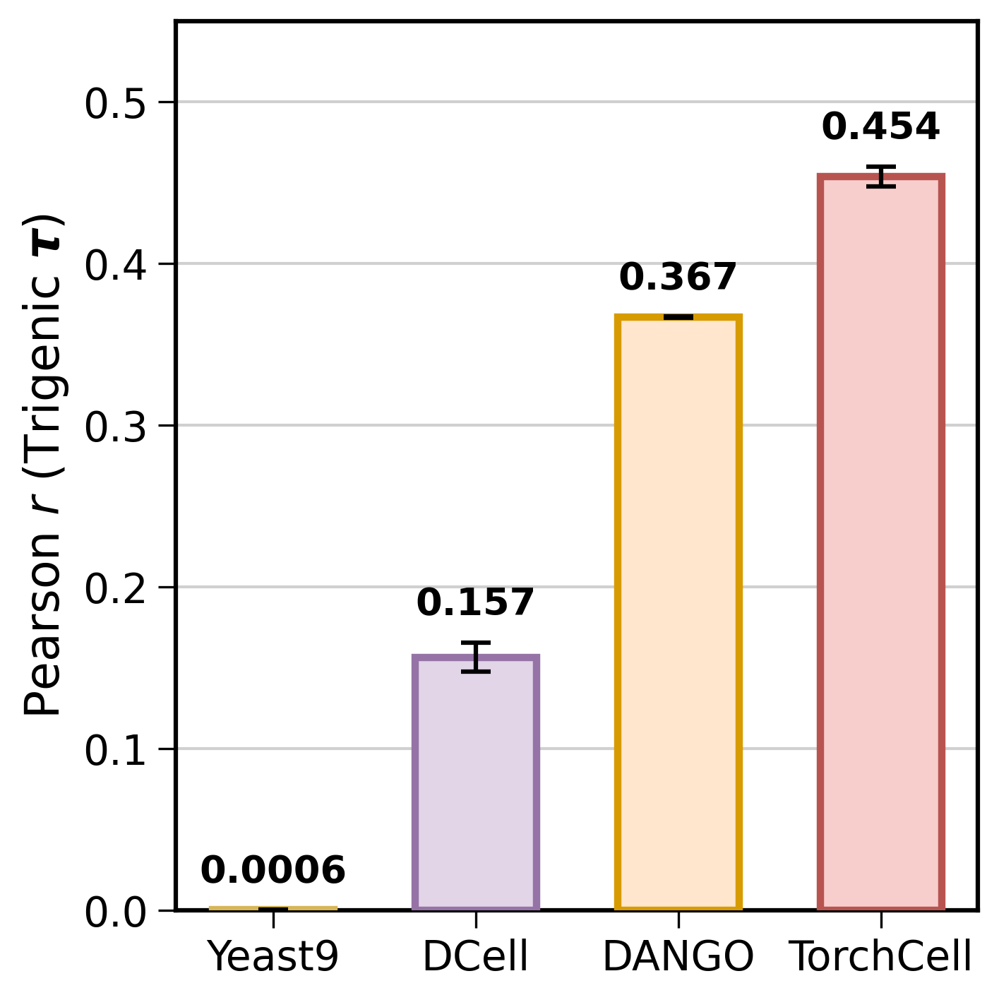
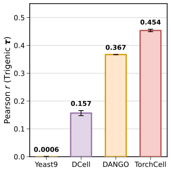

Source data and provenance for the trigenic τ model-comparison bar chart produced by `experiments/010-kuzmin-tmi/scripts/trigenic_tau_model_comparison.py`.



## 2026.04.11 - Source Data

Ours TorchCell Graph Regularized Transformer

| Val Pearson | Val Spearman |
| :--- | :--- |
| $\mathbf{0.454} \pm \mathbf{0.006}$ | $\mathbf{0.421} \pm \mathbf{0.004}$ |

Dango Repro Best (3 replicates)

```text
0.36759
0.36708
0.36637
```

DCell - use the val pearson shown (3 replicates)

```text
0.17321017384529114
0.1550033837556839
0.14192065596580505
```

GEM (Yeast9) fitness pearson - deterministic modeling, so no SE

```text
Pearson r = 0.0006
```

## 2026.06.04 - Error-Bar Provenance (which whiskers are real)

Caveat recorded after auditing `trigenic_tau_model_comparison.py`. The four error bars are **not all the same statistical quantity**, so be careful when presenting them side by side.

| Model | Mean | Error bar | Underlying data | Error type |
| :--- | :--- | :--- | :--- | :--- |
| Yeast9 | 0.0006 | 0.0 | single deterministic value | legitimately zero (no replicates by nature) |
| DCell | 0.157 | ≈ 0.009 | 3 real replicate Pearson values | **SEM** = `std(ddof=1)/√3` (computed) |
| DANGO | 0.367 | ≈ 0.0004 | 3 real replicate Pearson values | **SEM** = `std(ddof=1)/√3` (computed) |
| TorchCell | 0.454 | 0.006 | reported `0.454 ± 0.006`; **no raw replicates** | **reported SE, hardcoded** |

Key points:

- **None of the error bars are dummy placeholders** — every value is grounded in data. The Yeast9 zero is real (a deterministic FBA model has nothing to average over).
- **DCell and DANGO** are genuine: three replicate Pearson values each, with a properly computed SEM.
- **TorchCell** has no raw replicate array in the source — only the reported `0.454 ± 0.006`. The script *reconstructs* a synthetic 3-element array (`mean+SE, mean, mean−SE`) purely so the bar height renders at 0.454, then **hardcodes** the error to the reported `0.006`. The reconstructed array must not be treated as raw data.
- **Methodological inconsistency to resolve before external use:** DCell/DANGO whiskers are **SEM**, while TorchCell's is a **reported SE** taken at face value. If that reported `± 0.006` is itself a SEM over the TorchCell replicates, the comparison is apples-to-apples; if it is an SD, TorchCell's whisker is ~√3× too large relative to the other two. Confirm what the TorchCell `± 0.006` represents (trace it back to the training run) before publishing.
- The same statistics appear in the SIMB conference abstract ([[conference.simb-2026.abstract]]) — keep the two in sync.

## 2026.07.21 - Error-Bar Provenance RESOLVED (WS14): all four bars are now SEM

The blocker above is resolved. Traced the CGT `± 0.006` to its origin and made every error bar the **same** statistic (SEM), computed the same way DANGO/DCell already were.

**What the CGT `0.454 ± 0.006` actually was.** The CGT (010 "All") model has **three real replicate Pearson values** read from the wandb scatter plots of the runs tagged `inf_1`, documented in [[experiments.010-kuzmin-tmi.performance-diff-010-009]]:

```text
0.462
0.452
0.447
```

Mean = 0.45367 (≈ 0.454). Auditing the reported `± 0.006` against these three values shows it is the **population standard deviation** `np.std(ddof=0)` = 0.00624 ≈ 0.006 — NOT a SEM, and not even the sample SD. (Same finding for the companion stats: Spearman `0.421 ± 0.004` and MSE `3.222 ± 0.042` in that note are also population SDs of the three replicates.) So CGT was never missing replicates — it had three all along; the plot's earlier synthetic reconstruction (`mean±SE, mean, mean−SE`) was an unnecessary hack, and `± 0.006` was a *different statistic* than DANGO/DCell's SEM.

**Fix applied in `trigenic_tau_model_comparison.py`.** Replaced the synthetic CGT array with the three real replicate Pearson values and compute every error bar uniformly as `SEM = std(ddof=1)/√n`. No hardcoded error remains. Yeast9 stays a legitimately-zero single deterministic value.

| Model | Mean | Error bar (SEM) | Underlying data | Error type |
| :--- | :--- | :--- | :--- | :--- |
| Yeast9 | 0.0006 | 0.0 | single deterministic FBA value | legitimately zero (no replicates by nature) |
| DCell | 0.157 | 0.0091 | 3 real replicate Pearson values | **SEM** = `std(ddof=1)/√3` |
| DANGO | 0.367 | 0.0004 | 3 real replicate Pearson values | **SEM** = `std(ddof=1)/√3` |
| TorchCell | 0.454 | 0.0044 | 3 real replicate Pearson values (wandb `inf_1`) | **SEM** = `std(ddof=1)/√3` (was pop-SD 0.006) |

**Net change to reported numbers:** only the CGT whisker moves, `± 0.006 (pop-SD)` → `± 0.004 (SEM)`; all four means are unchanged (CGT rounds to 0.454 as before). The abstract Pearson line and this note are updated to `0.454 ± 0.004`. For internal consistency the CGT Spearman whisker in the abstract also moves to its SEM, `0.421 ± 0.004 (pop-SD)` → `0.421 ± 0.003 (SEM)`. Script emits both `.png` and `.svg`.


