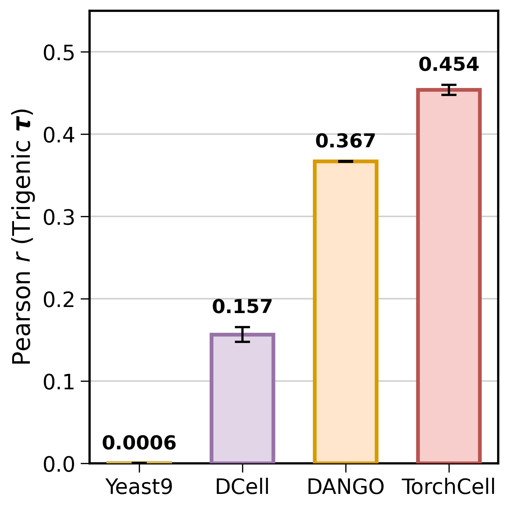
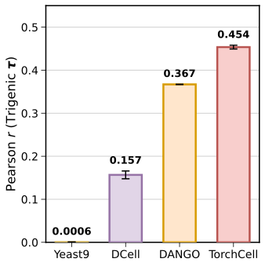

Source data and provenance for the trigenic τ model-comparison bar chart produced by `experiments/010-kuzmin-tmi/scripts/trigenic_tau_model_comparison.py`.



## 2026.04.11 - Source Data

Ours TorchCell Graph Regularized Transformer

| Val Pearson | Val Spearman |
| :--- | :--- |
| $\mathbf{0.454} \pm \mathbf{0.006}$ | $\mathbf{0.421} \pm \mathbf{0.004}$ |

Dango Repro Best (3 replicates)

```text
0.36759
0.36708
0.36637
```

DCell - use the val pearson shown (3 replicates)

```text
0.17321017384529114
0.1550033837556839
0.14192065596580505
```

GEM (Yeast9) fitness pearson - deterministic modeling, so no SE

```text
Pearson r = 0.0006
```

## 2026.06.04 - Error-Bar Provenance (which whiskers are real)

Caveat recorded after auditing `trigenic_tau_model_comparison.py`. The four error bars are **not all the same statistical quantity**, so be careful when presenting them side by side.

| Model | Mean | Error bar | Underlying data | Error type |
| :--- | :--- | :--- | :--- | :--- |
| Yeast9 | 0.0006 | 0.0 | single deterministic value | legitimately zero (no replicates by nature) |
| DCell | 0.157 | ≈ 0.009 | 3 real replicate Pearson values | **SEM** = `std(ddof=1)/√3` (computed) |
| DANGO | 0.367 | ≈ 0.0004 | 3 real replicate Pearson values | **SEM** = `std(ddof=1)/√3` (computed) |
| TorchCell | 0.454 | 0.006 | reported `0.454 ± 0.006`; **no raw replicates** | **reported SE, hardcoded** |

Key points:

- **None of the error bars are dummy placeholders** — every value is grounded in data. The Yeast9 zero is real (a deterministic FBA model has nothing to average over).
- **DCell and DANGO** are genuine: three replicate Pearson values each, with a properly computed SEM.
- **TorchCell** has no raw replicate array in the source — only the reported `0.454 ± 0.006`. The script *reconstructs* a synthetic 3-element array (`mean+SE, mean, mean−SE`) purely so the bar height renders at 0.454, then **hardcodes** the error to the reported `0.006`. The reconstructed array must not be treated as raw data.
- **Methodological inconsistency to resolve before external use:** DCell/DANGO whiskers are **SEM**, while TorchCell's is a **reported SE** taken at face value. If that reported `± 0.006` is itself a SEM over the TorchCell replicates, the comparison is apples-to-apples; if it is an SD, TorchCell's whisker is ~√3× too large relative to the other two. Confirm what the TorchCell `± 0.006` represents (trace it back to the training run) before publishing.
- The same statistics appear in the SIMB conference abstract ([[conference.simb-2026.abstract]]) — keep the two in sync.

## 2026.07.21 - Error-Bar Provenance RESOLVED (WS14): all four bars are now SEM

The blocker above is resolved. Traced the CGT `± 0.006` to its origin and made every error bar the **same** statistic (SEM), computed the same way DANGO/DCell already were.

**What the CGT `0.454 ± 0.006` actually was.** The CGT (010 "All") model has **three real replicate Pearson values** read from the wandb scatter plots of the runs tagged `inf_1`, documented in [[experiments.010-kuzmin-tmi.performance-diff-010-009]]:

```text
0.462
0.452
0.447
```

Mean = 0.45367 (≈ 0.454). Auditing the reported `± 0.006` against these three values shows it is the **population standard deviation** `np.std(ddof=0)` = 0.00624 ≈ 0.006 — NOT a SEM, and not even the sample SD. (Same finding for the companion stats: Spearman `0.421 ± 0.004` and MSE `3.222 ± 0.042` in that note are also population SDs of the three replicates.) So CGT was never missing replicates — it had three all along; the plot's earlier synthetic reconstruction (`mean±SE, mean, mean−SE`) was an unnecessary hack, and `± 0.006` was a *different statistic* than DANGO/DCell's SEM.

**Fix applied in `trigenic_tau_model_comparison.py`.** Replaced the synthetic CGT array with the three real replicate Pearson values and compute every error bar uniformly as `SEM = std(ddof=1)/√n`. No hardcoded error remains. Yeast9 stays a legitimately-zero single deterministic value.

| Model | Mean | Error bar (SEM) | Underlying data | Error type |
| :--- | :--- | :--- | :--- | :--- |
| Yeast9 | 0.0006 | 0.0 | single deterministic FBA value | legitimately zero (no replicates by nature) |
| DCell | 0.157 | 0.0091 | 3 real replicate Pearson values | **SEM** = `std(ddof=1)/√3` |
| DANGO | 0.367 | 0.0004 | 3 real replicate Pearson values | **SEM** = `std(ddof=1)/√3` |
| TorchCell | 0.454 | 0.0044 | 3 real replicate Pearson values (wandb `inf_1`) | **SEM** = `std(ddof=1)/√3` (was pop-SD 0.006) |

**Net change to reported numbers:** only the CGT whisker moves, `± 0.006 (pop-SD)` → `± 0.004 (SEM)`; all four means are unchanged (CGT rounds to 0.454 as before). The abstract Pearson line and this note are updated to `0.454 ± 0.004`. For internal consistency the CGT Spearman whisker in the abstract also moves to its SEM, `0.421 ± 0.004 (pop-SD)` → `0.421 ± 0.003 (SEM)`. Script emits both `.png` and `.svg`.



## 2026.09.03 - The TorchCell and DANGO bars are measured on different datasets

Checked after the claim came up that we outperform DANGO. We do, on a like-for-like
comparison that exists, but it is not the comparison this figure makes and the
margin is about half the one the figure shows.

### What the two bars actually are

`torchcell_vals = [0.462, 0.452, 0.447]` are the validation Pearson of the three
010 checkpoints, measured on the **010 build**. `dango_vals = [0.36759, 0.36708,
0.36637]` are max-over-epochs validation Pearson of DANGO runs in the
**006 project**, measured on the **006 build**. Two of the three match wandb runs
`014mprap` and `x3savllr` to five decimals; the third, 0.36637, did not match any
006 DANGO run and its nearest siblings are 0.36583 and 0.36518.

The two builds are not the same data. Their Cypher queries differ, verified by
diff: 006 restricts the Kuzmin2020 arm to `perturbation_type = 'deletion'` and
admits a record if ANY perturbation is in the gene set, while 010 requires ALL
perturbations to be in it.

| build | records | train / val / test |
|---|---|---|
| 006 | 332,313 | 265,851 / 33,231 / 33,231 |
| 010 | 376,732 | 301,386 / 37,673 / 37,673 |

So the figure's 0.454 against 0.367 is a difference across two datasets that
differ by 44,419 records and by which perturbation types are admitted. DANGO was
never trained on the 010 build; no 010 DANGO project exists.

### The like-for-like comparison, which does exist

Inside experiment 006 every model entrypoint reads the same query, the same
dataset root, the same `split_indices` and seed 42. Best validation Pearson over
epochs, full-dataset runs:

| model | best run | best val Pearson |
|---|---|---|
| equivariant cell graph transformer | `rba1ye58` | 0.4186 |
| cell_graph_transformer | `mm0tcs89` | 0.3841 |
| hetero_cell_bipartite_dango_gi | `kjmqbhvn` | 0.3691 |
| DANGO | `014mprap` | 0.3676 |

Like-for-like margin +0.051, against the figure's +0.087. That is one run each
with no replicate spread computed for the 006 transformer arm, so whether +0.051
clears run-to-run noise is not established.

### Four things to record with it

Every number on both sides is a **maximum over epochs**, which is an upward-biased
order statistic whose bias grows with the number of epochs run. The DANGO arms ran
450 to 1,000 epochs and the 006 transformer arms ran 51 to 58, so that bias favors
DANGO rather than us.

The split is the same for both and it is the leaky one: a single random 80/10/10
over records with seed 42. The stratification keys are degenerate here, since every
record carries the same phenotype label and the same perturbation count. On this
split an additive null reaches 0.400 and a model that ignores the third gene
entirely reaches 0.390, so beating DANGO by 0.05 on it is a fair head-to-head
between two models and is not evidence about trigenic biology.

Our DANGO reproduction sits about 0.10 below the roughly 0.47 the DANGO preprint
reports. Nothing in the repo explains the gap. Their number is 5-fold
cross-validated and pooled while ours is a single split, which is a difference in
protocol rather than an explanation of the size.

DANGO has no test-split number anywhere, because `trainer.test` is never called in
either DANGO entrypoint, and no Spearman is logged for it. Both bars in the figure
are validation, so they are at least consistent on that axis.

### Three more mismatches, one of which cuts against us

**The two bars are not the same statistic.** DANGO's three values are the maximum
over a training curve. The TorchCell values are single evaluations of selected
checkpoints, produced by separate evaluation runs. A curve maximum and a
checkpoint evaluation are not interchangeable.

**DANGO's checkpoints were selected on mean squared error, not Pearson.** Both
DANGO entrypoints monitor `val/gene_interaction/MSE`, so the best-Pearson epoch
quoted in the figure is a point on a curve that was never saved as a checkpoint
and cannot be re-evaluated. The 010 transformer saves both a best-MSE and a
best-Pearson checkpoint.

**Three of the four best DANGO 006 runs are in state failed or crashed.** They hit
a 48-hour wall clock, so they are truncated rather than converged. This is the one
caveat that runs against our claim: DANGO may simply be undertrained in our hands,
which would also help explain why our reproduction lands about 0.10 below the
number the preprint reports.

A fourth thing worth knowing: on the 006 build, `hetero_cell_bipartite_dango_gi`
essentially ties DANGO at 0.3691 against 0.3676, so the gap is specific to the
equivariant transformer rather than a property of everything we build.

The 005 and 006 LMDBs were rebuilt on 2025-08-26, after the May to July 2025 runs,
so those runs may have seen a different record count than the ones measured here.

### The cheapest way to make the claim defensible

Train DANGO on the 010 build and evaluate its best-Pearson checkpoint through the
same evaluation path the transformer uses, on runs allowed to converge. Failing
that, report the 006-internal pair, 0.4186 against 0.3676, which is genuinely
like-for-like on data and split, and say that both arms are curve maxima.

### Not changed here

The figure and its numbers are left as they are. Making the comparison
like-for-like is a choice between retraining DANGO on the 010 build, relabeling the
figure to say which dataset each bar comes from, or switching both bars to the 006
pair, and that is a decision about what the paper claims rather than a correction
to a script.
