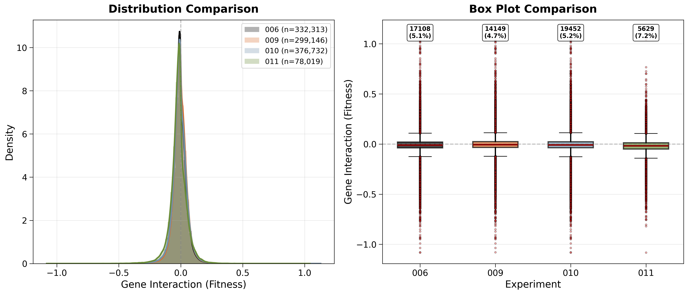
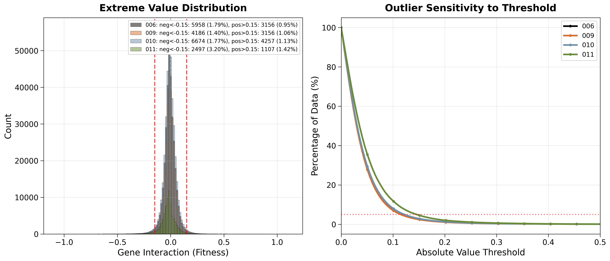

## Overview

Comparative analysis of gene interaction fitness distributions across four kuzmin-tmi experiments to investigate whether performance differences in experiment 010 are due to dataset composition or outlier characteristics.

**Analysis Results**: [Summary Statistics CSV](../experiments/011-kuzmin-tmi/results/query-comparison-006-009-010-011/comparison_statistics_2025-12-15-17-17-19.csv)

## Dataset Composition

- **Experiment 006**: Training baseline with inconsistent filtering (n=332,313)
- **Experiment 009**: All deletions only (n=299,146)
- **Experiment 010**: All perturbation types combined (n=376,732)
- **Experiment 011**: At least one non-deletion perturbation (n=78,019)

### Hypothesis Verification

len(009) + len(011) = 299,146 + 78,019 = 377,165
len(010) = 376,732
Difference = -433 (≈ 0.1% discrepancy)

The hypothesis that experiment 010 is approximately the union of deletion-only (009) and non-deletion (011) datasets is confirmed. The difference is likely do to the deduplication layer after querying.

## Distribution Analysis

### Key Observations

**Distribution Shape (Left Panel)**

- All four experiments show nearly identical distribution shapes centered at 0
- KDE curves overlap almost completely, suggesting similar overall fitness profiles
- No apparent distributional shift between deletion and non-deletion datasets

**Outlier Quantification (Right Panel)**
Using IQR method (Q1 - 1.5×IQR, Q3 + 1.5×IQR):

- Experiment 006: 17,108 outliers (5.1%)
- Experiment 009: 14,149 outliers (4.7%)
- Experiment 010: 19,452 outliers (5.2%)
- Experiment 011: 5,629 outliers (7.2%)

**Critical Finding**: Experiment 011 has the highest outlier percentage (7.2%) despite being the smallest dataset, indicating non-deletion mutations produce more extreme fitness effects.

## Outlier Deep Dive

### Extreme Value Distribution (Left Panel)

Extreme value thresholds at |fitness| > 0.15:

- Experiment 006: 1.79% negative, 0.95% positive
- Experiment 009: 1.40% negative, 1.06% positive
- Experiment 010: 1.77% negative, 1.13% positive
- Experiment 011: 3.20% negative, 1.42% positive

Experiment 011 shows 2.3× more extreme negative values and 1.3× more extreme positive values compared to deletion-only datasets.

### Outlier Sensitivity Analysis (Right Panel)

The sensitivity curves reveal:

- Experiment 011 (green) consistently shows higher outlier percentages across nearly all thresholds
- Divergence begins early at threshold ≈ 0.05 and persists throughout the range
- At threshold 0.15: 011 has ≈4-5% outliers while 006/009/010 have ≈2-3%
- At threshold 0.20: 011 has ≈2-3% outliers while others have ≈1-2%
- The gap between 011 and other datasets maintains or slightly widens at higher thresholds

This consistent elevation across all threshold values indicates that non-deletion mutations have fundamentally different tail behavior, with more extreme values throughout the distribution rather than just at the extremes.

## Conclusions

### Primary Findings

1. **Distribution Similarity**: Overall fitness distributions are remarkably similar across all experiments, suggesting deletion and non-deletion mutations affect fitness in comparable ways on average.

2. **Outlier Enrichment in Non-Deletions**: Experiment 011 contains significantly more extreme outliers (7.2% vs 4.7-5.2%), with particularly elevated negative extreme values (3.20% vs 1.40-1.79%).

3. **Hypothesis Confirmation**: Experiment 010 is compositionally the union of 009 and 011, with only 0.1% discrepancy.

### Implications for Model Performance

The higher Pearson correlation observed in experiment 010 may be influenced by:

**Outlier Leverage Effect**: Pearson correlation is sensitive to extreme values. The additional 78,019 data points from experiment 011, which contain disproportionately more extreme outliers, could artificially inflate correlation metrics through high-leverage points.

**Recommendation**: Evaluate trained models on held-out test sets using Spearman rank correlation in addition to Pearson correlation. Comparing these metrics on test data will reveal if performance gains in experiment 010 reflect genuine predictive improvement or statistical artifacts from extreme values. A large Pearson-Spearman gap would indicate outlier-driven inflation of correlation metrics. Can also do rough comparison on samples train and val spearman to see if there is a noticeable difference.

### Data Characteristics Summary

| Experiment | N       | Outliers (IQR) | Outlier % | Extreme Neg (<-0.15) % | Extreme Pos (>0.15) % |
|------------|---------|----------------|-----------|------------------------|-----------------------|
| 006        | 332,313 | 17,108         | 5.1%      | 1.79%                  | 0.95%                 |
| 009        | 299,146 | 14,149         | 4.7%      | 1.40%                  | 1.06%                 |
| 010        | 376,732 | 19,452         | 5.2%      | 1.77%                  | 1.13%                 |
| 011        | 78,019  | 5,629          | 7.2%      | 3.20%                  | 1.42%                 |
