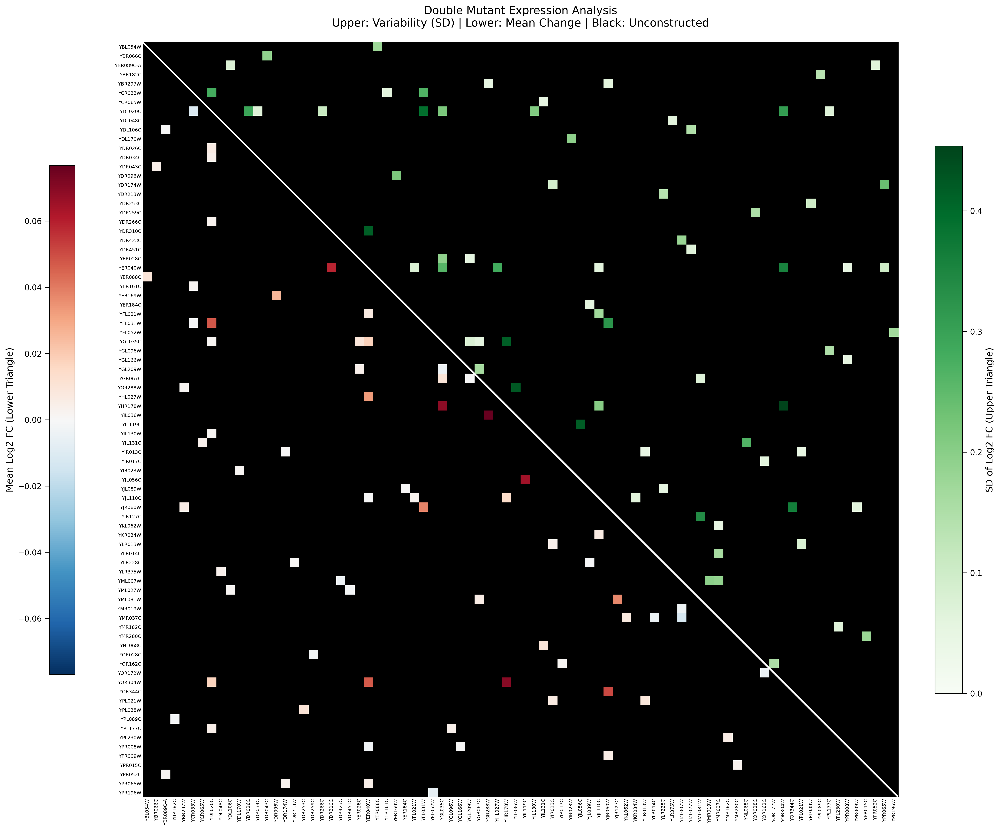

# Combined Double Mutant Heatmap

## Purpose

Creates a single triangular heatmap combining all ~72 GSTF double deletion pairs. Uses triangular matrix layout to show both mean expression changes and standard deviations in one compact visualization.

**Design Philosophy**: Avoid redundancy while maximizing information density.

## Implementation

**Script**: `experiments/012-sameith-kemmeren/scripts/double_mutant_combined_heatmap.py`

**Related Code**:

- [[torchcell.datasets.scerevisiae.sameith2015]] - DmMicroarraySameith2015Dataset

## Visualization Design

### Triangular Layout

```
         Gene1  Gene2  Gene3  Gene4
Gene1    [ SD ] [ SD ] [ SD ] [ SD ]
Gene2           [Mean] [ SD ] [ SD ]
Gene3                  [Mean] [ SD ]
Gene4                         [Mean]
```

- **Upper triangle**: Standard deviation (technical noise)
- **Lower triangle**: Mean log2 expression changes
- **Diagonal**: Self-comparisons (not shown or grayed out)

### Color Scheme

- **Mean** (lower triangle): Red (up), Blue (down), White (no change)
- **Std** (upper triangle): Green gradient from low (white) to high (dark green) variability
  - Changed from Blue to Green to avoid visual confusion with the red-blue diverging colormap

## Outputs

### Images



*Figure: Combined triangular heatmap showing standard deviation (upper triangle) and mean log2 expression changes (lower triangle) for all ~72 GSTF double deletion pairs. Provides at-a-glance view of technical variability and expression patterns across the entire double mutant dataset.*

## Key Findings

- Visual overview of variability across all double mutants
- Identifies high-variance pairs (measurement quality concerns)
- Shows systematic patterns across related GSTF pairs
- More compact than viewing 72 individual heatmaps

## Usage

```bash
python experiments/012-sameith-kemmeren/scripts/double_mutant_combined_heatmap.py
# Or: bash experiments/012-sameith-kemmeren/scripts/012-sameith-kemmeren.sh
```

## Related Notes

- [[experiments.012-sameith-kemmeren.scripts.verify_metadata]] - QC performed first
- [[experiments.012-sameith-kemmeren.scripts.012-sameith-kemmeren]] - Main pipeline
