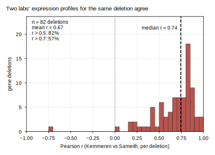
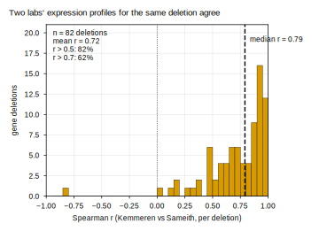

# Gene-by-Gene Expression Profile Correlation

## Purpose

Assesses cross-study reproducibility between Kemmeren2014 and Sameith2015 by correlating full genome-wide expression profiles for 82 overlapping gene deletions.

**Key Question**: Do the same gene deletions produce similar transcriptional responses across independent studies?

**Method**: For each of the 82 overlapping genes:

1. Extract full expression vector (~6K genes) from Kemmeren dataset
2. Extract full expression vector (~6K genes) from Sameith dataset
3. Calculate Pearson and Spearman correlation between vectors
4. Analyze distribution of correlation coefficients

## Implementation

**Script**: `experiments/012-sameith-kemmeren/scripts/gene_by_gene_expression_correlation.py`

**Related Code**:

- [[torchcell.datasets.scerevisiae.kemmeren2014]]
- [[torchcell.datasets.scerevisiae.sameith2015]]
- [[torchcell.datamodels.schema]] - Canonical log2 ratio convention

## Outputs

### Images



*Figure 1: Cross-study expression profile correlation distribution (Pearson), on the #72 sign-fixed Sameith rebuild. Shows **median r = 0.744** with 82% of deletions having r > 0.5, confirming that identical gene deletions produce similar genome-wide transcriptional responses across independent studies. (Numbers refreshed 2026.07.15 after #72; see the dated section below for the full before/after. Bars use repo palette red `#B85450`.)*



*Figure 2: Cross-study expression profile correlation distribution (Spearman). Shows **median r = 0.791**, consistent with the Pearson result — the similarity indicates linear relationships without major rank-order distortion.*

### Data Files

- `results/gene_expression_correlations.csv` - Per-gene Pearson and Spearman correlation coefficients

## Key Findings (Post-Fix)

> **Superseded 2026.07.15 (#72).** The figures above and the current values are on the
> per-array sign-fixed Sameith rebuild: median Pearson r = **0.744**, Spearman **0.791**,
> 82% of deletions r > 0.5. The r = 0.599 values in this section predate the #72 fix (they
> reflect only the earlier 2026-01-06 dye-swap correction) and are kept as the pre-#72
> record. See the 2026.07.15 section at the end of this note for the full before/after.

### GOOD Cross-Study Reproducibility Confirmed

After fixing the sign inversion bug (2026-01-06), the results show **strong biological consistency**:

| Metric                 | Value             | Interpretation                                 |
|------------------------|-------------------|------------------------------------------------|
| **Median Pearson r**   | **+0.599**        | Moderate-to-strong positive correlation        |
| **Median Spearman r**  | **+0.593**        | Consistent with Pearson (linear relationships) |
| **Genes with r > 0.5** | **57.3% (47/82)** | Majority show good reproducibility             |
| **Genes with r > 0.7** | **37.8% (31/82)** | Strong agreement for ~1/3 of genes             |
| **Genes with r < 0**   | **~20%**          | Minority with poor cross-study agreement       |

### Biological Interpretation

**Positive Correlation = Biological Validation**

The positive median correlation confirms:

1. **Sign convention fix was correct**: Both datasets now use canonical log2(sample/reference)
2. **Biological signal is reproducible**: Same deletions → similar transcriptional responses
3. **Technical noise is manageable**: Despite different platforms, biological signal dominates
4. **Datasets are usable together**: Can train models on one, validate on the other (with domain adaptation)

### Variance Explained

Median r = 0.599 is good for cross-platform comparisons, with variance from:

- Platform differences (probe designs, sensitivities)
- Batch effects and biological noise
- Strain drift over time

### Historical Note & Implications

**Sign bug fix (2026-01-06)**: Corrected dye-swap handling in `kemmeren2014.py` flipped correlation from -0.599 to +0.599, confirming biological reproducibility.

**Dataset compatibility**: Kemmeren2014 and Sameith2015 can be integrated with domain adaptation (transfer learning, CORAL/MMD).

## Related Notes

- [[torchcell.datamodels.schema]] - Canonical sign convention documentation
- [[experiments.012-sameith-kemmeren.scripts.verify_metadata]] - QC checks

## Usage

```bash
python experiments/012-sameith-kemmeren/scripts/gene_by_gene_expression_correlation.py
# Or: bash experiments/012-sameith-kemmeren/scripts/012-sameith-kemmeren.sh
```

## 2026.07.15 - Reproduced on the sign-fixed Sameith (#72)

Re-ran on the Sameith rebuild from the per-array dye-orientation fix (#72). "When both
labs delete the same gene, do their genome-wide expression responses agree?" -- now
**yes, clearly**, over the 82 single deletions measured by both:

| statistic | fixed Sameith | buggy Sameith (pre-#72) |
|---|---:|---:|
| Pearson median r | **0.744** | 0.59 |
| Pearson mean r | **0.666** | 0.42 |
| Spearman median r | **0.791** | -- |
| deletions with r > 0.5 | **82%** (67/82) | -- |
| deletions with r > 0.7 | **57%** (47/82) | -- |
| deletions with r > 0 | **98.8%** | -- |

The 24% of Sameith arrays that were sign-flipped had been dragging the cross-lab
correlation down (mean 0.42) and inflating the tail of low/negative r; with the fix the
distribution collapses onto a tight high-positive cluster (one deletion remains negative
at r~-0.75). This both **validates the #72 fix** and is a clean cross-lab reproducibility
result: two independent Holstege-lab-pipeline microarray studies agree on the
transcriptional response to a single deletion.

Figure follows the repo palette + Nature standards (single-hue histogram -- one
distribution; green-free; boxed; Arial 6 pt; `half` panel width; true-size SVG). The
per-deletion numbers are in `experiments/012-sameith-kemmeren/results/gene_expression_correlations.csv`.


