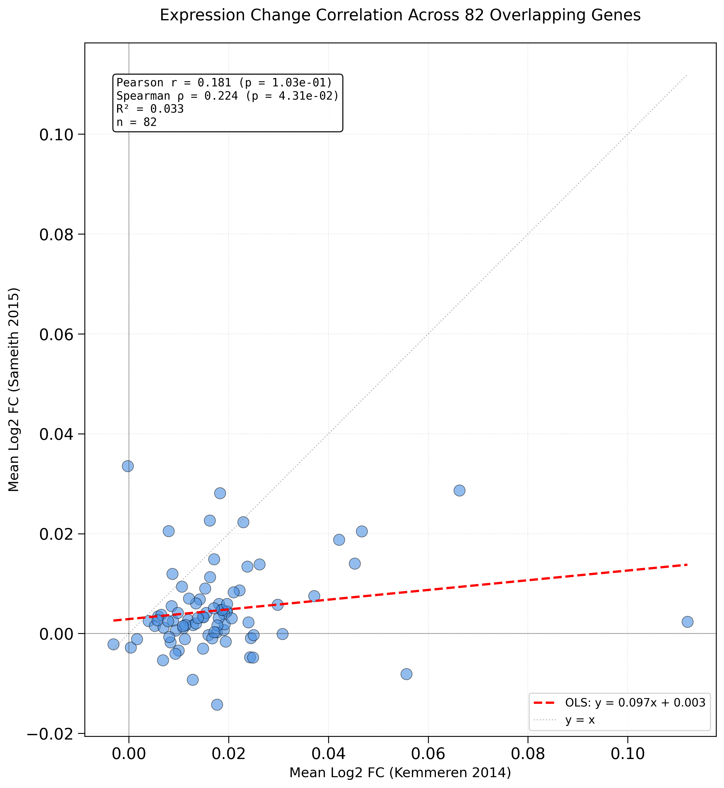
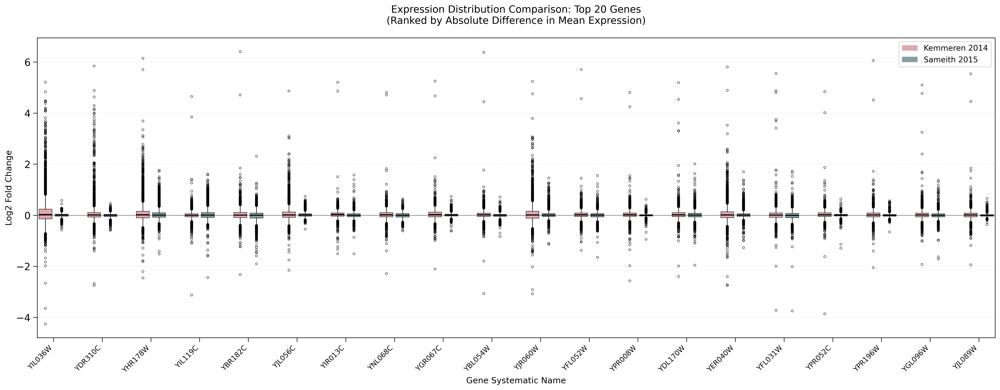

# Mean Expression Overlap Analysis

## Purpose

Compares **mean** log2 expression changes between Kemmeren2014 and Sameith2015 for the 82 overlapping gene deletions. This is a simpler analysis than the gene-by-gene profile correlation.

**Note**: This script analyzes mean expression values, while [[experiments.012-sameith-kemmeren.scripts.gene_by_gene_expression_correlation]] analyzes full expression vectors (~6K genes per deletion).

## Implementation

**Script**: `experiments/012-sameith-kemmeren/scripts/kemmeren_sameith_overlap_analysis.py`

## Methodology

For each of 82 overlapping deletions:

1. Calculate mean log2 expression change across all ~6K genes (Kemmeren)
2. Calculate mean log2 expression change across all ~6K genes (Sameith)
3. Correlate the 82 mean values between studies

## Outputs

### Images



*Figure 1: Scatter plot comparing mean expression changes for 82 overlapping gene deletions between Kemmeren2014 and Sameith2015. Each point represents the mean log2 expression change averaged across all measured genes for one deletion strain.*

**Note**: This mean-based comparison collapses ~6K expression values into single numbers per deletion, losing significant information. The [[Gene-by-Gene Expression Correlation - Experiment 012|experiments.012-sameith-kemmeren.scripts.gene_by_gene_expression_correlation]] analysis preserves full transcriptional profiles and provides a more informative assessment of cross-study reproducibility.



*Figure 2: Side-by-side box plots comparing expression distributions for top genes ranked by absolute difference in mean expression between studies.*

## Key Findings

After the sign inversion fix, mean-based correlation should show **positive** values, though likely lower than the profile-based correlation since mean values collapse information from ~6K genes into single numbers.

The profile-based correlation ([[experiments.012-sameith-kemmeren.scripts.gene_by_gene_expression_correlation]]) is more informative as it preserves the full transcriptional signature.

## Usage

```bash
python experiments/012-sameith-kemmeren/scripts/kemmeren_sameith_overlap_analysis.py
# Or: bash experiments/012-sameith-kemmeren/scripts/012-sameith-kemmeren.sh
```

## Related Notes

- [[experiments.012-sameith-kemmeren.scripts.gene_by_gene_expression_correlation]] - **Preferred analysis** (full profiles)
- [[experiments.012-sameith-kemmeren.scripts.012-sameith-kemmeren]] - Main pipeline
