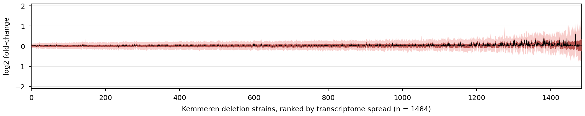
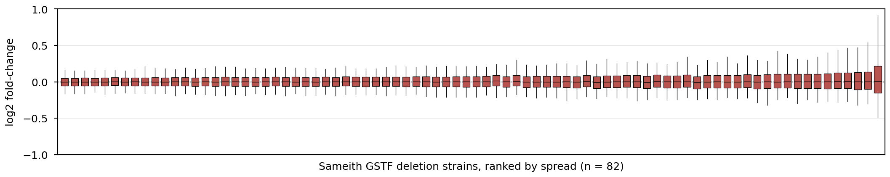

# Single Mutant Expression Distribution Visualizations

## Purpose

Creates box plot visualizations showing the distribution of genome-wide log2 expression changes for each single gene deletion strain. Provides an overview of expression variability across:

- **Kemmeren2014**: ~1,484 deletion mutants
- **Sameith2015**: 82 GSTF deletion mutants

Helps identify:

- Genes whose deletion causes widespread transcriptional changes (high variance)
- Genes with minimal transcriptional impact (low variance)
- Outlier genes with extreme expression changes

## Implementation

**Script**: `experiments/012-sameith-kemmeren/scripts/single_mutant_expression_distributions.py`

**Related Code**:

- [[torchcell.datasets.scerevisiae.kemmeren2014]]
- [[torchcell.datasets.scerevisiae.sameith2015]]

## Visualization

Box plots show log2 expression change distributions per deletion strain:

- **Wide boxes**: Broad transcriptional reprogramming
- **Narrow boxes**: Minimal genome-wide impact
- **Outliers**: Highly specific gene effects

## Outputs

### Images



*Figure 1: Kemmeren 2014 — genome-wide log2 fold-change for 1,484 single deletions, drawn as a **sorted spread band** (1,484 box-per-strain would be 0.12 mm/box at print width, invisible). Strains are ranked by IQR, quiet → disruptive; the dark-red band is the per-strain IQR (Q1–Q3), the light-red band the 5–95% range, the black line the median. Most deletions barely move the transcriptome — pooled, only **12.1%** of gene measurements exceed |log2FC| > 0.25 (2.8% > 0.5, 0.6% > 1.0) — with a disruptive minority in the right tail. Full-width × 35.7 mm true-size panel, palette red.*



*Figure 2: Sameith 2015 — genome-wide log2 fold-change for 82 GSTF deletions, **box-per-strain** (82 boxes survive at ~2.2 mm each), sorted by IQR; boxes = Q1–Q3, whiskers = 5–95%, median black. On the #72 sign-fixed data, pooled **8.4%** of gene measurements exceed |log2FC| > 0.25 (1.8% > 0.5). Same full-width × 35.7 mm true-size panel as Fig 1.*

## Key Findings

- **Kemmeren2014**: Most deletions show median ~0, IQR 0.5-1.0; few global regulators cause broad changes
- **Sameith2015**: Transcription factor deletions show variable impacts despite expected broad effects
- **Cross-study**: Similar distribution shapes and variance after sign inversion fix (±6 log2 FC range)

## Related Notes

- [[experiments.012-sameith-kemmeren.scripts.verify_metadata]] - QC checks performed first
- [[experiments.012-sameith-kemmeren.scripts.gene_by_gene_expression_correlation]] - Cross-study correlation

## Usage

```bash
python experiments/012-sameith-kemmeren/scripts/single_mutant_expression_distributions.py
# Or: bash experiments/012-sameith-kemmeren/scripts/012-sameith-kemmeren.sh
```

## 2026.07.15 - Option A redesign (palette, true-size, #72 data)

Both panels were rebuilt to the repo figure standard (CLAUDE.md "Figure & Plotting
Standards" + [[paper.nature-biotech.figures]]) and regenerated on the **#72 sign-fixed
Sameith**. The Figure 1/2 captions above now describe these panels; the earlier
"average per-strain" annotation and the "IQR 0.5–1.0 / ±6 log2 FC" numbers below are
pre-redesign and superseded (the real per-strain IQRs are ~0.05–0.5 and the range is ±2,
not ±6).

**Why Kemmeren changed chart type (Option A).** 1,484 box-per-strain is 0.12 mm/box at a
179 mm Nature panel — invisible. So Kemmeren becomes a *sorted spread band* (strains ranked
by IQR; median line + IQR band + 5–95% band), which carries the same message at print
width. Sameith (82) keeps box-per-strain, where boxes are still legible (~2.2 mm each).
Both are ranked quiet → disruptive so the spread visibly grows left → right.

**Sizing.** Each panel is a full-width × 35.7 mm true-size strip — the canonical wide-strip
cell of `notes/assets/drawio/figure-sizing-template.drawio.svg` (179.4 mm × 35.7 mm, ~5:1,
matching the old plots' aspect). Width = `PANEL_WIDTHS_MM["full"]`; exported with
`savefig_true_size_svg` so the SVG imports at exactly 179 × 35.7 mm in draw.io (verified:
`width="704.7244" height="140.5512"` draw.io units = 179 × 35.7 mm). Titles and the a/b
panel letters are added at draw.io composition, so the panels are title-free.

**Palette.** Single hue = palette red (`PLOT_PALETTE[1]` `#B85450`), the 012 lead color;
IQR/box = red line color, the 5–95% band = its lighter fill `#F8CECC` (the sanctioned
light/dark pairing), all edges/median/whiskers solid black. Green-free, boxed axes, Arial
6 pt.

**Pooled thresholds** (fraction of all gene measurements beyond each cutoff):

| dataset | >0.25 | >0.5 | >0.75 | >1.0 |
|---|---:|---:|---:|---:|
| Kemmeren (n=1,484) | 12.1% | 2.8% | 1.1% | 0.6% |
| Sameith (n=82) | 8.4% | 1.8% | 0.7% | 0.4% |

Per-strain quantiles + threshold fractions are in
`experiments/012-sameith-kemmeren/results/single_mutant_{kemmeren,sameith}_spread.csv`.

**Gotcha found (repo-wide).** Importing `torchcell.datasets` applies
`torchcell/torchcell.mplstyle`, which sets `savefig.bbox: tight`. That re-crops at save
time and silently defeats `savefig_true_size_svg` — the first pass came out 182 × 38.7 mm
instead of 179 × 35.7 mm. The script now pins `savefig.bbox = None` in its rc block. The
correlation figure ([[experiments.012-sameith-kemmeren.scripts.gene_by_gene_expression_correlation]],
PR #97) has the same latent issue and needs the same one-line fix; the proper fix is
removing `savefig.bbox: tight` from the mplstyle so true-size works by default.
