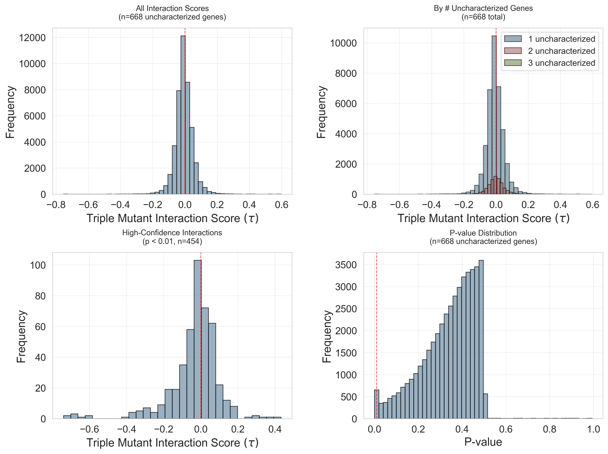
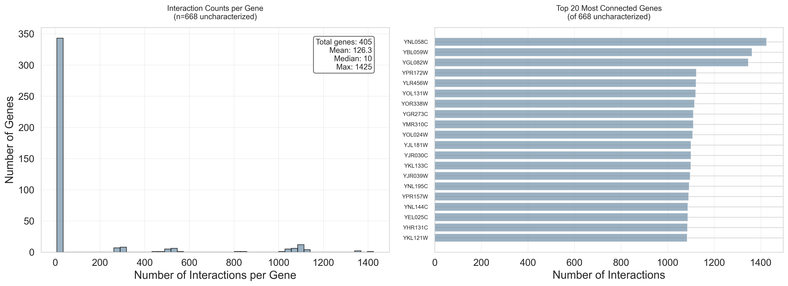

## Overview

Analyzes trigenic (triple mutant) genetic interactions involving uncharacterized genes from the Kuzmin2018 and Kuzmin2020 datasets. Creates comprehensive visualizations of interaction distributions and gene connectivity.

## Data Sources

### Kuzmin2018 TMI Dataset

- **Class**: `TmiKuzmin2018Dataset`
- **Publication**: DOI 10.1126/science.aao1729
- **PubMed**: 29674565
- **Type**: Triple-mutant genetic interactions (trigenic)

### Kuzmin2020 TMI Dataset

- **Class**: `TmiKuzmin2020Dataset`
- **Publication**: DOI 10.1126/science.aaz5667
- **PubMed**: 32586993
- **Type**: Triple-mutant genetic interactions (trigenic)

## Functionality

### Data Loading

1. Loads uncharacterized genes from `results/uncharacterized_genes.json`
2. **Loads existing dataset from experiment 010** (`data/torchcell/experiments/010-kuzmin-tmi/001-small-build`)
   - Does NOT requery the database
   - Uses already-processed trigenic interactions from both Kuzmin 2018 and 2020
3. Iterates through all trigenic interactions

### Interaction Analysis

For each interaction:

- Extracts 3 perturbed genes from genotype
- Gets gene interaction score (ε/τ) and p-value from phenotype
- Counts how many genes are uncharacterized
- Filters to keep only interactions with ≥1 uncharacterized gene

### Visualizations Created

#### 1. Interaction Score Distributions



4-panel figure showing:

- **Top-left**: Distribution of all interaction scores (n=668 uncharacterized genes)
- **Top-right**: Distribution by # uncharacterized genes (1, 2, or 3)
- **Bottom-left**: High-confidence interactions only (p < 0.01)
- **Bottom-right**: P-value distribution

All plots include red dashed line at score=0 to distinguish positive (aggravating) vs negative (alleviating) interactions.

#### 2. Gene Interaction Counts



2-panel figure showing:

- **Left**: Histogram of how many interactions each uncharacterized gene participates in
  - Includes statistics: total genes, mean, median, max
- **Right**: Bar chart of top 20 most connected uncharacterized genes
  - Shows gene IDs and their interaction counts

## Outputs

### CSV Files (in `results/`)

1. **`uncharacterized_triple_interactions.csv`** - Detailed interaction data
   - Columns: dataset, gene_1, gene_2, gene_3, gene_interaction, p_value, num_uncharacterized, uncharacterized_genes

2. **`gene_interaction_counts.csv`** - Gene connectivity data
   - Columns: gene, count (number of interactions)
   - Sorted by count (most connected first)

### PNG Files (in `notes/assets/images/013-uncharacterized-genes/`)

1. `interaction_score_distributions.png` - Distribution plots
2. `gene_interaction_counts.png` - Connectivity plots

Both saved at 300 DPI.

### Console Output

- Summary statistics (total interactions, breakdown by dataset)
- Interaction score statistics (mean, std, min, max, quartiles)
- High-confidence interaction counts (p < 0.01)
- Top 10 strongest positive interactions (highest scores)
- Top 10 strongest negative interactions (lowest scores)

## Interaction Score Interpretation

- **Positive scores (ε/τ > 0)**: Aggravating interactions
  - Triple mutant fitness worse than expected
- **Negative scores (ε/τ < 0)**: Alleviating interactions
  - Triple mutant fitness better than expected
- **Score = 0**: No interaction (multiplicative expectation)
- **p-value < 0.01**: High-confidence interaction

## Usage

```bash
python experiments/013-uncharacterized-genes/scripts/triple_interaction_enrichment_of_uncharacterized_genes.py
```

## Key Metrics Reported

1. Total interactions with uncharacterized genes
2. Breakdown by dataset (2018 vs 2020)
3. Breakdown by # uncharacterized genes (1, 2, or 3)
4. High-confidence interaction count (p < 0.01)
5. Interactions with 2+ uncharacterized genes
6. Interactions with all 3 uncharacterized genes (if any)
7. Number of unique uncharacterized genes in interactions
8. Mean/median interactions per gene

## Implementation Notes

- Uses direct dataset loading (not Neo4j queries)
- Filters for exactly 3 perturbations (trigenic only)
- Handles missing p-values (replaces None with NaN)
- Uses `Counter` for efficient gene interaction counting
- Stable image filenames for version control
- Matplotlib/Seaborn styling: whitegrid, 300 DPI, consistent colors
- Text boxes styled to match correlation plot (white background, gray border)
