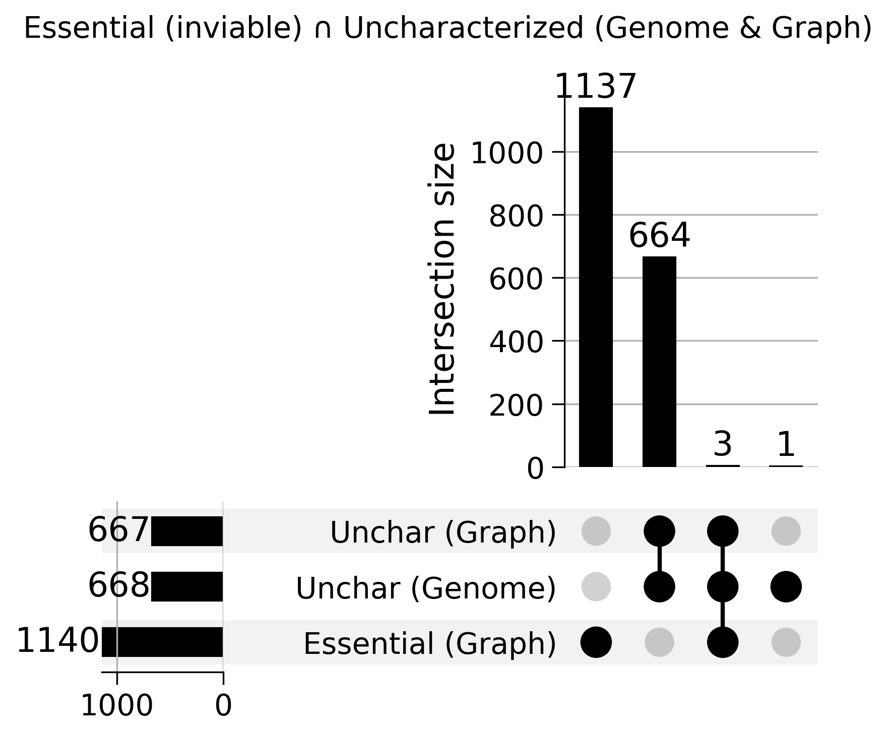

# Uncharacterized Essential Overlap Analysis

## Overview

Script: `experiments/013-uncharacterized-genes/scripts/uncharacterized_essential_overlap.py`

Analyzes the overlap between essential genes (identified by inviable phenotypes) and uncharacterized genes, comparing two data sources: genome annotations (GFF3) and graph data (SGD API).

## Key Findings

### Data Source Agreement

- **Genome uncharacterized**: 668 genes (GFF3 `orf_classification`)
- **Graph uncharacterized**: 667 genes (SGD API `qualifier`)
- **Agreement**: 667 genes (99.85%)
- **Discrepancy**: 1 gene only in genome (YCR016W)

### Essential ∩ Uncharacterized

Found **3 genes** that are both essential and uncharacterized:

1. **YEL035C**: False positive for essentiality - deletion overlapped HYP2 TATA box
2. **YIL102C-A**: Regulatory subunit of DPM synthase
3. **YNL181W**: Putative oxidoreductase required for cell viability

### Source Discrepancy

**YCR016W** is marked as:

- **Genome**: Uncharacterized
- **Graph**: Verified (RNA-binding ribosome assembly factor)

This represents a recent annotation update in the SGD API that hasn't been reflected in the GFF3 file yet.

## Visualizations

### UpSet Plot

Shows intersection of:

- Essential (Graph): 1,140 genes with inviable phenotypes
- Unchar (Genome): 668 genes from GFF3
- Unchar (Graph): 667 genes from SGD API

The left-side bars clearly show the 1-gene discrepancy (668 vs 667), and the intersection patterns reveal that 667 genes are agreed upon by both sources.

## Output Files

### Data

- `essential_uncharacterized_analysis.json`: All statistics
- `essential_uncharacterized_gene_sets.json`: Gene lists for all sets
- `essential_uncharacterized_summary.csv`: Summary table

### Images

- `upset_essential_uncharacterized_all.png`: Main UpSet plot

## Biological Insights

The small overlap (3 genes, 0.26% of essential genes) between essential and uncharacterized genes suggests:

1. **Most essential genes are well-characterized** - their critical functions have been studied
2. **YEL035C case study** - demonstrates importance of careful deletion design
3. **Annotation lag** - GFF3 files update slower than SGD API (YCR016W example)

## Technical Details

### Essential Gene Detection

Uses same logic as `torchcell/datasets/scerevisiae/sgd.py:171-179`:

- Null mutant phenotype
- S288C strain
- "inviable" phenotype classification

### Data Sources

1. **Genome** (GFF3): `torchcell/sequence/genome/scerevisiae/s288c.py:204`
2. **Graph** (SGD API): `torchcell/graph/graph.py` node attributes
