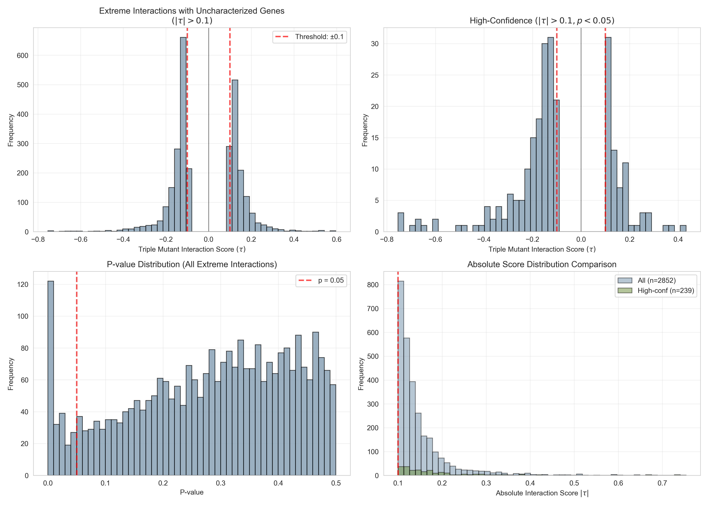
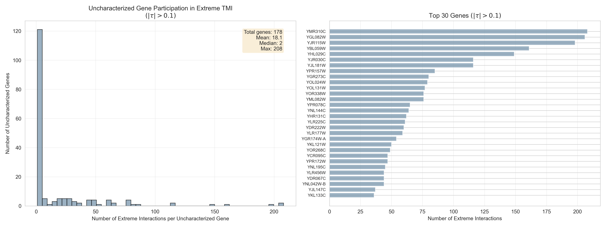
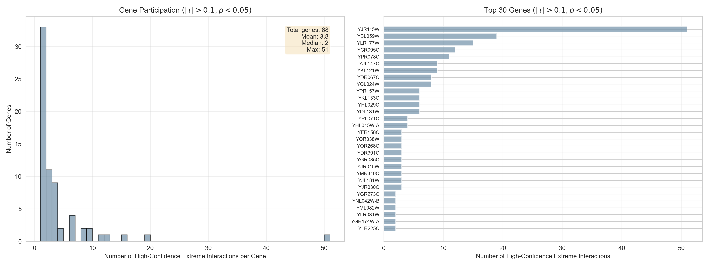
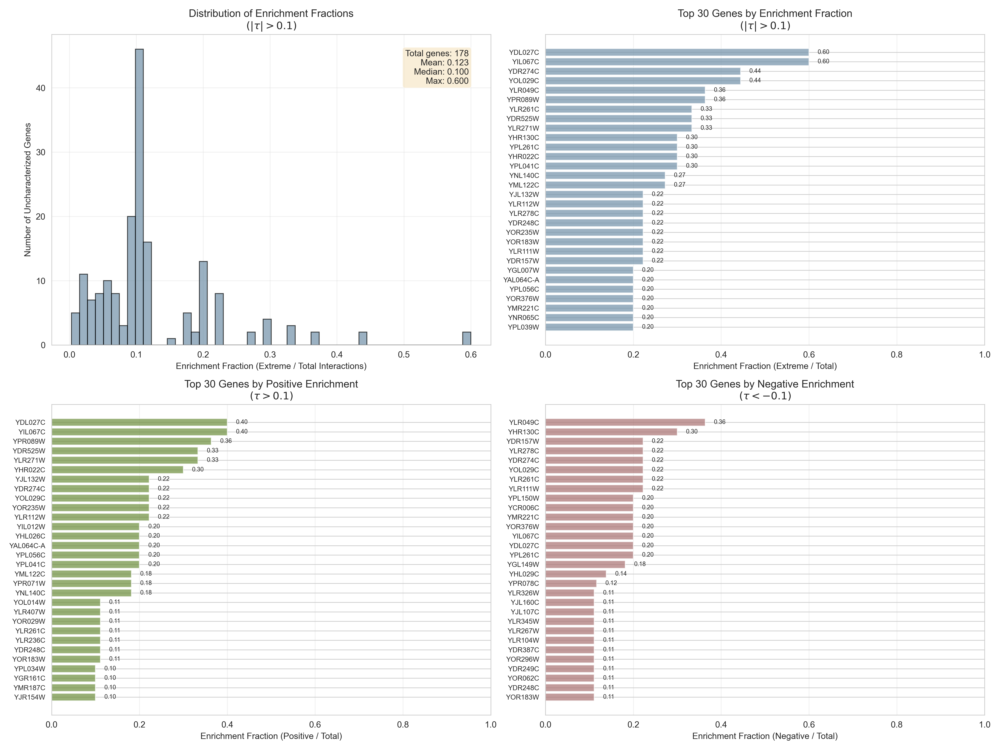

## Overview

Visualization script that creates plots from pre-computed extreme TMI interaction results. Generates 4 multi-panel figures showing interaction distributions, gene participation, and enrichment patterns.

## Purpose

**This is the fast step** - loads CSVs and creates plots in seconds. Can be re-run many times to iterate on visualization styling without recomputing the expensive dataset analysis.

## Input Data

Loads pre-computed CSVs from: `experiments/014-genes-enriched-at-extreme-tmi/results/`

1. `uncharacterized_extreme_interactions_all.csv` (2,852 interactions)
2. `uncharacterized_extreme_interactions_high_conf.csv` (239 interactions)
3. `uncharacterized_gene_counts_all.csv` (178 genes)
4. `uncharacterized_gene_counts_high_conf.csv` (68 genes)
5. `uncharacterized_enrichment_fractions_all.csv` (178 genes)
6. `uncharacterized_enrichment_fractions_high_conf.csv` (68 genes, optional)

## Visualizations Created

All images saved to: `notes/assets/images/014-genes-enriched-at-extreme-tmi/`

### Figure 1: Extreme Interaction Score Distributions

**File:** `extreme_interaction_distributions.png`



**4-panel layout:**

1. **Top-left:** All extreme interactions histogram
   - Distribution of τ scores for |τ| > 0.1
   - Red dashed lines at ±0.1 (thresholds)
   - Black line at 0 (separates positive/negative)

2. **Top-right:** High-confidence subset
   - Same as left but filtered for p < 0.05
   - Shows statistical significance distribution

3. **Bottom-left:** P-value distribution
   - Histogram of p-values for all extreme interactions
   - Red dashed line at p = 0.05

4. **Bottom-right:** Absolute score comparison
   - Overlaid histograms: all (blue) vs high-conf (green)
   - Shows |τ| distribution for both criteria

### Figure 2: Gene Enrichment - All Criterion

**File:** `gene_enrichment_all_criterion.png`



**2-panel layout:**

1. **Left:** Histogram of participation counts
   - How many extreme interactions per uncharacterized gene
   - Statistics box: total, mean, median, max

2. **Right:** Top 30 genes (horizontal bar chart)
   - Genes sorted by number of extreme interactions
   - Shows which uncharacterized genes are most connected

### Figure 3: Gene Enrichment - High-Confidence Criterion

**File:** `gene_enrichment_high_conf_criterion.png`



**2-panel layout** (same structure as Figure 2 but for p < 0.05 subset)

1. **Left:** Histogram for high-confidence interactions only
2. **Right:** Top 30 genes by high-confidence extreme interactions

### Figure 4: Enrichment Fractions with Positive/Negative Split

**File:** `gene_enrichment_fractions.png`



**4-panel layout:**

1. **Top-left:** Overall enrichment fraction distribution
   - Histogram of (extreme / total) for all uncharacterized genes
   - Shows what fraction of each gene's interactions are extreme

2. **Top-right:** Top 30 genes by overall enrichment
   - Horizontal bar chart with enrichment fractions
   - X-axis capped at [0.0, 1.0]
   - Labels show exact fractions

3. **Bottom-left:** Top 30 genes by positive enrichment (τ > 0.1)
   - Green bars
   - Shows genes enriched in **aggravating** interactions

4. **Bottom-right:** Top 30 genes by negative enrichment (τ < -0.1)
   - Red bars
   - Shows genes enriched in **alleviating** interactions

## Key Insights from Visualizations

### Interaction Distribution

- Most extreme interactions have moderate scores (0.1 < |τ| < 0.3)
- High-confidence subset is smaller but shows similar distribution
- P-values widely distributed (not all extreme interactions are significant)

### Gene Participation

- 178 uncharacterized genes participate in extreme interactions
- Highly skewed: few genes have many interactions, most have few
- Top gene (YMR310C) has 208 extreme interactions

### Enrichment Patterns

- Some genes are specifically enriched in extreme interactions
- Enrichment fractions vary widely (0.0 to 1.0)
- **Directional enrichment:** Some genes preferentially show positive (aggravating) or negative (alleviating) extremes

## Usage

```bash
# Run visualization (fast - just loads CSVs and plots)
python experiments/014-genes-enriched-at-extreme-tmi/scripts/visualize_extreme_interactions.py

# Or use convenience script
bash experiments/014-genes-enriched-at-extreme-tmi/scripts/run_visualization_only.sh
```

## Implementation Notes

### Styling

- Uses torchcell.mplstyle colors: `CUSTOM_BLUE (#7191A9)`, `CUSTOM_GREEN (#6B8D3A)`, red (#A97171)
- Seaborn whitegrid style
- 300 DPI for publication quality
- Consistent font sizes (8pt for gene labels, 7pt for bar labels)

### Mathematical Notation

- Uses LaTeX notation: $\tau$ for interaction score, $|\tau|$ for absolute value
- Raw strings (r"...") for proper LaTeX rendering in matplotlib

### No Timestamps

- Image filenames are **stable** (no timestamps)
- Allows version control tracking of visualization changes
- Files overwrite on each run

### Enrichment Calculation

- **Positive enrichment:** Count interactions where τ > 0.1
- **Negative enrichment:** Count interactions where τ < -0.1
- Merges with total counts from enrichment_df for fraction calculation

## Related Scripts

- **Data processing:** `analyze_extreme_interactions.py` (must run first to generate CSVs)
- **Master script:** `014-genes-enriched-at-extreme-tmi.sh` (runs both in sequence)
