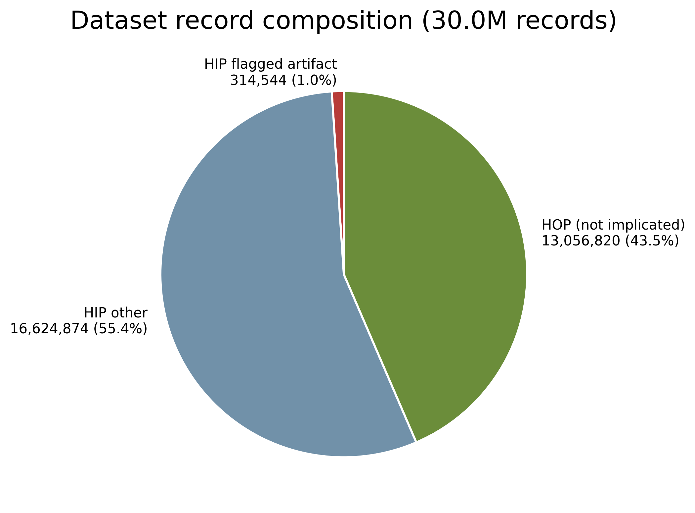
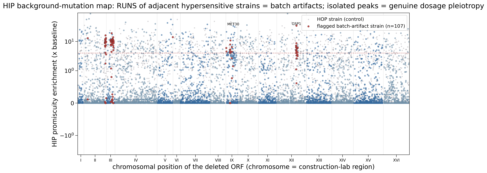
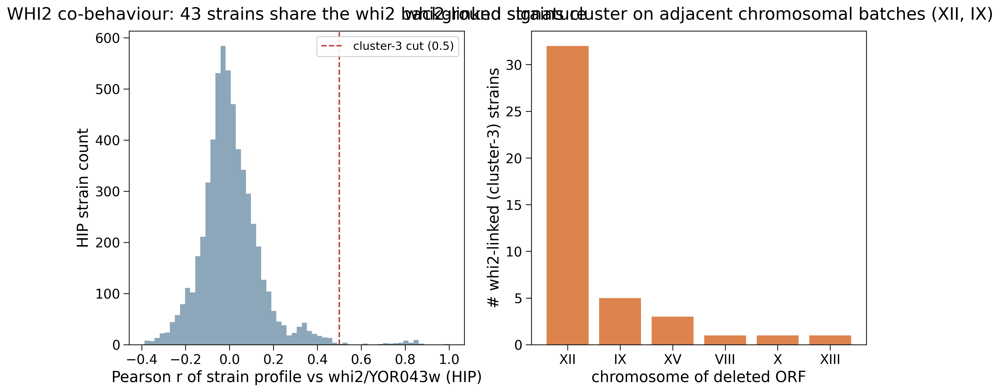
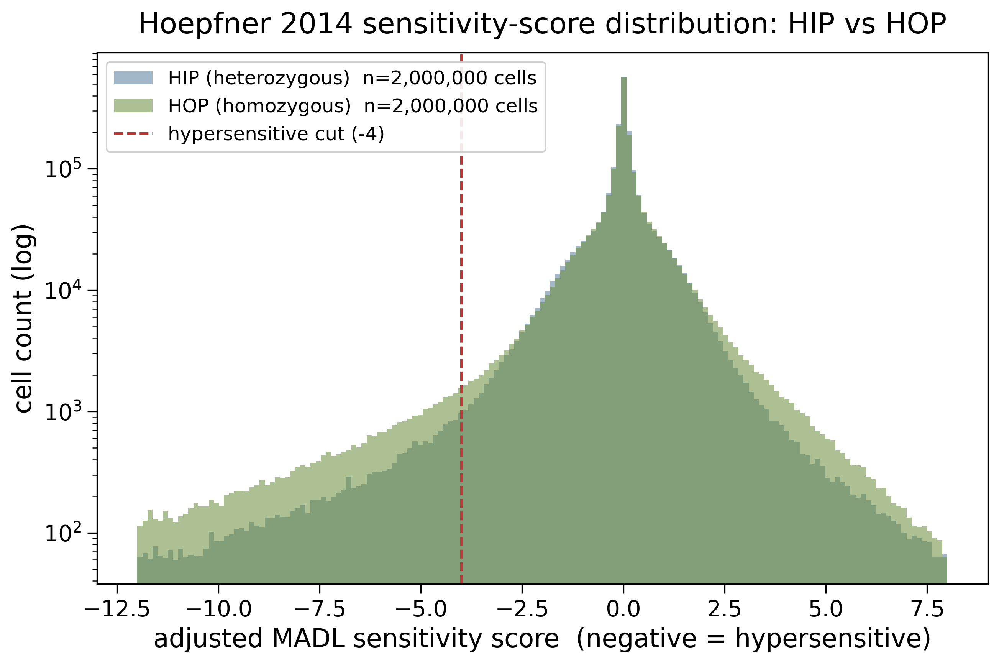
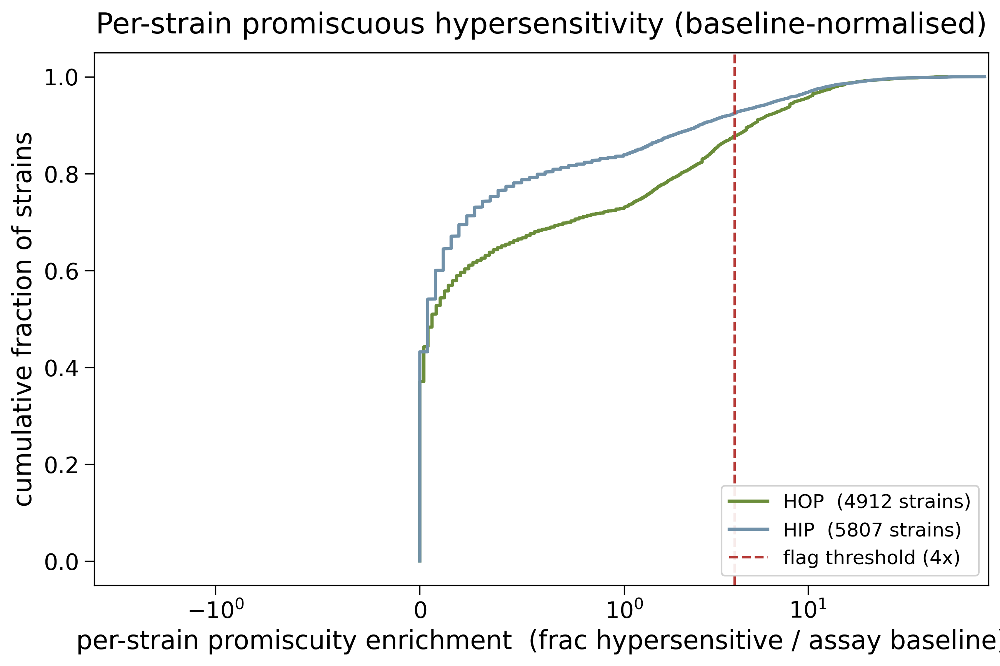

## 2026.07.13 - Hoepfner 2014 HIP/HOP background-mutation risk audit

### The question

Hoepfner et al. 2014 (the "HIP HOP" chemogenomic atlas,
`[[torchcell.datasets.scerevisiae.hoepfner2014]]`, `EnvChemgenHoepfner2014Dataset`,
**29,996,238 records** built) discovered that a subset of the **heterozygous (HIP)** yeast
deletion strains carry **undocumented background mutations** — co-inherited through
construction-lab batches — that produce compound hypersensitivity NOT caused by the
annotated single-gene perturbation. torchcell stores these strains as clean single-locus
perturbations (`EngineeredCopyNumberPerturbation` copy 1/2 for HIP), so any record for an
affected strain has a genotype that is **wrong at the sequence level**. This experiment
quantifies, from our own sha256-pinned raw matrices, **what fraction of the built dataset is
at risk**, and whether to train on it / purge instances / drop the dataset.

### What the paper says (verbatim-anchored, `paper.md`)

Section "HIP profile clustering identifies background mutations in the heterozygous deletion
strain collection" (lines 170–194):

- Hierarchical clustering of HIP profiles found **four clusters of strains** whose ORF
  deletions cover **discrete chromosomal regions** with shared promiscuous hypersensitivity,
  matching **construction laboratory** — "The individual strains of the yeast deletion
  collection were constructed by a consortium of laboratories, where each group was
  responsible for defined chromosomal regions … leading to a total of **157 affected HIP
  strains**" (line 174).
- Identified secondary mutations: clusters 1 & 2 → **chr XI aneuploidy**; cluster 3 →
  **WHI2/YOR043w premature stop** (truncates ORF by 60%); cluster 4 → **chr V 12 kb
  amplification** (line 176).
- Explicit caveat that 157 is a **lower bound**: "While we have characterized those mutations
  for 157 strains, **more remain** … additional strain clusters that **remain uncharacterized**"
  (lines 184, 194).
- The finding is **HIP-specific** (heterozygous collection). HOP (homozygous) is not
  implicated by this specific result.

**Provenance gap:** the paper's definitive strain list (**Table S5**) is referenced but is
**NOT in our library mirror** (MinerU did not capture it; only `paper.{pdf,md}` +
`Table_S1.xls` are mirrored). So the exact 157 identities are not currently in our
provenance chain — see Follow-ups.

### Method — empirical reconstruction from our pinned data

Rather than depend on the un-mirrored Table S5, we reproduce the paper's own detector from
the sha256-pinned raw score matrices (`HIP_scores.txt`, `HOP_scores.txt` — the exact files
the LMDB loader consumes) + SGD R64 coordinates. The detector logic:

> **promiscuous hypersensitivity + chromosomal ADJACENCY of the deleted ORFs** (adjacency ==
> same construction lab == co-inherited secondary mutation).

Promiscuity alone is insufficient — some genes are genuinely multidrug-sensitive (essential
dosage: GSP1, MET30; NER: RAD4; ribosomal). The discriminator is a **run of neighbouring-ORF
deletion strains** all broadly hypersensitive, which has no biological cause but a batch
artifact. Scripts:

- `[[experiments.017-hoepfner-background-mutations.scripts.hoepfner_compute_risk_metrics]]`
  — Phase 1 heavy parse → per-strain metrics + score sample + summary. **Reconciles exactly
  to the LMDB: 16,939,418 HIP + 13,056,820 HOP = 29,996,238 records.**
- `[[experiments.017-hoepfner-background-mutations.scripts.hoepfner_plot_risk]]` — Phase 2
  per-assay-normalised enrichment, rolling adjacency detector, whi2 correlation, HOP control,
  tiering, figures.

### Headline result — % of the dataset at risk (tiered)

The dataset is **56.5% HIP (16.94M records) / 43.5% HOP (13.06M)**. The answer depends
entirely on the definition, spanning **0.42% → 56.5%**:

| Definition | Strains | Records | % of 30.0M |
|---|---|---|---|
| whi2 cluster (mechanism-anchored, whi2_corr ≥ 0.5) | 43 | 127,090 | **0.42%** |
| empirical adjacency runs (≥ 4× baseline) | 107 | 314,544 | **1.05%** |
| paper-stated 157 HIP (record est. via mean HIP coverage) | 157 | ~457,979 | **1.53%** |
| conservative HIP envelope (uncharacterized clusters remain) | 5,807 | 16,939,418 | **56.47%** |

Empirical-run sweep (threshold robustness): 3× → 137 strains / 1.34%; 4× → 107 / 1.05%;
5× → 85 / 0.83%. **So the actionable, characterized risk is ~1–1.5% of records** — NOT the
70% the dataset's HIP share might suggest at worst case. HOP (43.5%) is not implicated by
this finding.

### The empirical detector recovers the paper's clusters

8 suspect runs (≥ 3 adjacent flagged HIP strains), matching the paper's "four clusters":

| chr | ORF pos span | n | whi2_frac | interpretation |
|---|---|---|---|---|
| II | 760,596–809,238 | 24 | 0.00 | right-arm batch (uncharacterised / non-whi2) |
| III | 4 runs, 159k–264k | 41 | 0.00 | chr III heavily affected (smallest, trouble-prone chrom) |
| XII | 704,726–721,100 & 750k–761k | 20 | **0.79 / 0.83** | **cluster 3 — whi2/YOR043w signature** |
| IX | 146,518–164,519 | 9 | 0.11 | adjacent batch |

The whi2/YOR043w handle validates cluster 3: **32 of 43 whi2-correlated strains form a
contiguous adjacent-ORF block on chr XII** (YLR279W→YLR297W), every one present in all 2,956
experiments, whi2_corr ≈ 0.7–0.86 — the textbook batch fingerprint.

**HOP control confirms it is a construction artifact, not gene biology.** The flagged strains
are enriched for hypersensitivity **5.5× over baseline in HIP but only 1.7× in HOP**; on the
HIP-vs-HOP scatter they sit above the diagonal (high HIP / low HOP), exactly as expected for
a heterozygous-collection-specific batch mutation.

**Detector nuance (honest):** the rolling flag is a **region** flag — a few individually-clean
strains inside a hot batch neighbourhood (e.g. COR1, SAF1) are flagged by proximity. This is
the conservative, paper-aligned choice (the paper flags whole clusters, 157 strains, not only
the individually-hypersensitive ones). `results/flagged_hip_strains.csv` carries per-strain
evidence so a stricter per-strain cut can be applied.

### Recommendation

1. **Do NOT drop the dataset.** The characterized/empirical risk is ~1–1.5% of records; 30M
   records of signed chemogenomic response is too valuable to discard over it. The scary 56.5%
   is only the ultra-conservative "any HIP record could carry an unmapped mutation" envelope.
2. **Purge or hold out the flagged batch-artifact set** as a cheap floor — `flagged_hip_strains.csv`
   (107 @ ≥4×, or 137 @ ≥3× for a wider net). ~1% of records; trivial to exclude from training.
3. **Flag, don't drop, the rest of HIP.** Add a provenance/quality annotation to HIP records
   ("heterozygous dosage collection; elevated, incompletely-mapped background-mutation risk;
   uncharacterized clusters remain per Hoepfner 2014") so downstream training can down-weight
   or filter HIP without losing 56.5% of the data.
4. **Provenance-first fix (ideal, torchcell-native):** for the affected strains, represent the
   KNOWN secondary mutations *in the genotype* — chr XI aneuploidy and chr V 12 kb amp as CNV
   perturbations, the whi2 premature stop as a sequence-variant perturbation — turning a wrong
   genotype into a correct, MORE-rigorous-than-source one. Gated on retrieving Table S5 + the
   FGS details (below).

### Follow-ups

- **Retrieve Table S5** (Elsevier SI for doi:10.1016/j.micres.2013.11.004, or the Dryad
  deposit doi:10.5061/dryad.v5m8v) → mirror it, get the exact 157 identities + lab/cluster
  labels, and **cross-validate against the empirical 107/137**. Then apply fix #4.
- The finding generalises: **Hillenmeyer 2008 and Lee 2014 are also HIP/HOP** (WS15) — the
  same heterozygous-collection background-mutation risk applies; reuse this detector.

## 2026.07.13 - Table_S5 retrieved: authoritative list + detector validated

The provenance gap is closed. Table_S5 IS in the same Dryad deposit we build from
(doi:10.5061/dryad.v5m8v, file id **4834604**) → retrieved + sha256-pinned to the library
mirror `si/Table_S5.xls` (**sha256 `b123dc3e…6624a2`**). Canonical, review-ready writeup now
lives under the DATASET hierarchy:
`[[torchcell.datasets.scerevisiae.hoepfner2014.background-mutations]]` (child of
`[[torchcell.datasets.scerevisiae.hoepfner2014]]`).

- **Authoritative Tier A:** 157 positional strains → **463,654 records (1.55%)**; 188 total
  flagged (incl. correlated) → 546,404 (1.82%). Clusters: CL1+CL2 chr XI aneuploidy (55),
  CL3 WHI2 nonsense (35), CL4 chr V amp (67); labs 7/14/3/12. Per-strain MUT/WT sequencing
  validation included.
- **Detector cross-validation** vs the authoritative 188: precision 0.71, recall 0.41; misses
  still at the 92nd promiscuity percentile (conservative, not wrong); the 31 detector-only flags
  = candidates for the uncharacterised clusters the paper predicted.
- New scripts: `hoepfner_fetch_table_s5.py`, `hoepfner_crossvalidate_table_s5.py`,
  `hoepfner_plot_table_s5_crossval.py` (fig 08 cluster recovery). New results:
  `table_s5_affected_strains.csv` (the purge list), `table_s5_crossvalidation.json`.

