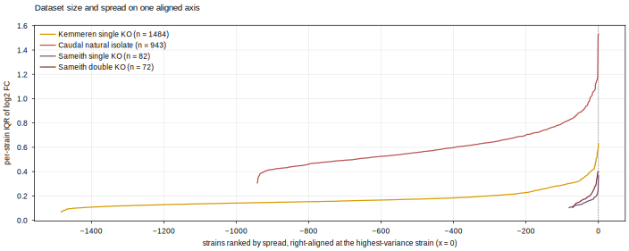

# Dataset Comparison — Engineered KO vs Natural Isolate

The **descriptive** panels (b–f, plus three supporting panels) of Fig 4 ("Natural Genetic Variation vs
Model-Design Perturbations"): how different are engineered-knockout and natural-isolate
strains, in **genotype** and in **transcriptome**? Modeling panels (g, h = E1/E2) and the
one-panel-one-question map live in the plan note
[[experiments.018-natural-isolate-genomics.expression-modeling-setup]]; the per-dataset
single-KO detail is [[experiments.012-sameith-kemmeren.scripts.single_mutant_expression_distributions]].

**Related note — division of labour.** This note is the **Fig 4 panel spec** (what each panel
shows, generated by `dataset_comparison.py`). Its sibling
[[experiments.018-natural-isolate-genomics]] is the **analysis / bit-accounting** note (issue
#66, feeding Fig 1c / Supp Note 5), generated by `make_figures.py` + the six analysis scripts.
They share four topics — divergence (b), regulatory π, DE counts (e), and genome↔transcriptome
coupling (decoupling) — but **the full derivations + provenance for those live in the analysis
note**; here those panels carry only a one-line result and a pointer, to keep a single source
of truth. Panels unique to this note (c, d, d2, f, and the gene-overlap panel) carry their own
computation inline.

**Script**: `experiments/018-natural-isolate-genomics/scripts/dataset_comparison.py`.
**Kemmeren single KO = orange**, **Caudal natural isolate = red** (our lead hue, the
natural-isolate focus). In the panels that separate strains by position (c, d, e) **both
Sameith arms share purple**; in the two **overlay** panels (**d2** and **f**) they split into
**dark purple (single)** and **dark red (double)** so the sparse arms stay distinguishable
where they land on top of the dense clouds. Point panels use plain dots (no shape coding) —
colour alone separates the arms, and the rare Sameith dots are drawn larger and on top so
they stay pickable. The supporting panels default to red. Repo figure standard throughout
(Arial 6 pt, boxed, true-size SVG). Panel **a** (setup schematic) is authored in draw.io.

**Platform caveat (applies throughout).** Kemmeren and Sameith are two-colour **microarray**
(log2 mut/WT); Caudal is **RNA-seq** (log2 iso/pop-mean). Any KO-vs-isolate comparison of
magnitude, spread, or embedding is therefore partly confounded by technology, not only
biology — restated on the panels where it bites hardest (e, f, and the gene-overlap panel).

## b — Genotype: engineered and natural occupy disjoint space


*Each red point is a natural isolate (n = 918 with both measures): x = reference ORFs
**absent** (median **124**), y = mean sequence **divergence on shared genes** (median
**0.38 %**). The engineered KO (orange diamond) removes 1–2 whole genes with **0 %**
divergence on the rest of the genome (drawn at the log-axis floor, since 0 has no place on
a log scale). The two are not one-for-one and they do not overlap: a KO is a single clean
gene edit in an isogenic background; an isolate is hundreds of absences **plus** sub-percent
divergence spread across thousands of shared genes. A deletion-only model cannot represent
the isolate axis at all.*

**Computation.** $x=n^{\text{abs}}_s$ = number of reference ORFs absent from isolate $s$;
$y=\text{div}_s$ = the het-weighted fraction of mismatched coding bases over all genes shared
with S288C. The full formula (het-weighting, indel edit-distance) and its provenance live in
the analysis note — see [[experiments.018-natural-isolate-genomics]] §1–2 (*Genome
divergence*).

## c — Per-strain spread across datasets, on one axis


*The cross-dataset noise comparison panel d cannot show together — each dataset has a
different strain count, hence a different x-axis. Each strain is collapsed to its **IQR of
genome-wide log2 FC** and the four IQR distributions drawn as violins on one shared axis
(black bar = median). Single and double KOs sit tight (median IQR ~0.14–0.18); **Caudal
natural isolates are ~3.6× wider (median 0.57)**. Both Sameith arms share purple here
(separated by position); the split dark-purple / dark-red is used only in the overlay
panels d2 and f.*

**Computation.** Each strain $s$ collapses to a single spread scalar over its genome-wide
fold-changes $\ell_{s,g}=\log_2\mathrm{FC}_{s,g}$; the violin for dataset $D$ is the
distribution of that scalar across its strains $s\in D$:

$$
\mathrm{IQR}_s = Q_{0.75}\bigl(\{\ell_{s,g}\}_{g}\bigr)-Q_{0.25}\bigl(\{\ell_{s,g}\}_{g}\bigr),
\qquad \text{violin}_D=\{\mathrm{IQR}_s : s\in D\}.
$$

## d — Transcriptome: natural isolates move far more than any KO


*Per-strain genome-wide log2 fold-change as matched **sorted spread bands** (dark = IQR,
light = 5–95 %, black line = median), all on **one shared ±2.6 scale**, strains ranked by
IQR within each dataset. The four perturbation classes rank cleanly: single KOs (Kemmeren
n = 1,484; Sameith n = 82) are tight, double KOs (n = 72) a touch wider at the tail, and
**natural isolates (Caudal n = 943) are dramatically broader across the whole panel** — an
isolate perturbs far more of its transcriptome than any single or double deletion. This is
the transcriptome counterpart of panel b.*

**Computation.** Within each dataset, strains are ranked by $\mathrm{IQR}_s$ (as in c) and
each contributes a vertical band of genome-wide percentiles of its $\{\ell_{s,g}\}_g$:

$$
\text{band}_s = \bigl(Q_{0.05},\,Q_{0.25},\,\mathrm{median},\,Q_{0.75},\,Q_{0.95}\bigr)\bigl(\{\ell_{s,g}\}_{g}\bigr),
\qquad x = \operatorname{rank}_{\mathrm{IQR}}(s)\in\{0,\dots,N_D-1\}.
$$

Every dataset is stretched to the same panel width, so **d hides the size gap** — which is
what d2 restores.

## d2 — Dataset size and spread on one aligned axis



*Companion to d that makes **dataset size legible**. The same per-strain spread
$\mathrm{IQR}_s$ is drawn as one curve per dataset, but all four are **right-aligned at their
highest-variance strain** ($x=0$) and extend **left** for exactly as many strains as the
dataset has. So the **tail length is the sample size** and the **curve height is the spread
profile**: the two Sameith arms (dark purple / dark red) **peter out into a short tail**
(72–82 strains) while Kemmeren (1,484) and Caudal (943) run far to the left, with Caudal
riding highest — most spread AND many strains. This is the single view that shows *both*
axes at once: how noisy each dataset is per strain, and how much of it there is.*

**Computation.** With $N_D$ = number of strains in dataset $D$, and strains sorted ascending
by $\mathrm{IQR}_s$ so the highest-variance strain is last:

$$
y_s = \mathrm{IQR}_s,\qquad x_s = \operatorname{rank}_{\mathrm{IQR}}(s) - (N_D-1)\ \in\ \{-(N_D-1),\dots,0\},
$$

which pins every dataset's highest-variance strain to $x=0$ (right edge) and lets the tail
run to $x=-(N_D-1)$ on the left.

## e — How many genes move: single KO ≪ double KO ≈ natural isolate


*Differentially expressed genes per strain, one noise-controlled rule for all three arms
(|log2 FC| > log2(1.7) = 0.766 **and** BH-adjusted p < 0.05; the p-value from each dataset's
own noise model — Kemmeren limma, Caudal its 29 replicate cultures, Sameith its stored
per-gene log2-ratio SE via z = M/SE). A **single KO** changes a median of **4** genes; a
**Sameith double KO** changes **58**; a **natural isolate** changes **59**. So a double TF
knockout perturbs about as much of the transcriptome as a natural isolate, while a single KO
moves ~15× fewer genes — the "a double deletion perturbs a network, not a node" point
(plan note E4, now unblocked by #72) made concrete. **Platform caveat:** Kemmeren/Sameith
are microarray, Caudal RNA-seq, so the absolute counts are not perfectly comparable across
technologies — but the single ≪ double ≈ natural ordering is robust to it.*

**Computation.** The DE count for strain $s$ counts genes passing an effect-size **and** a
per-strain BH-significance gate ($\ell_{s,g}=\log_2$ expression FC of gene $g$ vs reference):

$$
\mathrm{DE}_s = \Bigl|\bigl\{\, g : |\ell_{s,g}| > \log_2 1.7 \ \wedge\ p^{\mathrm{BH}}_{s,g} < 0.05 \,\bigr\}\Bigr|.
$$

The raw $p$ comes from each dataset's own noise model (Kemmeren limma; Caudal its 29
replicate cultures; Sameith a $z=M/\mathrm{SE}$ test on the stored log2-ratio SE). Those
noise-model derivations + the effect-only-vs-noise-controlled comparison live in the analysis
note — see [[experiments.018-natural-isolate-genomics]] §6 (*the expression comparison*).

## f — Transcriptome design-space coverage (with a platform caveat)


*PCA and UMAP of the joint expression matrix (**5,811 genes** shared across all four
datasets), per-gene **z-scored within each dataset**. Dots only (no shapes) — colour alone
separates the arms: Kemmeren = orange, Caudal = red, and the two sparse Sameith arms split
into **dark purple (single)** and **dark red (double)**, drawn as larger dots on top so they
read against the overlapping clouds. UMAP separates natural isolates from KOs. **Caveat,
stated on the panel:** Kemmeren/Sameith are microarray log2(mut/WT) and Caudal is RNA-seq
log2(iso/pop-mean), so the split is **partly platform, not purely biology** — PC1+PC2 explain
only 23 %, i.e. no single dominant axis. Read this as coverage, not clean biological
separation; the modeling side (Option B, two decoder heads) is what dodges the confound
properly.*

**Computation.** Each strain becomes a length-5,811 vector; every gene is **z-scored within
its own dataset** $D$ first (this is the platform-confound guard — it removes each
technology's per-gene mean and scale before mixing), then all strains are stacked and
embedded:

$$
z_{s,g}=\frac{\ell_{s,g}-\mu^{D}_g}{\sigma^{D}_g},\quad
\mu^{D}_g=\frac{1}{|D|}\sum_{s\in D}\ell_{s,g},\quad
\bigl(\sigma^{D}_g\bigr)^2=\frac{1}{|D|}\sum_{s\in D}\bigl(\ell_{s,g}-\mu^{D}_g\bigr)^2,
$$

and PCA / UMAP run on the row-stacked matrix $Z=[\,z_{s,g}\,]$ over all strains of all four
datasets.

## Supporting panels (further explanation)

### Do KOs and natural isolates move the same genes?


*The unit here is a **gene** (5,811 shared across all four datasets), **not a strain**. For
each gene we ask two independent things and correlate them across genes: **how often a
knockout moves this gene** (x) and **how much this gene naturally varies across isolates**
(y). **What a high Pearson $r$ would mean:** the genes that knockouts frequently perturb are
exactly the genes that vary most in nature — i.e. **both populations engage the same
"responsive core" of genes.** We get **$r = 0.34$** (moderate): a real shared core, but each
modality also moves genes the other does not — so KOs and natural isolates are **partly
overlapping, partly complementary**, not redundant. Platform caveat applies (Kemmeren
microarray, Caudal RNA-seq).*

**Computation.** Symbols: $g$ indexes the 5,811 shared genes; $s$ a strain; $\ell_{s,g}$ is
the $\log_2$ **expression** fold-change of gene $g$ in strain $s$ **versus its reference**
(wild-type for Kemmeren KOs, the population-mean expression for Caudal isolates); $N_K$ = the
number of Kemmeren single-KO strains; $\mathbb{1}[\cdot]$ = the indicator (1 if the bracket is
true, else 0); $\operatorname{SD}$ = standard deviation; "$g$ is DE in $s$" uses the panel-e
rule. Each gene gets a KO-response frequency and a natural-variability, then **one Pearson
correlation over the genes**:

$$
\underbrace{f^{\mathrm{KO}}_g}_{\text{how often a KO moves }g}=\frac{1}{N_K}\sum_{s\in\text{Kemmeren}}\mathbb{1}\!\left[g\text{ is DE in }s\right]\in[0,1],
\qquad
\underbrace{\sigma^{\mathrm{iso}}_g}_{\text{natural variability of }g}=\operatorname{SD}_{s\in\text{Caudal}}\bigl(\ell_{s,g}\bigr),
$$

$$
r=\operatorname{Pearson}_{g}\bigl(f^{\mathrm{KO}}_g,\ \sigma^{\mathrm{iso}}_g\bigr)\in[-1,1],\qquad r=0.34.
$$

Reading it: $r\to 1$ means the same genes are the "movers" in both populations; $r\to 0$ means
KO-responsive genes and isolate-variable genes are unrelated sets. $0.34$ sits in between —
overlapping but not identical.

### Where the natural variation sits: regulatory vs coding


*Nucleotide diversity π across the 1,011 isolates, by region. **Regulatory sequence (upstream
0.79 %, downstream 0.84 %) is ~2× as variable as coding (CDS 0.41 %)** — purifying selection
on protein sequence, drift in promoters/terminators. This is why the sequence encoder must
read the regulatory window; the SpeciesLM input (1000 bp up + 297 bp down) already covers
~93 % of all π.*

**Computation.** Per region, $\pi$ is the mean per-site nucleotide diversity (the average
over sites of the probability two random isolate alleles differ), region membership assigned
by precedence CDS > upstream > downstream > intergenic. The formula and the transformer-window
coverage numbers live in the analysis note — see [[experiments.018-natural-isolate-genomics]]
§4–5 (*coding vs regulatory*).

### Genome divergence does not predict transcriptome response


*First, what "DE" is here, since it is easy to misread: **each point is one isolate**, and its
"DE genes" is a count over the **whole transcriptome** — the number of genes (out of ~6,000)
whose **mRNA expression level** in that isolate differs significantly from a **reference
baseline** (the population-mean expression of each gene). It is **not** an allele-vs-allele
comparison and **not** a single reporter gene; it is the isolate's genome-wide expression
readout, exactly as in panel e. The x-axis is a completely different molecular layer — the
isolate's **DNA-sequence** divergence from S288C. So the panel asks: **does a more
sequence-diverged genome move more of the transcriptome?** There is **little a-priori reason
it should** — a strong "more divergence ⇒ more genes move" dose-response has scant biological
basis, and even the weak mutational-load nudge one might expect is diluted by buffering. The
panel's job is to **measure how weak the coupling actually is: $r = 0.04$**, essentially zero
— not even the faint positive trend a mutational-load view would predict. That does two useful
things. **(1) It quantifies buffering:** natural sequence variation is so concentrated in
dispensable / redundant genes that it barely reaches the transcriptome. **(2) It is a modeling
caution:** a model that predicts *how much* of the transcriptome moves from *how large* the
genotype edit is has no signal to learn — so score *which* genes move and in *what direction*
(per-gene rank/direction agreement), not *how much* (magnitude MSE).*

**Computation.** $s$ indexes the $n=865$ isolates with **both** measurements; $\text{div}_s$ =
genome-wide sequence divergence (panel **b**); $\mathrm{DE}_s$ = the isolate's genome-wide
expression DE-gene count (panel **e**). The panel is a single Pearson correlation across
isolates, $r=\operatorname{Pearson}_{s}(\text{div}_s,\ \mathrm{DE}_s)=0.04$ (with $\text{div}$
and $\mathrm{DE}$ each centred on their isolate mean). The companion coupling analysis — both
genotype axes vs DE, plus the genotype-vs-genotype control $r=0.48$ that shows the genotype
axis is measured fine — is in the analysis note, [[experiments.018-natural-isolate-genomics]]
§7. Reading it: $r\to 1$ would be a dose-response; $r\approx 0$ is the observed **decoupling**.

## Reproduce

```bash
python experiments/018-natural-isolate-genomics/scripts/dataset_comparison.py
```

Reads the 018 result parquets (`natural_ko_burden`, `per_strain_divergence_summary`,
`de_counts_per_strain`) for b + e and the built Kemmeren / Sameith SM+DM / Caudal LMDBs for
d + f; writes all panels to
`notes/assets/images/018-natural-isolate-genomics/comparison_*` and a numeric summary to
`results/dataset_comparison_summary.json`.

The Kemmeren dataset is built with an **injected `SCerevisiaeGenome`** and
**`process_workers=8`** — both are required for a faithful 1,484-strain build (see the
provenance note below); without them the loader silently produces a partial dataset.

## 2026.07.16 - Kemmeren 1,484 restoration (loader resolver fix)

Rebuilding Kemmeren for these panels initially yielded **1,450** strains, not 1,484. Two
independent loader defects, both now fixed:

1. **Alias-only KO names were dropped (1,484 → 1,450).** The loader's gene-name resolver
   filters alias hits by Excel membership (`systematic_to_strain`), which rejects a valid
   one-to-one alias whose systematic id is not itself an Excel strain key — e.g. `CDK8 →
   YPL042C`, and the whole Mediator / CDK-module set (`MED3/5/9/12/13/15/16/18/20/31`,
   `SSN6`, `CDK8`), autophagy (`ATG6/24/31`), and others (34 genes total). Fix: (a) the
   script now **injects a genome** (without one, the alias passes are skipped entirely and
   resolution falls back to the Excel common-name map, which lacks these); (b) added a
   final **Pass 7** in `resolve_gene_name_comprehensive` that defers to the shared R64
   reconciler `SCerevisiaeGenome.resolve_gene_name` (PR #98), accepting only a definite
   live gene (`CURRENT`/`RENAMED`) so ambiguous/retired names still fall through to review.
   Result: `Could not resolve: 0`, `Perfect match: all 1484`.
2. **Sequential build path lost the LMDB (1,484 written, then unreadable).** With
   `process_workers=0` the build wrote all 1,484 records but the `processed/lmdb` store was
   not reliably materialised for the readonly `compute_gene_set` pass. Fix: build with
   `process_workers=8` (parallel path), which persists `processed/lmdb` + `pre_filter.pt`.

Net: panels b/c/d/f (LMDB) and panel e (`de_counts` parquet) are now **all 1,484**,
internally consistent. Loader change: `torchcell/datasets/scerevisiae/kemmeren2014.py`.
