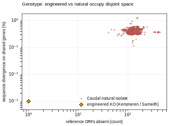
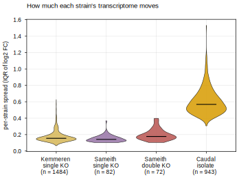
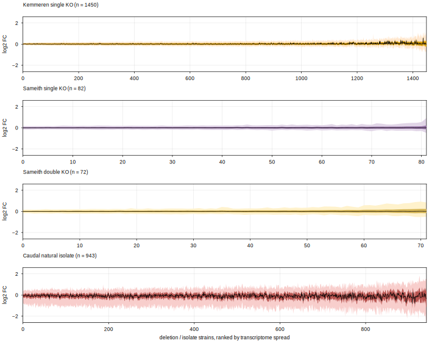
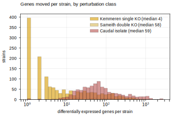
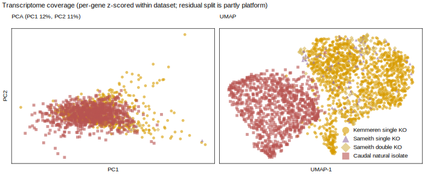
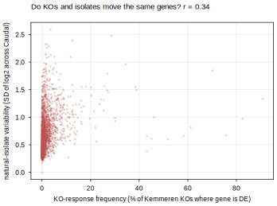
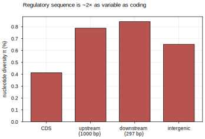
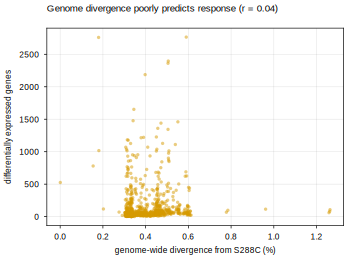

# Dataset Comparison — Engineered KO vs Natural Isolate

The **descriptive** panels (b–f, plus three supporting panels) of Fig 4 ("Natural Genetic Variation vs
Model-Design Perturbations"): how different are engineered-knockout and natural-isolate
strains, in **genotype** and in **transcriptome**? Modeling panels (g, h = E1/E2) and the
one-panel-one-question map live in the plan note
[[experiments.018-natural-isolate-genomics.expression-modeling-setup]]; the per-dataset
single-KO detail is [[experiments.012-sameith-kemmeren.scripts.single_mutant_expression_distributions]].

**Script**: `experiments/018-natural-isolate-genomics/scripts/dataset_comparison.py`.
Three hues, consistent across every panel: **Kemmeren single KO = orange**, **Caudal natural
isolate = red** (our lead hue, the natural-isolate focus), and **both Sameith arms = purple**
(one lab/platform, grouped as a single colour). Point panels use plain dots (no shape
coding) — colour alone separates the arms, and in panel f the rare Sameith dots are drawn
larger and on top so they stay pickable against the dense clouds. The supporting panels
default to red. Repo figure standard throughout (Arial 6 pt, boxed, true-size SVG). Panel
**a** (setup schematic) is authored in draw.io.

**Platform caveat (applies throughout).** Kemmeren and Sameith are two-colour **microarray**
(log2 mut/WT); Caudal is **RNA-seq** (log2 iso/pop-mean). Any KO-vs-isolate comparison of
magnitude, spread, or embedding is therefore partly confounded by technology, not only
biology — restated on the panels where it bites hardest (e, f, and the gene-overlap panel).

## b — Genotype: engineered and natural occupy disjoint space



*Each red point is a natural isolate (n = 918 with both measures): x = reference ORFs
**absent** (median **124**), y = mean sequence **divergence on shared genes** (median
**0.38 %**). The engineered KO (orange diamond) removes 1–2 whole genes with **0 %**
divergence on the rest of the genome (drawn at the log-axis floor, since 0 has no place on
a log scale). The two are not one-for-one and they do not overlap: a KO is a single clean
gene edit in an isogenic background; an isolate is hundreds of absences **plus** sub-percent
divergence spread across thousands of shared genes. A deletion-only model cannot represent
the isolate axis at all.*

## c — Per-strain spread across datasets, on one axis



*The cross-dataset noise comparison panel d cannot show together — each dataset has a
different strain count, hence a different x-axis. Each strain is collapsed to its **IQR of
genome-wide log2 FC** and the four IQR distributions drawn as violins on one shared axis
(black bar = median). Single and double KOs sit tight (median IQR ~0.14–0.18); **Caudal
natural isolates are ~3.6× wider (median 0.57)**. Same per-dataset colours as panel f.*

## d — Transcriptome: natural isolates move far more than any KO



*Per-strain genome-wide log2 fold-change as matched **sorted spread bands** (dark = IQR,
light = 5–95 %, black line = median), all on **one shared ±2.6 scale**, strains ranked by
IQR within each dataset. The four perturbation classes rank cleanly: single KOs (Kemmeren
n = 1,484; Sameith n = 82) are tight, double KOs (n = 72) a touch wider at the tail, and
**natural isolates (Caudal n = 943) are dramatically broader across the whole panel** — an
isolate perturbs far more of its transcriptome than any single or double deletion. This is
the transcriptome counterpart of panel b.*

## e — How many genes move: single KO ≪ double KO ≈ natural isolate



*Differentially expressed genes per strain, one noise-controlled rule for all three arms
(|log2 FC| > log2(1.7) = 0.766 **and** BH-adjusted p < 0.05; the p-value from each dataset's
own noise model — Kemmeren limma, Caudal its 29 replicate cultures, Sameith its stored
per-gene log2-ratio SE via z = M/SE). A **single KO** changes a median of **4** genes; a
**Sameith double KO** changes **58**; a **natural isolate** changes **59**. So a double TF
knockout perturbs about as much of the transcriptome as a natural isolate, while a single KO
moves ~15× fewer genes — the "a double deletion perturbs a network, not a node" point
(plan note E4, now unblocked by #72) made concrete. **Platform caveat:** Kemmeren/Sameith
are microarray, Caudal RNA-seq, so the absolute counts are not perfectly comparable across
technologies — but the single ≪ double ≈ natural ordering is robust to it.*

## f — Transcriptome design-space coverage (with a platform caveat)



*PCA and UMAP of the joint expression matrix (**5,811 genes** shared across all four
datasets), per-gene **z-scored within each dataset**. UMAP separates natural isolates (red)
from KOs (orange), with the Sameith arms (purple) drawn as larger dots on top so they read
against the overlapping clouds. **Caveat, stated on the panel:** Kemmeren/Sameith are microarray
log2(mut/WT) and Caudal is RNA-seq log2(iso/pop-mean), so the split is **partly platform,
not purely biology** — PC1+PC2 explain only 23 %, i.e. no single dominant axis. Read this as
coverage, not clean biological separation; the modeling side (Option B, two decoder heads)
is what dodges the confound properly.*

## Supporting panels (further explanation)

### Do KOs and natural isolates move the same genes?



*Per gene (5,811 shared): x = KO-response frequency (% of Kemmeren single KOs where the gene
is DE), y = its variability across Caudal isolates (SD of log2). The two are **moderately
correlated (r = 0.34)** — a shared "responsive core" both modalities move, plus substantial
per-gene coverage each has that the other lacks. Natural isolates and KOs are **partly
complementary**, not redundant. Platform caveat applies (Kemmeren microarray, Caudal RNA-seq).*

### Where the natural variation sits: regulatory vs coding



*Nucleotide diversity π across the 1,011 isolates, by region. **Regulatory sequence (upstream
0.79 %, downstream 0.84 %) is ~2× as variable as coding (CDS 0.41 %)** — purifying selection
on protein sequence, drift in promoters/terminators. This is why the sequence encoder must
read the regulatory window; the SpeciesLM input (1000 bp up + 297 bp down) already covers
~93 % of all π.*

### Genome divergence does not predict transcriptome response



*One point per isolate (n = 865): genome-wide sequence divergence from S288C vs number of DE
genes. **r = 0.04** — an isolate twice as diverged does not move twice as many genes; natural
gene loss is concentrated in dispensable, buffered genes. Modeling consequence: score *which*
genes move and in *what direction* (per-gene rank/direction agreement), not *how much*
(magnitude MSE), or the isolates will look harder to predict than the mechanism deserves.*

## Reproduce

```bash
python experiments/018-natural-isolate-genomics/scripts/dataset_comparison.py
```

Reads the 018 result parquets (`natural_ko_burden`, `per_strain_divergence_summary`,
`de_counts_per_strain`) for b + e and the built Kemmeren / Sameith SM+DM / Caudal LMDBs for
d + f; writes all panels to
`notes/assets/images/018-natural-isolate-genomics/comparison_*` and a numeric summary to
`results/dataset_comparison_summary.json`.

The Kemmeren dataset is built with an **injected `SCerevisiaeGenome`** and
**`process_workers=8`** — both are required for a faithful 1,484-strain build (see the
provenance note below); without them the loader silently produces a partial dataset.

## 2026.07.16 - Kemmeren 1,484 restoration (loader resolver fix)

Rebuilding Kemmeren for these panels initially yielded **1,450** strains, not 1,484. Two
independent loader defects, both now fixed:

1. **Alias-only KO names were dropped (1,484 → 1,450).** The loader's gene-name resolver
   filters alias hits by Excel membership (`systematic_to_strain`), which rejects a valid
   one-to-one alias whose systematic id is not itself an Excel strain key — e.g. `CDK8 →
   YPL042C`, and the whole Mediator / CDK-module set (`MED3/5/9/12/13/15/16/18/20/31`,
   `SSN6`, `CDK8`), autophagy (`ATG6/24/31`), and others (34 genes total). Fix: (a) the
   script now **injects a genome** (without one, the alias passes are skipped entirely and
   resolution falls back to the Excel common-name map, which lacks these); (b) added a
   final **Pass 7** in `resolve_gene_name_comprehensive` that defers to the shared R64
   reconciler `SCerevisiaeGenome.resolve_gene_name` (PR #98), accepting only a definite
   live gene (`CURRENT`/`RENAMED`) so ambiguous/retired names still fall through to review.
   Result: `Could not resolve: 0`, `Perfect match: all 1484`.
2. **Sequential build path lost the LMDB (1,484 written, then unreadable).** With
   `process_workers=0` the build wrote all 1,484 records but the `processed/lmdb` store was
   not reliably materialised for the readonly `compute_gene_set` pass. Fix: build with
   `process_workers=8` (parallel path), which persists `processed/lmdb` + `pre_filter.pt`.

Net: panels b/c/d/f (LMDB) and panel e (`de_counts` parquet) are now **all 1,484**,
internally consistent. Loader change: `torchcell/datasets/scerevisiae/kemmeren2014.py`.
