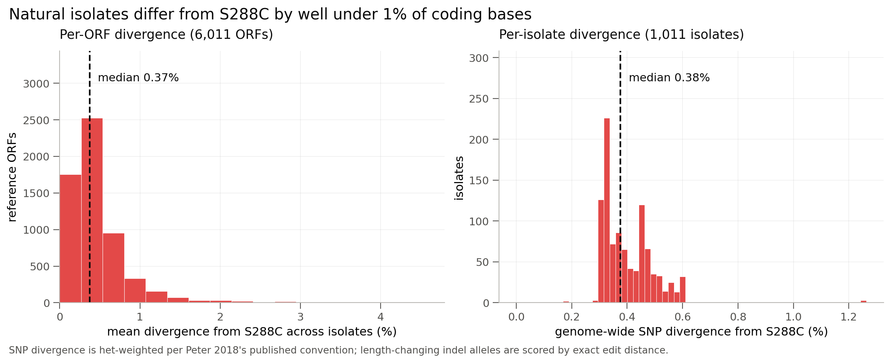
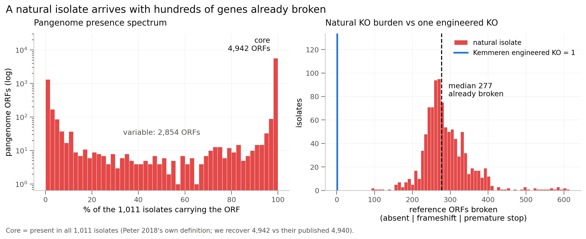
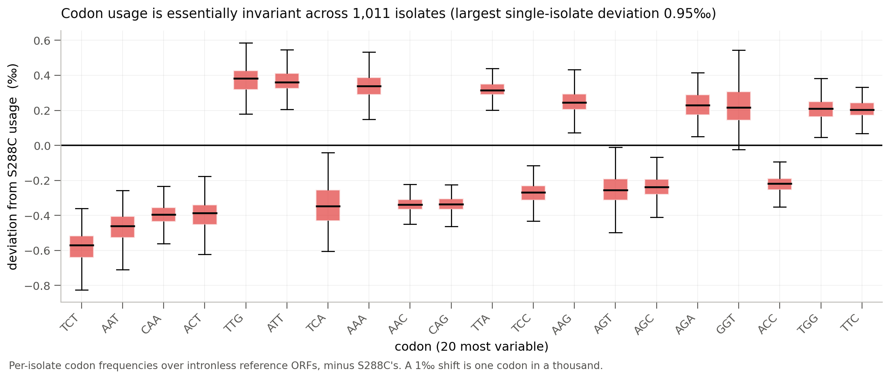
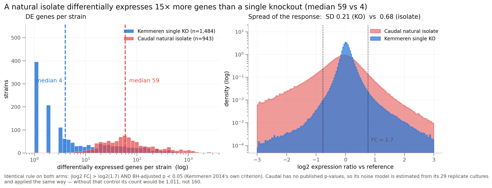
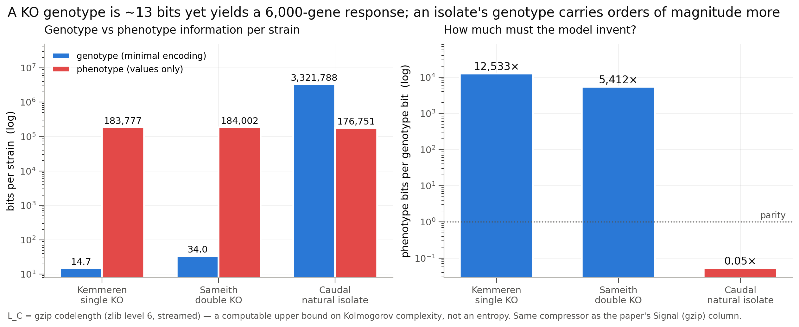

## 2026.07.13 - Where do the bits come from? (issue #66)

Closes the analysis asked for in [issue #66](https://github.com/Mjvolk3/torchcell/issues/66):
natural-isolate genomic diversity vs KO-driven expression variability, as a bit
accounting for the inputs the Cell Graph Transformer consumes. Feeds **Fig. 1c /
Supplementary Note 5**.

### The one-paragraph answer

The two modalities sit in **opposite information regimes, and the phenotype side is
identical in both.** A Kemmeren single-KO genotype is one gene index out of 6,607 --
**14.7 bits** -- and produces a ~6,000-gene expression vector worth **183,777 bits**: the
model must *invent* **12,533 phenotype bits per genotype bit**. A Caudal natural isolate's
genotype carries **3,321,788 bits** of sequence divergence and produces a phenotype of
**176,751 bits** -- **0.05x**, below parity: the model can largely *read* the answer off the
sequence. Same phenotype dimensionality; the phenotype/genotype ratio swings **250,000x**.
And the transcriptional consequence is wildly sublinear in the genotype: an isolate has a
median of **277 reference ORFs already broken** (vs the KO's 1) yet differentially
expresses only **~15x** more genes, and per-isolate genomic divergence is **uncorrelated**
with the number of DE genes (**r = 0.04**).

### Headline numbers

| Question | Answer |
|---|---|
| Per-ORF divergence vs S288C R64 | mean **0.42%** (SNP-only), **0.69%** incl. indels |
| Core vs accessory (Peter's own rule: present in all 1,011) | **4,942** core / **2,854** variable (paper: 4,940 / 2,856) |
| π: coding vs regulatory | CDS **0.412%**, upstream-1000 **0.788%**, downstream-297 **0.843%** |
| Species-aware transformer input coverage | **94.7%** of genome, **93.3%** of all π |
| Codon usage drift across isolates | largest deviation **< 1‰** -- essentially invariant |
| DE genes per **single KO** (Kemmeren, paper-exact) | mean **36.1**, **median 4**, 5% change nothing |
| DE genes per **natural isolate** (same rule) | mean **160.3**, **median 59** |
| Natural KO burden per isolate | **median 277** ORFs broken (123 absent + 134 frameshift + 32 nonsense) |
| Genotype bits: KO vs isolate | **14.7** vs **3,321,788** |
| Phenotype bits (values only) | **183,777** vs **176,751** -- essentially the same |

### Data + provenance

All inputs hash-pinned; every retrieved file's md5 verified against the source's own
published `md5.txt`.

| Artifact | Provenance |
|---|---|
| `allReferenceGenesWithSNPsAndIndelsInferred.tar.gz` | already mirrored; sha256 `b5400b89…` -- 6,015 gene FASTAs x 1,011 isolate alleles |
| `1011Matrix.gvcf.gz` (**newly retrieved**, 5.8 GB) | `http://1002genomes.u-strasbg.fr/files/` -- md5 `42478e3e…` **matches published md5.txt**; sha256 `03777325…` |
| `genesMatrix_PresenceAbsence` / `_Frameshift`, `gene_dNdS`, `1011LossOfFunction` | same host; all four md5s **match published md5.txt** |
| `deleteome_all_mutants_ex_wt_var_controls.txt` (**newly retrieved**) | `deleteome.holstegelab.nl` -- sha256 `7f93af35…`; ships limma M + p per mutant |
| `deleteome_responsive_mutants_ex_wt_var_controls.txt` | sha256 `563f3064…` -- the paper's OWN responsive set (ground truth) |
| Kemmeren 2014 PDF | Zotero group `6582362`, item `A2V6WX6H`; sha256 `531037bd…`. **Not open access -- not in PMC.** |

**Sourced thresholds** (never guessed, per the provenance rules):

- **DE criterion** -- Kemmeren 2014, Extended Experimental Procedures, *"Statistical
  Analysis of Expression Profiles"*: *"P values were obtained from the limma R package
  version 2.12.0 … after Benjamini-Hochberg FDR correction. Genes were considered
  significantly changed when the fold-change (FC) was > 1.7 and the p value < 0.05."*
  → `|log2 FC| > log2(1.7) = 0.7655` **AND** BH-adj `p < 0.05`.
- **Responsive mutant** -- same source: *"responding (>= 4 genes changing) and
  nonresponding (<4 genes changing)."*
- **Core genome** -- Peter 2018 `paper.md` (sha256 `21c49934…`, line 220): *"…the
  identification of 4,940 ORFs present in the 1,011 strains of the collection,
  representing the core genome plus 2,856 ORFs…"* → core = present in **all** 1,011, not a
  ≥99% cutoff.
- **Het weighting** -- Peter 2018 `filesDescription.txt`: *"Heterozygous differences were
  half-weighted compared to the homozygous differences."* Generalized to any IUPAC code as
  `w = 1 - [ref ∈ alleles(code)] / |alleles(code)|`, which reduces to their rule exactly.

### Validation gates (all pass)

1. **DE criterion reproduces the paper.** The deleteome publishes the paper's own
   responsive-mutant set (**699** mutants). Our derived set (769 at ≥4 changed genes) is a
   strict **superset**: intersection 699, **zero missed**. The criterion is implemented as
   specified. Our union-of-changed-transcripts (4,473) sits 6.7% above the paper's 3,966 --
   the deleteome file is a later revision of the 2014 matrices, so we take the **published**
   responsive set as authoritative and report the gap rather than tune to it.
2. **Core genome reproduces the paper.** 4,942 / 2,854 vs published 4,940 / 2,856.
3. **Two independent methods agree.** CDS π from the VCF (**0.412%**) vs per-gene FASTA
   Hamming divergence (**0.420%**) -- different files, different algorithms, same answer.
4. **Codon logic cross-checks.** Our per-gene pN/pS vs Peter's published PAML dN/dS:
   **r = 0.579** over 5,681 genes.
5. **Bit ledger reproduces the paper table.** Caudal `phenotype_as_stored` = **94,054,411 B**
   -- byte-identical to the cached `Signal (gzip)` value in `dataset_signals_cache.json`.

---

### 1-2. Genome divergence, core vs accessory



6,077,121 (gene x isolate) pairs over 6,011 reference ORFs. **9.6% carry a
length-changing indel**, which Hamming cannot score; leaving them NaN would have biased the
headline down, so they are resolved by exact global edit distance. Indel-bearing alleles
average **36.7 bp** of edit distance, which is why total divergence (**0.693%**) is 65%
above SNP-only (**0.420%**). Median indel is **3 bp** -- in-frame, the signature of
selection against frameshifts.



The presence spectrum is sharply **bimodal** -- ORFs are either in everything or in almost
nothing. Of 6,059 reference ORFs in the pangenome, **81.4%** are core.

### 3. Codon usage



**Codon usage is essentially invariant across the 1,011 isolates** -- the largest
single-isolate deviation from S288C is well under 1 codon per 1,000. Whatever the isolates
differ by, it is not codon preference. (Computed over intronless ORFs only; the 241
intron-containing genes are excluded from all codon statistics because the Peter sequences
are unspliced genomic spans.)

### 4-5. Coding vs regulatory -- the species-aware transformer window


From 1,753,947 population variants in `1011Matrix.gvcf`. The window is the one the
**species-aware transformer** (`FungalUpDownTransformer` → `gagneurlab/SpeciesLM`) actually
reads, pinned at `torchcell/datasets/fungal_up_down_transformer.py:29-32`: `window_five_prime(1003,
include_start_codon=True)` = **1,000 bp upstream + ATG**, and `window_three_prime(300,
include_stop_codon=True)` = **stop + 297 bp downstream**.

- **Regulatory sequence is ~2x more polymorphic than coding sequence** (π 0.79-0.84% vs
  0.41%) -- purifying selection on protein-coding sequence, drift in promoters/terminators.
- **The model's input already sees nearly everything**: CDS + 1,000 up + 297 down covers
  **94.7%** of the nuclear genome and captures **93.3%** of all nucleotide diversity. Widening
  the window buys almost nothing; there is very little variation the model cannot see.
- Caveat: `intergenic_other` is the *leftover* after precedence (CDS > upstream >
  downstream), so in a genome this compact it is a small, odd residue (5.3% of bp) and its
  π (0.652%) should not be over-read.

### 6. Single KO vs natural isolate -- the expression comparison



Both arms get the **identical rule**. Kemmeren's is noise-controlled by limma's p-value;
Caudal ships one culture per isolate and no p-values, so an effect-only count for Caudal
compared against a p-gated count for Kemmeren would be rigged. We therefore built Caudal an
equivalent noise control from **its own 29 replicate cultures**: per-gene noise SD
`sigma_g` (pair SD / sqrt(2), since a pair carries two noisy measurements), then z → p → BH
within each isolate.

That correction matters enormously and is the difference between an honest and a dishonest
headline:

| | effect-only | noise-controlled |
|---|---|---|
| Caudal DE genes / isolate (mean) | 1,011 | **160** |

Variance decomposition: observed SD **0.678** = noise **0.390** ⊕ biological **0.554**.
Caudal's single-culture RNA-seq is *close to noise-parity per gene*, and any analysis that
skips this will over-state natural variation by ~6x.

**Results:**

- A **typical single deletion changes 4 genes** out of ~6,100. **5% change nothing at all.**
  Only **47%** are "responsive" (≥4 genes) -- exactly the paper's 699/1,484.
- A **typical natural isolate changes 59 genes** -- **~15x more** (4.4x by mean; the mean
  ratio is dragged down by Kemmeren's heavy tail of hub/TF deletions, max 1,014 genes).

### 7. Genotype magnitude does not predict transcriptome response


This is the most surprising result. Across the 865 isolates with both measurements:

- `r(genome-wide divergence, n_DE)` = **0.038**
- `r(natural-KO burden, n_DE)` = **0.086**
- `r(genome-wide divergence, natural-KO burden)` = **0.477**

The third correlation is the control: the two *genotype* measures agree with each other, so
the genotype axis is measured fine. It simply **does not predict how much the transcriptome
moves**. An isolate with twice the sequence divergence does not differentially express twice
as many genes.

Combined with the burden numbers, the sublinearity is stark: **277x more broken genes → only
~15x more DE genes → and no dose-response at all within the isolates.** Natural gene loss is
overwhelmingly concentrated in dispensable, accessory, already-redundant genes and is heavily
buffered. **A natural isolate is not "277 random knockouts."**

### 8. The bit ledger



`L_C` = gzip codelength (zlib level 6, streamed) -- a *computable upper bound* on Kolmogorov
complexity, **not** an entropy. Same compressor as the paper's `Signal (gzip)` column.

| modality | encoding | L_C | bits/strain |
|---|---|---:|---:|
| Kemmeren single KO | genotype (combinatorial floor) | 2,354 B | **12.7** |
| Kemmeren single KO | genotype (minimal) | 2,720 B | **14.7** |
| Kemmeren single KO | genotype (as stored) | 13,985 B | 75.4 |
| Kemmeren single KO | phenotype (values only) | 34.1 MB | **183,777** |
| Kemmeren single KO | phenotype (as stored) | 395.8 MB | 2,133,710 |
| Sameith double KO | genotype (minimal) | 306 B | **34.0** |
| Sameith double KO | phenotype (values only) | 1.7 MB | 184,002 |
| Caudal isolate | phenotype (values only) | 20.8 MB | **176,751** |
| Caudal isolate | phenotype (as stored) | **94.05 MB** | 797,917 |
| Caudal isolate | genotype (as stored) | **94.77 MB** | 803,971 |
| Caudal isolate | **sequence diff vs S288C** | **419.8 MB** | **3,321,788** |
| Caudal isolate | sequence raw nt | 2,548.4 MB | 20,165,720 |

**Issue #66's premise is confirmed -- and then explained away.** The 94 MB phenotype /
95 MB perturbation near-equality is real (94.05 vs 94.77 MB, reproduced to the byte). But
**that ~95 MB is encoding, not information.** The LMDB perturbation records store a gene
name, an SO term, a URI, and *the same `sequence_sha256` repeated on all ~4.7M records* --
never the actual variant. The **real** genotype content, the sequence diff against S288C, is
**419.8 MB -- 4.4x larger**. So the Signal column *understates* the isolate genotype by 4.4x
while appearing to measure it.

---

### Methodological findings the manuscript needs

Two problems with `Signal (gzip)` as currently reported, both quantified here:

1. **Schema overhead dominates.** Kemmeren's phenotype is **395.8 MB as stored** but only
   **34.1 MB as values** -- **91% of the reported Signal is JSON keys, SE, and
   `n_replicates`**, not measurement. Caudal: 94.05 → 20.8 MB (**78%** overhead). The column
   is mostly measuring our serializer.

2. **`L_C` is order-dependent, by 24.5x.** DEFLATE's back-reference window is 32 KB. The same
   8.75 Gnt of isolate sequence compresses to **103.9 MB gene-major** (all 1,011 alleles of a
   gene adjacent, 84.2x) but **2,548.4 MB isolate-major** (3.4x) -- identical content,
   **24.5x** apart. The LMDB is one-record-per-strain, i.e. **isolate-major: the worst
   ordering for cross-record redundancy**, and that is the ordering every Signal number in
   the supported-datasets table is computed in.

   → Report Signal as *a codelength under a stated encoding and ordering*, never as "the
   information content of the dataset". It is a valid **relative** proxy across
   identically-serialized datasets, but it is not within an order of magnitude of `K(D)`.

### Implications for the CGT

- **KO data forces the model to be generative.** A 13-bit genotype cannot contain a
  6,000-gene answer; ~12,500x of the phenotype must come from the learned prior / graph.
  This is the hard regime, and it is where Costanzo/Kuzmin/Kemmeren live.
- **Natural-isolate data is the opposite** -- the genotype over-determines the phenotype
  (0.05x). It is a *sequence-reading* task, and it is the only modality that can teach the
  model what sequence variation *does*.
- **But the coupling is weak (r = 0.04)**, so natural isolates will not, on their own, teach
  a dose-response. They teach *which* variation is silent -- which is most of it.
- **The species-aware transformer's window is already near-complete** (93.3% of π). Effort is
  better spent on what the model does with those bits than on widening the window.

### Caveats, stated not buried

- **Sameith 2015 has a sign bug** and is excluded from the DE comparison. A deleted gene's own
  probe must go down: that oracle holds in **97%** of Kemmeren records but only **84%**
  (single) / **72%** (double) of Sameith's. Its loader trusts the GEO `VALUE` column, whose
  orientation is inconsistent *within* GSE42536, instead of recomputing from `Signal Norm_Cy5`/
  `Cy3` as Kemmeren's loader does. → filed as a follow-up; Sameith DE counts would be a lower
  bound.
- **Caudal's noise model rests on 29 replicate pairs** and a normal approximation for `sigma_g`.
  It is the best available and it is the isolates' own data, but it is thin.
- **`_NumOfGenes_N` pangenome clusters**: 804 matrix columns collapse N paralogous copies into
  one ORF. `caudal2024._orf_to_s288c` returns `None` for all of them, silently dropping real
  reference ORFs (YAL005C among them). We strip the suffix and map the cluster, which is right
  for a gene-presence question but **conflates paralogs**; 793 reference ORFs are recovered this
  way.
- **`caudal2024.py` may drop ~93 isolates' sequence variants.** 93 of the 1,011 gene-FASTA
  headers use the `SACE_<CODE>_...` form rather than `<CODE>_...`; all 1,011 are distinct
  strains, but the loader's `iso not in matched` filter looks like it discards the prefixed
  ones. → follow-up.
- **The 1,011 vs 943 gap**: divergence/pangenome analyses use all 1,011 Peter isolates;
  expression analyses use the 943 with Caudal transcriptomes. Joins are on the 865 with both.

### Reproduce

```bash
# 1. per-ORF divergence (6.08M gene x isolate pairs, ~64 workers)
python experiments/018-natural-isolate-genomics/scripts/build_divergence_matrix.py
# 2. resolve the 9.6% length-changing indel alleles by exact edit distance
python experiments/018-natural-isolate-genomics/scripts/resolve_indel_divergence.py
# 3. core/accessory + natural-KO burden + dN/dS cross-check
python experiments/018-natural-isolate-genomics/scripts/pangenome_and_natural_ko_burden.py
# 4. coding vs regulatory pi from the population VCF
python experiments/018-natural-isolate-genomics/scripts/regulatory_divergence.py
# 5. THE comparison: single KO vs natural isolate, one DE rule, noise-controlled
python experiments/018-natural-isolate-genomics/scripts/differential_expression_comparison.py
# 6. the L_C ledger
python experiments/018-natural-isolate-genomics/scripts/bit_accounting.py
# 7. the ordering caveat
python experiments/018-natural-isolate-genomics/scripts/serialization_order_effect.py
# 8. figures
python experiments/018-natural-isolate-genomics/scripts/make_figures.py
```

Results land in `experiments/018-natural-isolate-genomics/results/`; figures in
`notes/assets/images/018-natural-isolate-genomics/`.
