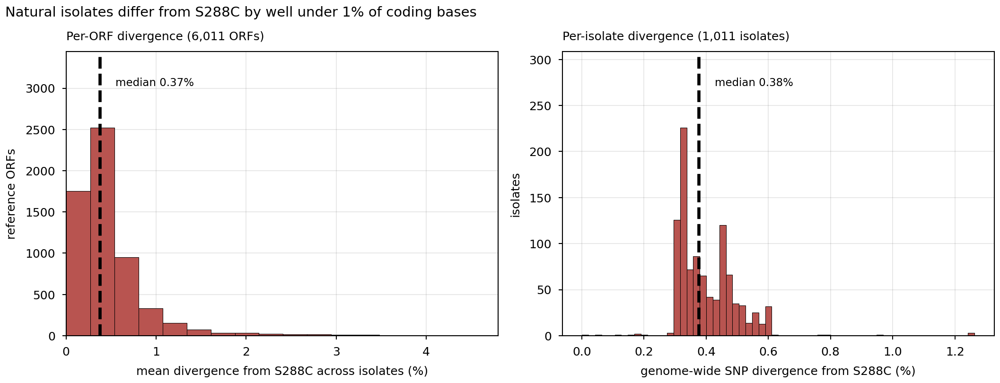
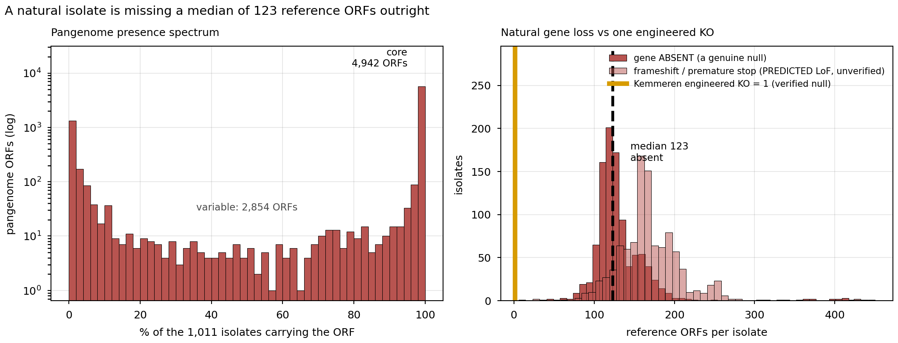
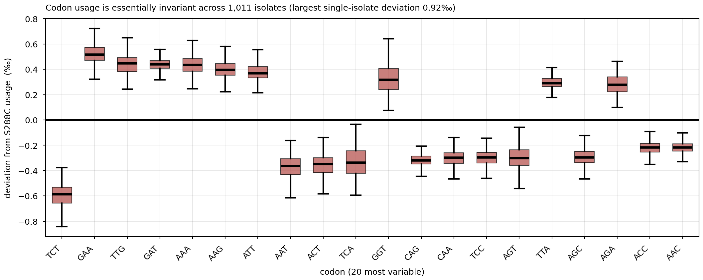
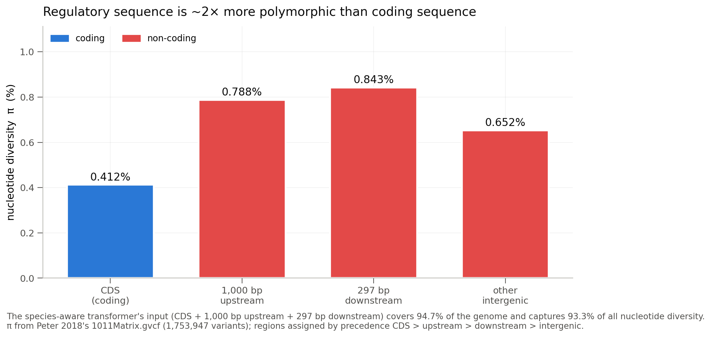
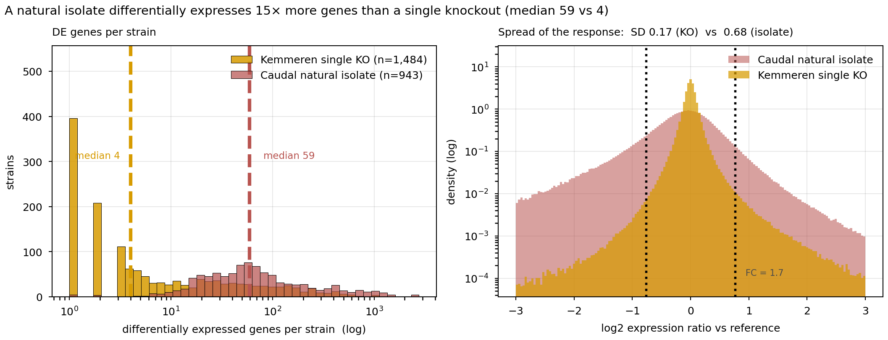
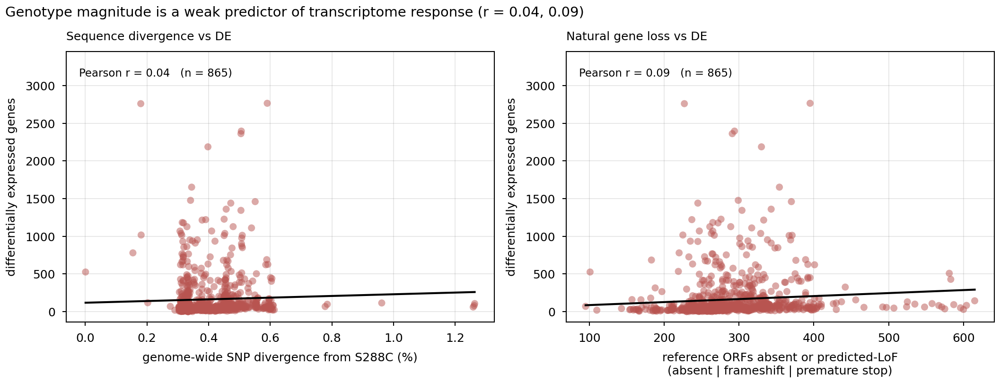
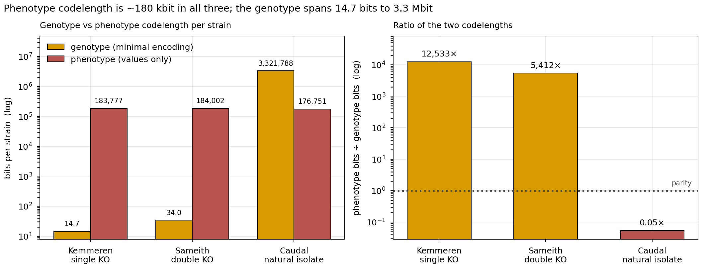

## 2026.07.13 - Where do the bits come from? (issue #66)

Closes the analysis asked for in [issue #66](https://github.com/Mjvolk3/torchcell/issues/66):
natural-isolate genomic diversity vs KO-driven expression variability, as a bit
accounting for the inputs the Cell Graph Transformer consumes. Feeds **Fig. 1c /
Supplementary Note 5**.

**Future modeling setup** (Fig. 4, "Natural Genetic Variation vs Model-Design
Perturbations") — how to turn this analysis into a prediction experiment (Kemmeren +
Sameith + Caudal expression; does natural variation improve perturbation prediction; the
sequence-encoding motivation): [[experiments.018-natural-isolate-genomics.expression-modeling-setup]].

> **Read the [Corrections](#20260713---corrections-what-the-first-pass-got-wrong)
> section at the bottom before citing anything here.** The first pass of this experiment
> overclaimed in three places; the body below has been corrected, and the retractions are
> documented rather than quietly edited away.
>
> **2026.07.15 — the Caudal genotype was fixed (#71).** The loader had silently dropped
> ~126,839 gene-absence edits across the panel (median 0 vs 126 per isolate). It now emits
> them. Effect on the numbers below: **negligible** — the genotype codelength is dominated
> by the ~4.76M sequence-variant records, so `genotype_as_stored` moved only 94.8 → 93.7 MB
> and the sequence-diff headline (3.3 Mbit) is unchanged. The fix matters for **genotype
> fidelity** (the dataset a model would train on is now correct), not for this bit
> accounting. See [[experiments.018-natural-isolate-genomics.expression-modeling-setup]].

### The one-paragraph answer

The two modalities sit at **opposite ends of a genotype-codelength range, while their
phenotype codelength is essentially identical.** A Kemmeren single-KO genotype is one gene
index out of 6,607 -- **14.7 bits** -- against a ~6,000-gene expression vector of
**183,777 bits**. A Caudal natural isolate's genotype carries **3,321,788 bits** of
sequence divergence against a phenotype of **176,751 bits**. **Codelength here is PER
STRAIN** -- each strain's ~6,000-gene expression vector compresses to ~180 kbit regardless
of dataset, which is why the phenotype side is ~equal across all three even though Sameith
has only 72 strains and Caudal 943; the genotype side spans **five orders of magnitude**.
That is the finding. (The ratio of the two -- 12,533x vs 0.05x -- is arithmetic on two
gzip codelengths; reading it as "how much a model must infer" is *interpretation*, not
measurement, and earlier drafts of this note stated that gloss as if it were a result.)

The transcriptional consequence is strongly sublinear in the genotype: an isolate is
missing a median of **123 reference ORFs outright** (vs the KO's 1 engineered deletion)
yet differentially expresses only **~15x** more genes, and per-isolate genomic divergence
is **uncorrelated** with the number of DE genes (**r = 0.04**).

### Headline numbers

| Question | Answer |
|---|---|
| Per-ORF divergence vs S288C R64 | mean **0.42%** (SNP-only), **0.69%** incl. indels |
| Core vs accessory (Peter's own rule: present in all 1,011) | **4,942** core / **2,854** variable -- *reproduces* Peter's 4,940 / 2,856 (we recompute their count and land within 2) |
| π: coding vs regulatory | CDS **0.412%**, upstream-1000 **0.788%**, downstream-297 **0.843%** |
| Species-aware transformer input coverage | **94.7%** of genome, **93.3%** of all π |
| Codon usage drift across isolates | largest deviation **< 1‰** -- essentially invariant |
| DE genes per **single KO** (Kemmeren, paper-exact) | mean **36.1**, **median 4**, 5% change nothing |
| DE genes per **natural isolate** (same rule) | mean **160.3**, **median 59** |
| Natural gene loss per isolate | **median 123** reference ORFs ABSENT (a genuine null); + 134 frameshift / 32 nonsense as *predicted*, unverified LoF |
| Genotype bits: KO vs isolate | **14.7** vs **3,321,788** |
| Phenotype bits (values only) | **183,777** vs **176,751** -- essentially the same |

### Data + provenance

All inputs hash-pinned; every retrieved file's md5 verified against the source's own
published `md5.txt`.

| Artifact | Provenance |
|---|---|
| `allReferenceGenesWithSNPsAndIndelsInferred.tar.gz` | already mirrored; sha256 `b5400b89…` -- 6,015 gene FASTAs x 1,011 isolate alleles |
| `1011Matrix.gvcf.gz` (**newly retrieved**, 5.8 GB) | `http://1002genomes.u-strasbg.fr/files/` -- md5 `42478e3e…` **matches published md5.txt**; sha256 `03777325…` |
| `genesMatrix_PresenceAbsence` / `_Frameshift`, `gene_dNdS`, `1011LossOfFunction` | same host; all four md5s **match published md5.txt** |
| `deleteome_all_mutants_ex_wt_var_controls.txt` (**newly retrieved**) | `deleteome.holstegelab.nl` -- sha256 `7f93af35…`; ships limma M + p per mutant |
| `deleteome_responsive_mutants_ex_wt_var_controls.txt` | sha256 `563f3064…` -- the paper's OWN responsive set (ground truth) |
| Kemmeren 2014 PDF | Zotero group `6582362`, item `A2V6WX6H`; sha256 `531037bd…`. **Not open access -- not in PMC.** |

**Sourced thresholds** (never guessed, per the provenance rules):

- **DE criterion** -- Kemmeren 2014, Extended Experimental Procedures, *"Statistical
  Analysis of Expression Profiles"*: *"P values were obtained from the limma R package
  version 2.12.0 … after Benjamini-Hochberg FDR correction. Genes were considered
  significantly changed when the fold-change (FC) was > 1.7 and the p value < 0.05."*
  → `|log2 FC| > log2(1.7) = 0.7655` **AND** BH-adj `p < 0.05`.
- **Responsive mutant** -- same source: *"responding (>= 4 genes changing) and
  nonresponding (<4 genes changing)."*
- **Core genome** -- Peter 2018 `paper.md` (sha256 `21c49934…`, line 220): *"…the
  identification of 4,940 ORFs present in the 1,011 strains of the collection,
  representing the core genome plus 2,856 ORFs…"* → core = present in **all** 1,011, not a
  ≥99% cutoff.
- **Het weighting** -- Peter 2018 `filesDescription.txt`: *"Heterozygous differences were
  half-weighted compared to the homozygous differences."* Generalized to any IUPAC code as
  `w = 1 - [ref ∈ alleles(code)] / |alleles(code)|`, which reduces to their rule exactly.

### Validation gates (all pass)

1. **DE criterion reproduces the paper.** The deleteome publishes the paper's own
   responsive-mutant set (**699** mutants). Our derived set (769 at ≥4 changed genes) is a
   strict **superset**: intersection 699, **zero missed**. The criterion is implemented as
   specified. Our union-of-changed-transcripts (4,473) sits 6.7% above the paper's 3,966 --
   the deleteome file is a later revision of the 2014 matrices, so we take the **published**
   responsive set as authoritative and report the gap rather than tune to it.
2. **Core genome reproduces the paper.** 4,942 / 2,854 vs published 4,940 / 2,856.
3. **Two independent methods agree.** CDS π from the VCF (**0.412%**) vs per-gene FASTA
   Hamming divergence (**0.420%**) -- different files, different algorithms, same answer.
4. **Codon logic cross-checks.** Our per-gene pN/pS vs Peter's published PAML dN/dS:
   **r = 0.579** over 5,681 genes.
5. **Bit ledger reproduces the paper table.** Caudal `phenotype_as_stored` = **94,054,411 B**
   -- byte-identical to the cached `Signal (gzip)` value in `dataset_signals_cache.json`.

---

### 1-2. Genome divergence, core vs accessory



*SNP divergence is het-weighted per Peter 2018's published convention; length-changing indel alleles are scored by exact edit distance.*

6,077,121 (gene x isolate) pairs over 6,011 reference ORFs (8,639,057 coding bases total; "0.42% divergence" means 0.42% OF those coding bases differ). **9.6% carry a
length-changing indel**, which Hamming cannot score; leaving them NaN would have biased the
headline down, so they are resolved by exact global edit distance. Indel-bearing alleles
average **36.7 bp** of edit distance, which is why total divergence (**0.693%**) is 65%
above SNP-only (**0.420%**). Median indel is **3 bp** -- in-frame, the signature of
selection against frameshifts.

**Computation.** Divergence is one ratio over *all* coding bases of *all* shared genes (not
a mean of per-gene percentages), with heterozygous sites down-weighted per Peter 2018's
half-weight convention:

$$
\text{div}=100\cdot\frac{\displaystyle\sum_{g}\sum_{i=1}^{L_g} c_{g,i}}{\displaystyle\sum_{g} L_g}\ \%,
\qquad
c_{g,i}=1-\frac{\mathbb{1}\!\left[\text{ref}_{g,i}\in\mathcal A(\text{code}_{g,i})\right]}{\bigl|\mathcal A(\text{code}_{g,i})\bigr|}
$$

where $\mathcal A(\text{code})$ is the base set an IUPAC code admits, so a het call carrying
the reference base costs $1-\tfrac12=\tfrac12$ and a homozygous non-reference call costs $1$;
indel-bearing alleles (which Hamming cannot score) instead contribute
$\operatorname{editdist}(a^{s}_g,a^{\text{ref}}_g)$ mismatched bases to the numerator.



*Core = present in all 1,011 isolates (Peter 2018's own definition; we recompute their count and reproduce it -- 4,942 vs their published 4,940, within 2). NOT comparable to a KO one-for-one: a KanMX deletion is a verified complete null in an isogenic background; a natural variant allele is unverified, selected-upon and compensated.*

The presence spectrum is sharply **bimodal** -- ORFs are either in everything or in almost
nothing. Of 6,059 reference ORFs in the pangenome, **81.4%** are core.

### 3. Codon usage



**Codon usage is essentially invariant across the 1,011 isolates** -- the largest
single-isolate deviation from S288C is well under 1 codon per 1,000. Whatever the isolates
differ by, it is not codon preference. (Computed over intronless ORFs only; the 241
intron-containing genes are excluded from all codon statistics because the Peter sequences
are unspliced genomic spans.)

### 4-5. Coding vs regulatory -- the species-aware transformer window



*The species-aware transformer's input (CDS + 1,000 bp upstream + 297 bp downstream) covers 94.7% of the genome and captures 93.3% of all nucleotide diversity. π from Peter 2018's 1011Matrix.gvcf (1,753,947 variants); regions assigned by precedence CDS > upstream > downstream > intergenic.*

From 1,753,947 population variants in `1011Matrix.gvcf`. The window is the one the
**species-aware transformer** (`FungalUpDownTransformer` → `gagneurlab/SpeciesLM`) actually
reads, pinned at `torchcell/datasets/fungal_up_down_transformer.py:29-32`: `window_five_prime(1003,
include_start_codon=True)` = **1,000 bp upstream + ATG**, and `window_three_prime(300,
include_stop_codon=True)` = **stop + 297 bp downstream**.

- **Regulatory sequence is ~2x more polymorphic than coding sequence** (π 0.79-0.84% vs
  0.41%) -- purifying selection on protein-coding sequence, drift in promoters/terminators.
- **The model's input already sees nearly everything**: CDS + 1,000 up + 297 down covers
  **94.7%** of the nuclear genome and captures **93.3%** of all nucleotide diversity. Widening
  the window buys almost nothing; there is very little variation the model cannot see.
- Caveat: `intergenic_other` is the *leftover* after precedence (CDS > upstream >
  downstream), so in a genome this compact it is a small, odd residue (5.3% of bp) and its
  π (0.652%) should not be over-read.

**Computation.** Per region, $\pi$ is the mean per-site nucleotide diversity — averaging,
over the $L$ sites of that region, the probability that two randomly drawn isolate alleles
differ:

$$
\pi_{\text{region}}=\frac{1}{L}\sum_{i=1}^{L}\frac{n_i}{n_i-1}\Bigl(1-\sum_{b\in\{A,C,G,T\}}\hat p_{i,b}^{\,2}\Bigr),
$$

with $\hat p_{i,b}$ the frequency of base $b$ at site $i$ across the $n_i$ isolates genotyped
there (the $\tfrac{n_i}{n_i-1}$ factor is the finite-sample correction). Region membership is
assigned by precedence CDS $>$ upstream $>$ downstream $>$ intergenic, and each site is
counted once.

### 6. Single KO vs natural isolate -- the expression comparison



*Identical rule on both arms: |log2 FC| > log2(1.7) AND BH-adjusted p < 0.05 (Kemmeren 2014's own criterion). Caudal has no published p-values, so its noise model is estimated from its 29 replicate cultures and applied the same way — without that control its count would be 1,011, not 160.*

Both arms get the **identical rule**. Kemmeren's is noise-controlled by limma's p-value;
Caudal ships one culture per isolate and no p-values, so an effect-only count for Caudal
compared against a p-gated count for Kemmeren would be rigged. We therefore built Caudal an
equivalent noise control from **its own 29 replicate cultures**: per-gene noise SD
`sigma_g` (pair SD / sqrt(2), since a pair carries two noisy measurements), then z → p → BH
within each isolate.

That correction matters enormously and is the difference between an honest and a dishonest
headline:

| | effect-only | noise-controlled |
|---|---|---|
| Caudal DE genes / isolate (mean) | 1,011 | **160** |

Variance decomposition: observed SD **0.678** = noise **0.390** ⊕ biological **0.554**.
Caudal's single-culture RNA-seq is *close to noise-parity per gene*, and any analysis that
skips this will over-state natural variation by ~6x.

**Computation.** The identical DE rule is an effect-size gate AND a per-strain BH-significance
gate:

$$
\mathrm{DE}_s=\Bigl|\bigl\{g:\ |\ell_{s,g}|>\log_2 1.7\ \wedge\ p^{\mathrm{BH}}_{s,g}<0.05\bigr\}\Bigr|.
$$

Caudal has no published $p$, so a per-gene noise SD is built from its 29 replicate culture
**pairs** and turned into a $z$-test (the $\sqrt2$ removes the two independent noise draws a
difference-of-pair carries):

$$
\sigma_g=\frac{\operatorname{SD}_{\text{pairs}}\!\bigl(\Delta_g\bigr)}{\sqrt2},\qquad
z_{s,g}=\frac{\ell_{s,g}}{\sigma_g},\qquad p_{s,g}=2\,\Phi(-|z_{s,g}|),\ \ p^{\mathrm{BH}}_{s,\cdot}=\mathrm{BH}\bigl(\{p_{s,g}\}_g\bigr).
$$

The variance split is an additive decomposition of the observed per-gene variance into the
replicate-noise floor and the residual biological component:

$$
\sigma^2_{\text{obs}}=\sigma^2_{\text{noise}}+\sigma^2_{\text{bio}}\ \Rightarrow\ 0.678^2=0.390^2+0.554^2.
$$

**Results:**

- A **typical single deletion changes 4 genes** out of ~6,100. **5% change nothing at all.**
  Only **47%** are "responsive" (≥4 genes) -- exactly the paper's 699/1,484.
- A **typical natural isolate changes 59 genes** -- **~15x more** (4.4x by mean; the mean
  ratio is dragged down by Kemmeren's heavy tail of hub/TF deletions, max 1,014 genes).

### 7. Genotype magnitude does not predict transcriptome response



*Each point is one of the 943 natural isolates. If genome bits translated directly into transcriptome bits, these would be tight lines.*

This is the most surprising result. Across the 865 isolates with both measurements:

- `r(genome-wide divergence, n_DE)` = **0.038**
- `r(natural-KO burden, n_DE)` = **0.086**
- `r(genome-wide divergence, natural-KO burden)` = **0.477**

**Computation.** Each $r$ is a Pearson correlation over the $n=865$ isolates carrying both
quantities — the fit line in the panel is the matching degree-1 (least-squares) regression:

$$
r(u,v)=\frac{\sum_{s}(u_s-\bar u)(v_s-\bar v)}{\sqrt{\sum_{s}(u_s-\bar u)^2}\,\sqrt{\sum_{s}(v_s-\bar v)^2}},
$$

with $(u,v)$ ranging over the three pairs above ($\text{div}_s$, natural-KO burden, and
$\mathrm{DE}_s$).

The third correlation is the control: the two *genotype* measures agree with each other, so
the genotype axis is measured fine. It simply **does not predict how much the transcriptome
moves**. An isolate with twice the sequence divergence does not differentially express twice
as many genes.

The defensible reading is the *decoupling*, not a fold-change: within the natural isolates,
**how much genome you have lost tells you almost nothing about how much your transcriptome
moves** (r = 0.04 for divergence, r = 0.09 for gene loss). Natural gene loss is concentrated
in dispensable, accessory, already-redundant genes and is buffered.

Do **not** turn this into "N× more broken genes → only 15× more DE genes." An engineered
KanMX deletion is a *verified complete null in an isogenic background*; a natural isolate's
missing or truncated allele is unverified, selected-upon and compensated. The two are not
commensurable one-for-one, and an earlier draft of this note wrongly treated them as if
they were.

### 8. The bit ledger



*L_C = gzip codelength (zlib level 6, streamed) — a computable UPPER BOUND on Kolmogorov complexity, not an entropy, and a loose one (gzip leaves 1.4–5× vs a large-window compressor). The right-hand ratio is arithmetic on those two codelengths; any reading of it as 'what a model must infer' is interpretation, not measurement.*

`L_C` = gzip codelength (zlib level 6, streamed) -- a *computable upper bound* on Kolmogorov
complexity, **not** an entropy. Same compressor as the paper's `Signal (gzip)` column. All
figures are **bits PER STRAIN** (per record), not dataset totals.

**Computation.** For a modality serialized to a byte stream $x$ over $N$ strains, the
per-strain codelength and the right-panel ratio are:

$$
L_C(\text{per strain})=\frac{8\cdot\bigl|\mathrm{gzip}_{6}(x)\bigr|}{N}\ \text{bits},
\qquad
\text{ratio}=\frac{L_C^{\text{phenotype}}}{L_C^{\text{genotype}}},
$$

with $|\mathrm{gzip}_6(x)|$ the compressed size in bytes ($\times 8$ = bits). The ratio is
pure arithmetic on the two codelengths — nothing is inferred — so parity (dotted line) is
$\text{ratio}=1$.

**How to read the two-panel figure.** Left panel: two bars per dataset -- genotype
codelength and phenotype codelength, per strain. Right panel: their **ratio**,
phenotype-bits ÷ genotype-bits (nothing is added). The dotted line is **parity** (ratio =
1, where a strain's genotype and phenotype carry equal bits). Kemmeren's ratio is
**12,533x** (phenotype hugely outweighs its 14.7-bit genotype -- far above parity); Caudal's
is **0.05x** (its multi-megabit genotype outweighs the phenotype -- far below parity). The
phenotype bars are ~equal across all three because every strain is a ~6,000-gene vector; the
genotype bars are what move.

| modality | encoding | L_C | bits/strain |
|---|---|---:|---:|
| Kemmeren single KO | genotype (combinatorial floor) | 2,354 B | **12.7** |
| Kemmeren single KO | genotype (minimal) | 2,720 B | **14.7** |
| Kemmeren single KO | genotype (as stored) | 13,985 B | 75.4 |
| Kemmeren single KO | phenotype (values only) | 34.1 MB | **183,777** |
| Kemmeren single KO | phenotype (as stored) | 395.8 MB | 2,133,710 |
| Sameith double KO | genotype (minimal) | 306 B | **34.0** |
| Sameith double KO | phenotype (values only) | 1.7 MB | 184,002 |
| Caudal isolate | phenotype (values only) | 20.8 MB | **176,751** |
| Caudal isolate | phenotype (as stored) | **94.05 MB** | 797,917 |
| Caudal isolate | genotype (as stored) | **94.77 MB** | 803,971 |
| Caudal isolate | **sequence diff vs S288C** | **419.8 MB** | **3,321,788** |
| Caudal isolate | sequence raw nt | 2,548.4 MB | 20,165,720 |

**Issue #66's premise is confirmed -- and then explained away.** The 94 MB phenotype /
95 MB perturbation near-equality is real (94.05 vs 94.77 MB, reproduced to the byte). But
**that ~95 MB is encoding, not information.** The LMDB perturbation records store a gene
name, an SO term, a URI, and *the same `sequence_sha256` repeated on all ~4.7M records* --
never the actual variant. The **real** genotype content, the sequence diff against S288C, is
**419.8 MB -- 4.4x larger**. So the Signal column *understates* the isolate genotype by 4.4x
while appearing to measure it.

---

### What `Signal (gzip)` actually measures

Verified against the live table: our Kemmeren instance = **396.4 MB** (table: 4.0e8) and
Caudal = **190.2 MB** (table: 1.9e8). ✓ These are the same bytes the table counts.
Script: `verify_signal_composition.py`.

**1. A large share is serialization, but it is not "metadata".** Holding representation
fixed at each step (as-stored JSON → keys stripped → primary field only → binary):

| phenotype | JSON keys | extra value **fields** | float-as-text | primary values |
|---|---:|---:|---:|---:|
| Kemmeren (395.8 MB) | 34.8% | **43.7%** (se, variance, n_replicates, linear expr) | 12.9% | **8.6%** |
| Caudal (94.1 MB) | 37.3% | 12.4% (counts) | 28.6% | **21.8%** |

So **~48-66% is true serialization overhead** -- the gene-name key repeated in every
record, plus floats stored as ASCII. The rest is *real companion data*, not metadata.
This is why Kemmeren sits so far above the trend in
`assets/images/database/supported-datasets-instances-vs-signal.png`: a vector(6169)
phenotype with four companion dicts.

**2. Record ORDER does not matter here.** Measured on the actual LMDB records:
strain-major (as stored) vs gene-major vs shuffled = **1.00x**. No effect.

**3. gzip's 32 KB window does leave real slack, worst on perturbation-heavy rows**
(gzip-6 vs a large-window compressor, on the exact bytes the table counts):

| | gzip-6 | xz | gzip leaves |
|---|---:|---:|---:|
| Kemmeren instance | 396.4 MB | 285.3 MB | 1.4x |
| Caudal instance | 190.2 MB | 89.6 MB | **2.1x** |
| Caudal **genotype block alone** | 94.8 MB | 19.1 MB | **5.0x** |

→ Report Signal as **a codelength under a stated encoding** -- a valid *relative* proxy
across identically-serialized datasets, and a **loose** upper bound on `K(D)` (1.4-2.1x at
the instance level, ~5x on perturbation-heavy blocks). The current caption's
"Kolmogorov-complexity proxy" is defensible; "the information content of the dataset"
would not be.

### Implications for the CGT

- The phenotype codelength is ~180 kbit in **all three** datasets. The genotype spans
  14.7 bits (single KO) to 3.3 Mbit (natural isolate) -- five orders of magnitude. Whatever
  a model learns from a KO strain, it cannot be reading it out of the genotype.
- **Natural-isolate data is the only modality that carries sequence variation at all**, and
  it is the only one that can teach what such variation *does*. That is the argument for
  wanting it.
- **But the coupling is weak (r = 0.04)**, so natural isolates will not, on their own, teach
  a dose-response. They mostly teach *which* variation is silent -- which is most of it.
- **The species-aware transformer's window is already near-complete** (93.3% of π; 94.7% of
  the genome). Widening it buys almost nothing -- worth remembering before anyone spends
  effort there.

### Caveats, stated not buried

- **Sameith 2015 is excluded from the DE comparison** -- confirmed per-array dye-orientation
  defect, see Corrections below. Its DE counts would be a lower bound.
- **Caudal's noise model rests on 29 replicate pairs** and a normal approximation for
  `sigma_g`. It is the best available and it is the isolates' own data, but it is thin.
- **"Absent" vs "broken".** Only *gene absent* (median 123/isolate) is a genuine null.
  Frameshift (134) and premature stop (32) are **predicted** loss-of-function in a
  co-evolved, compensated background -- never verified as nulls. And a KanMX deletion is a
  *verified complete null in an isogenic background*, so "N natural losses vs 1 engineered
  KO" is not a one-for-one comparison. Earlier drafts called the union "broken ORFs" and
  drew a "277x more broken genes" conclusion from it; that was an overclaim and is
  withdrawn.
- **The 1,011 vs 943 gap**: divergence/pangenome analyses use all 1,011 Peter isolates;
  expression analyses use the 943 with Caudal transcriptomes. Joins are on the 865 with both.

### Reproduce

```bash
# 1. per-ORF divergence (6.08M gene x isolate pairs, ~64 workers)
python experiments/018-natural-isolate-genomics/scripts/build_divergence_matrix.py
# 2. resolve the 9.6% length-changing indel alleles by exact edit distance
python experiments/018-natural-isolate-genomics/scripts/resolve_indel_divergence.py
# 3. core/accessory + natural-KO burden + dN/dS cross-check
python experiments/018-natural-isolate-genomics/scripts/pangenome_and_natural_ko_burden.py
# 4. coding vs regulatory pi from the population VCF
python experiments/018-natural-isolate-genomics/scripts/regulatory_divergence.py
# 5. THE comparison: single KO vs natural isolate, one DE rule, noise-controlled
python experiments/018-natural-isolate-genomics/scripts/differential_expression_comparison.py
# 6. the L_C ledger
python experiments/018-natural-isolate-genomics/scripts/bit_accounting.py
# 7. the ordering caveat
python experiments/018-natural-isolate-genomics/scripts/serialization_order_effect.py
# 8. figures
python experiments/018-natural-isolate-genomics/scripts/make_figures.py
```

Results land in `experiments/018-natural-isolate-genomics/results/`; figures in
`notes/assets/images/018-natural-isolate-genomics/`.

## 2026.07.13 - Corrections (what the first pass got wrong)

Three claims in the first landing did not survive checking. They are retracted here rather
than quietly edited out, and each retraction now has a script that reproduces the correct
number.

### RETRACTED 1 -- "91% of Kemmeren's Signal is JSON keys/metadata"

That compared as-stored JSON against a float32 binary array of **one** field, silently
conflating four different costs: keys, *additional value fields*, float-as-text, and
float precision. Decomposed properly (`verify_signal_composition.py`), the 395.8 MB is
**34.8% keys / 43.7% extra value fields / 12.9% float-text / 8.6% primary values**. The
extra fields (SE, variance, `n_replicates`, linear expression) are **real data**, not
metadata. Corrected statement: **~48-66% is serialization overhead.**

### RETRACTED 2 -- "L_C swings 24.5x on record order, so the gzip column is off by an order of magnitude"

The 24.5x is real but it is a property of the **DNA corpus**, where two isolates' allele of
the same gene are ~99.3%-identical *strings* and adjacency lets DEFLATE emit one long
back-reference. I extrapolated it to the Signal column without measuring. On the **actual
LMDB expression records** the order effect is **1.00x** -- strain-major, gene-major and
shuffled are all identical, because float32 patterns of similar numbers share no substring.

**Lesson: compressibility does not transfer across data types.** What *is* true: gzip's
32 KB window leaves **1.4x** (Kemmeren instance), **2.1x** (Caudal instance) and **5.0x**
(Caudal genotype block) versus a large-window compressor. Loose -- not off by 10x.

### RETRACTED 3 -- "caudal2024 drops ~93 isolates' sequence variants"

False. All 943 built isolates have sequence variants (4,759,608 rows, 943 unique strains).
The 93 `SACE_`-prefixed isolates simply are not among the 943. **The parse is still a
landmine** and is filed as an issue -- see below -- but it loses nothing today.

### CONFIRMED 1 -- Sameith 2015: per-array dye-orientation defect (NOT a global sign error)

The earlier "Sameith has a sign bug" framing was too strong and the **global sign is
correct**: the Kemmeren↔Sameith profile correlation over the 82 overlapping single
deletions is **+0.42 mean / +0.59 median as stored**, and is exactly negated by a global
flip. Do **not** flip it.

What is real, read straight from the GEO source (`audit_sameith_geo_orientation.py`):
GSE42536 is a **dye-swap** design (the `-a`/`-b` title suffix *is* the swap), and GEO
declares **both ratio directions within the same series**:

| `#VALUE` definition in GEO | arrays |
|---|---:|
| `normalized log2 ratio (Cy5/Cy3)` | 132 |
| `normalized log2 ratio (Cy3/Cy5)` | **127** |
| `dye bias corrected … (Cy5/Cy3)` | 8 |
| `dye bias corrected … (Cy3/Cy5)` | 7 |
| `-INV_VALUE: … Cy3/Cy5 test/ref)` | 7 |
| `normalized log2 ratio Cy3/Cy5 test/ref` | 6 |

Recomputing each array's true orientation from `Signal Norm_Cy5`/`Cy3` (|corr| with VALUE
= 1.000, unambiguous): **217 arrays are log2(Cy5/Cy3), 70 are log2(Cy3/Cy5)**.
`sameith2015.py:645-653` hard-codes one convention and derives the sign from
`source_name_ch1` alone → **217/287 correct, 70 (24%) signed BACKWARDS.**

Because replicates are averaged, mixed-sign replicates **attenuate |M| and inflate SE** --
which is exactly why Sameith's deleted-gene median is **-0.71** against Kemmeren's
**-2.48**, and why 16% of Sameith deletions show their own gene going *up* (Kemmeren: 3%).
**No global flip fixes this.** The fix is the one Kemmeren's loader already uses: ignore
`VALUE`, recompute the ratio from the signal columns + the dye assignment.

### CONFIRMED 2 -- caudal2024 omits ~133 gene-absence edits per isolate

This is the serious one, and it is a genome-fidelity bug.
`_content_perturbations` takes `s288c_mask` as a parameter and **never uses it**. Both
loops guard on `core_mask` (`presence.mean(axis=0) >= 0.99`):

```python
presence : (~core_mask) & (presence_row == 1)   # non-core ORF PRESENT
absence  :   core_mask  & (presence_row == 0)   # core ORF ABSENT
```

An S288C **reference ORF that is variable (not core) and ABSENT from the isolate matches
NEITHER loop → no perturbation record is emitted at all**, and the isolate reconstructs as
if it still carries the gene. The guard is on the wrong axis: presence/absence relative to
S288C is a question about **reference membership**, not **population frequency**.

Measured over the panel (`audit_caudal_missing_absences.py`):

| gene-absence records, per isolate | |
|---|---:|
| loader **emits** | mean 1.9, **median 0** |
| **should** emit | mean 134.9, **median 126** |
| **silently missing** | **mean 133** |

**134,428 missing gene-absence edits across the 1,011-isolate panel.** The function's own
docstring promises *"Every absence is recorded … never dropped (a dropped absence would
wrongly reconstruct as present)"* -- which is precisely what is happening.

`s288c_mask` -- the mask that *should* gate the absence loop -- is **also incomplete**: it
is built from `_orf_to_s288c`, which returns `None` for all **804 `_NumOfGenes_N` paralog
clusters**, of which **793 are real reference ORFs** (YAL005C/SSA1, YAL038W/CDC19 …). Any
fix must strip that suffix before mapping. **Fixing this requires a Caudal LMDB rebuild.**
