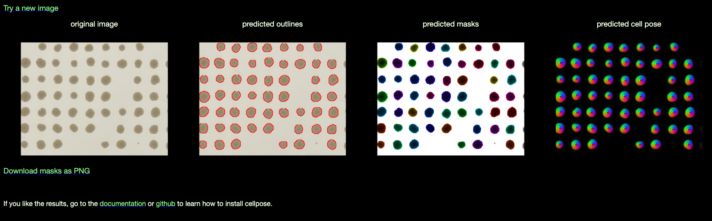

## 2026.07.21 - Decision and plan: move colony segmentation to Cellpose

Related: [[experiments.010-kuzmin-tmi.12_panel_crispr_fitness_assay]] (the assay + the classical
`torchcell/sga/image.py` pipeline this replaces), `torchcell/sga/image.py` (current segmenter).

### Decision

Adopt **Cellpose** (Cellpose-SAM / `cyto3`) for per-colony segmentation, replacing the classical
per-cell MAD/border threshold in `torchcell/sga/image.py`. Rationale, after benchmarking every
classical option (threshold, convex hull, Chan-Vese, morphological active contour) on our own
colonies:

- Every classical *smoothing* method hallucinates on empty/tiny cells (active contour balloons to
  fill an empty well; hull deletes small colonies), so the threshold could only ever be a
  presence-gate, not a clean boundary. Classical is at its ceiling for this imaging.
- Cellpose returns **instance masks** -- each colony gets its own integer ID -- so overlapping /
  touching / off-grid extra colonies are separated natively. This directly solves the "invalidate
  a well that has a second, off-grid colony" requirement (two instances mapping to one grid node
  -> invalidate) and the merged-double case that distance-transform peak-splitting could not catch
  (thick necks give one ridge, not two peaks).
- Morphology-independent, no per-plate threshold tuning; zero-shot capable (no fine-tuning needed
  to start). We already have GPU (gila workstation, MIG-partitioned), so inference cost is a
  non-issue.

### Key realization that de-risks this

At **full resolution the colonies are clean, sharp discs with no shadow tails** (see the crop
`experiments/019-echo-crispr-array/cellpose_test/P2_5nL_t72_crop_center.png`). Much of the edge
raggedness and "shadow tails" we fought was an artifact of the **low-res 1499x1999 preview images
being downscaled to 1400 px** for processing, not the real imaging. So Cellpose (and even the
classical threshold) will do materially better on the full-res source. Corollary imaging SOP:
export full-res originals (never the dragged Photos preview), and consider a fully diffuse
backlight to further flatten any residual directional shading.

### Web-demo validation (2026.07.21) - it works

Uploaded the full-res crop to the cellpose.org demo (`cyto3`, zero-shot, no tuning): predicted
outlines hug every colony tightly and each colony becomes its own instance mask -- visibly cleaner
than the classical threshold, and touching colonies are separated. This green-lights the plan.



Downloaded instance-mask PNG for reference:
`assets/images/019-echo-crispr-array/cellpose/P2_5nL_t72_crop_center_cellpose_masks.png`.

### Compute + data move (to gila workstation)

- Work moves to the **gila workstation** (GPU). Transfer the run-2 images to the analogous
  location under the data root there, e.g. `/home/michaelvolk/Documents/projects/torchcell/torchcell-scratch`.
- rsync (from this M1 machine; adjust host alias as configured):

  ```bash
  rsync -avP \
    experiments/019-echo-crispr-array/data/run2_2026-07-17/ \
    gila:/home/michaelvolk/Documents/projects/torchcell/torchcell-scratch/019-echo-crispr-array/run2_2026-07-17/
  ```

  Only the **full-res `*_up.jpg`** captures should transfer (the low-res previews and the
  mislabeled archive were deleted -- see `notes/scratch.2026.07.21.174048-del.md`). Verify sha256
  after transfer (t72: `e2b7c59b...` P1, `c9118d17...` P2).

### Cellpose integration plan

1. **Sanity check on the web demo (now):** upload the crop above to the Cellpose-SAM Hugging Face
   Space (or cellpose.org). Model `cyto3`; invert OFF (colonies are darker than agar); let it
   auto-estimate diameter first, then pin diameter ~ the colony pixel size if needed. Confirm it
   instance-labels each disc and splits touching pairs.
2. **Local install on gila:** follow the official install + model-download instructions at
   <https://github.com/mouseland/cellpose> (`pip install cellpose[gui]` or `pip install cellpose`;
   pulls torch). Models auto-download on first use to `~/.cellpose/models`; `cyto3` is the default
   generalist. For an offline/pinned run, pre-fetch with `python -c "from cellpose import models;
   models.CellposeModel(gpu=True, model_type='cyto3')"` on a networked node, then sync
   `~/.cellpose/models`. (ONNX `cpsam` export `keejkrej/cellpose-cpsam-onnx` is a torch-light
   alternative.) Verify GPU inference before wiring in.
3. **Wire into the pipeline (keep the grid):** the lattice fit in `image.py`
   (`_detect_blobs_backlit` -> `_fit_lines` -> `nodes`) is still the right well-assignment
   backbone and should be KEPT. New flow per plate:
   - Run Cellpose once on the whole processed plate (or per-cell crop) -> instance masks.
   - Assign each instance to its nearest grid node (centroid within ~`node_tol * pitch`).
   - `size` = instance mask pixel area; centroid = instance centroid.
   - **Invalidate** (`M` flag) any node that receives >= 2 instances, or an instance that is off
     every node -> a stray/contaminant colony. This is the "multiple colonies not in the grid ->
     invalidate" rule, now exact.
   - Keep the gel-polygon gate (`_gel_polygon`) to drop instances outside the gel.
   - Add a new `seg_method='cellpose'` branch (parallel to `'threshold'` / `'watershed'`), so the
     classical path stays available and comparable.
4. **Validation vs classical:** run both on all six run-2 plates; compare per-colony size
   correlation, WT CV (target: <= the classical ~0.11-0.17), Costanzo Pearson/Spearman (current
   best 2.5 nL 50 h: r = 0.76, rho = 0.69), and the number of overlap/merged wells recovered vs
   invalidated. Only promote Cellpose to default if it holds or beats these.

### Open questions

- Full-res vs downscaled input to Cellpose (full-res is cleaner but slower; `cyto3` has a diameter
  param that rescales internally -- likely feed full-res per-plate crops).
- Dependency weight: `cellpose` + `torch` GPU in the `torchcell` env; keep it an optional extra so
  the classical path runs without it.
- Whether to fine-tune on a few hand-labeled plate crops if zero-shot `cyto3` under-segments the
  faint 2.5 nL colonies (the SegFormer organoid checkpoint `ReyaLabColumbia/Segformer_Organoid_Counter`
  is the closest analog if a semantic model is preferred, but it needs a separate split step).

### Provenance

- Test crop: `experiments/019-echo-crispr-array/cellpose_test/P2_5nL_t72_crop_center.png`
  (946x730, full-res, from `P2_5nL_view_t72_up.jpg`), plus `..._crop_1024.png`.
- Reference tool studied: `sgatools` (Boone/Andrews SGA web app) added to the VS Code workspace;
  its image analysis calls **gitter** (`public/gitter/gitter.R`), the method the classical pipeline
  already follows.
