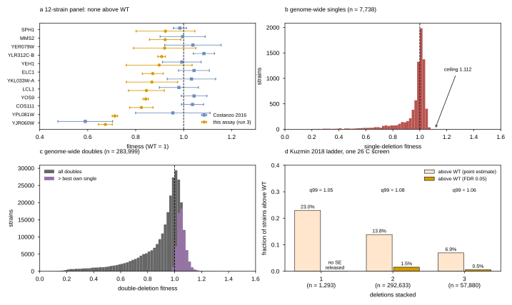

## 2026.07.26 - Is "stepping up the fitness ladder" reachable with a deletion panel?

Generated by `experiments/019-echo-crispr-array/scripts/ladder_feasibility.py`.
Outputs: `results/run3_ladder_feasibility.csv`, `results/run3_panel_vs_wt_tests.csv`,
`results/run3_ladder_feasibility_summary.json`.

**Question.** The next round pairs the 12 assayed single knockouts with ~14 double
knockouts to test whether stacking deletions walks fitness upward. That is only worth
doing if upward headroom exists. All tests are **one-sided** (only improvement counts)
with **Benjamini-Hochberg FDR at 0.05**.

### Results

| comparison | n | above WT (point) | above WT (FDR) | ceiling |
|---|---|---|---|---|
| our panel, run 3 | 12 | **0 (0%)** | 0 | 0.924 |
| our panel, Costanzo published | 12 | 6 (50%) | **0** | 1.085 |
| genome-wide single deletions | 7,738 | 3,775 (48.8%) | **209 (2.7%)** | **1.1118** |
| genome-wide doubles vs WT | 300,427 | 106,328 (35.4%) | 50,115 (16.7%)* | 1.340 |
| genome-wide doubles vs best own single | 283,999 | 66,607 (23.5%) | 1,039 (0.37%) | 1.340 |
| **RUNG: double > best own single AND > WT** | 283,999 | 64,979 (22.9%) | **1,033 (0.36%)** | 1.340 |

\* optimistic: the double/triple uncertainty is `sample_sd / sqrt(4 colonies)` **within one
screen**, so it omits the plate/screen term. That biases exceedance counts UP, which makes
the "no headroom" conclusion conservative. Single-mutant SEs are honest bootstrap SEs over
17 screens.

### The Kuzmin 2018 ladder (singles/doubles/triples, one 26 C screen)

| deletions stacked | n | above WT (point) | above WT (FDR) | 99th pct |
|---|---|---|---|---|
| 1 | 1,293 | 23.0% | no SE released | 1.046 |
| 2 | 292,633 | 13.8% | 1.52% | 1.081 |
| 3 | 57,880 | **6.9%** | **0.54%** | 1.060 |

**Stacking deletions moves the population monotonically AWAY from wild type**
(23.0% -> 13.8% -> 6.9%), and the 99th percentile does not move at all (1.05-1.08 at every
order). There is no ladder to climb in this direction.

### Findings

1. **Our panel has no headroom.** Zero of 12 measure above WT in run 3 (max 0.924), and
   zero of 12 are significantly above WT even in Costanzo's own published values. The one
   the eye picks out, **YLR312C-B (1.0845 +/- 0.0441)**, is only `z = 1.92` one-sided and
   does not survive multiplicity across 12 strains.
2. **YLR312C-B is nonetheless near the genome-wide maximum** -- it ranks 3rd of all 7,738
   deletion strains. So this is not a weak panel; the whole deletion collection is capped.
   The single best deletion in the genome (`YBR078W`/ECM33) buys **+11.2%**, and the median
   significant improver buys only **+4.1%**.
3. **Random doubles will not produce a rung.** At the measured rate of 0.36%, 14 doubles
   drawn at random yield **0.051 expected** FDR-significant rungs; `P(zero) = 95.0%`. A
   model would need **~19.6x enrichment over random** just to make one hit the expected
   outcome.

### Consequence for the design

Growth in rich/SGA medium is the phenotype yeast is already optimized for, so deletions are
overwhelmingly neutral-to-deleterious and the "improvement ladder" cannot be demonstrated
on it. Three framings survive:

- **Descending ladder** (WT > single > double > triple): well-supported and directly
  testable with the JT ordered-trend test at the powers computed in
  [[experiments.019-echo-crispr-array.next-round-sampling-design]].
- **Epistasis ladder**: rank by `eps = f_ab - f_a * f_b` rather than by raw fitness. The
  double need not beat WT -- only beat its own multiplicative expectation. This is what the
  assay can actually resolve.
- **Change the phenotype** so WT is no longer the optimum (stress, alternative carbon
  source, or a production trait). This is the only route to a genuine upward ladder.
