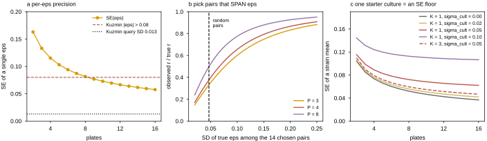
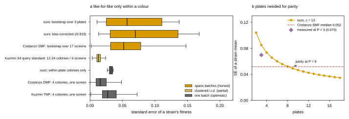
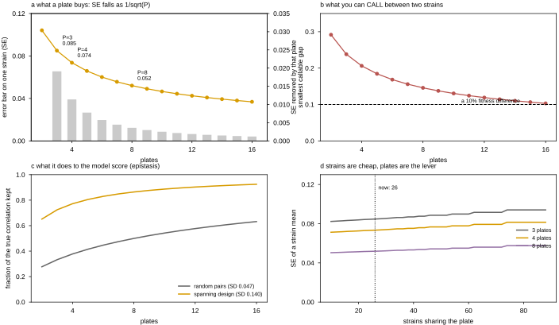
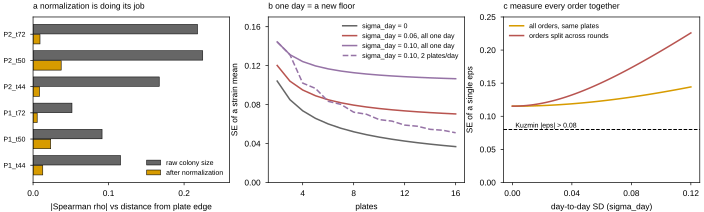

## 2026.07.27 - Kuzmin replicate structure (sourced) + dense layout for the next round

Generated by `experiments/019-echo-crispr-array/scripts/next_round_layout.py`.
Output: `results/run4_layout_options.csv`.

Framing settled: the upward fitness ladder is dead
([[experiments.019-echo-crispr-array.scripts.ladder_feasibility]]); the next round is scored
on **epistasis** `eps = f_ab - f_a*f_b`, and the model's real target is trigenic `tau`.



### What Kuzmin 2018 actually reports about replicate uncertainty

**Yes -- it is written in the SI prose, not only in the data tables.** Source:
`$DATA_ROOT/torchcell-library/kuzminSystematicAnalysisComplex2018/si/si1.md`,
`sha256 = 2ec80d05d823976e12add17699ad759bcd983768d2f53e7eb6c0185b963b8291`
(PDF `sha256 = afd5487946cc02da1840b213434c79c48ad6ace88074d594b2db85deb3fafca5`), line 59:

> "The quantitative scoring method employed for single and double mutant fitness estimation
> was described previously (8), with the exception that **bootstrapped means, instead of
> medians, across replicates were used in variance estimation and final fitness values**.
> Each high-density array was screened in **triplicate for a total of 6 replicates**. Since
> the arrays were in 1536-colony format, there are **4 technical replicates of mutants on
> the array** resulting in a total of **between 12 and 24 colony measurements for each
> fitness estimate**."

And line 191, on how those SDs are used:

> "Each query mutant fitness score has an associated **standard deviation**, and these were
> combined to calculate the expected variance of the double mutant fitness under the
> product. As epsilon scores are approximately normally distributed, this expected variance
> can be used to calculate a p-value."

So the uncertainty **type** is a bootstrap SD of the mean (= bootstrap SE) and the
replicate **structure** is `3 screens x 2 control-strain assays x 4 on-array technical =
12-24 colonies`. Reference (8) is Baryshnikova 2010 (already mirrored), which the SI defers
to for the scoring method itself.

**The released numbers.** `si/si_data/Data File S4_Fitness standard for single and double
mutant query strains.xlsx` = 546 query strains with columns `Fitness` and `St.dev.`:

| statistic | value |
|---|---|
| `St.dev.` median | **0.0130** |
| `St.dev.` range | 0.0035 - 0.0330 |
| `Fitness` median | 0.9527 |
| `Fitness` max | **1.0870** |

Two things fall out. First, the **max query fitness is 1.087** even across curated
single+double query strains -- independent confirmation of the ceiling. Second, their query
precision (0.013) is ~5x tighter than ours (run-3 bootstrap SE median ~0.056).

**Caveat on that 0.013 (ours is not 5x worse than it looks).** They bootstrap the pooled
12-24 colonies, but those colonies are 6 clusters of 4, not 24 independent draws. An i.i.d.
colony bootstrap over a clustered design under-represents the between-screen component --
the same pseudo-replication issue we hit. Their released SD is therefore optimistic by an
unknown factor, so the honest read is "their per-screen replication is better," not "their
error bars are 5x tighter."

**Still an open provenance gap:** the number of bootstrap DRAWS for the fitness bootstrap is
not stated here. The SI does state draw counts for two *other* bootstraps -- 50,000
repetitions for the interaction-count estimate (line 269) and "sampling with replacement
10,000 times" for the trigenic-space extrapolation (line 361) -- which bounds the lab's
habit but is not the fitness bootstrap. The chain runs Kuzmin 2018 SI -> ref (8)
Baryshnikova 2010, which we searched previously without finding a numeric B.

### Does the shared liquid starter culture matter? YES

From the SGA protocol the SI cites as ref (67),
`$DATA_ROOT/torchcell-library/kuzminSyntheticGeneticArray2016/paper.txt`, steps 33-37:

> 33. "Prepare query strain lawns **from the frozen glycerol stocks**."
> 35. "**Inoculate 5 mL of YEPD liquid medium with a single colony.** Incubate for 2 d at 30 C."
> 36. "Spread 800 uL of the **saturated liquid culture** on an OmniTray... Repeat to prepare
>     a total of **four query strain lawns for one genome-wide screen**."
> 37. "**Pin** the query strain from the lawn to freshly prepared plates..."

So within ONE screen, every replicate colony of a query strain descends from a single 5 mL
starter -- exactly our situation. What saves them is that the screen is repeated three
times, and each repeat re-enters at step 33 **from the frozen stock**, i.e. re-draws the
starter culture. Their replication unit is the screen, and the screen re-randomises the
culture.

**Our situation.** Every destination replicate is Echo-dispensed from ONE source well per
strain, so *all* plates share *one* starter. The variance model gains a term with no
divisor:

```
Var(mean) = sigma_culture^2 / K + sigma_plate^2 / P + sigma_colony^2 / (P*c)
```

At `K = 1` that first term is an **SE floor no number of plates can cross**, and run 3
could not measure it because it is perfectly confounded with the strain effect. Effect at
P = 4, c = 13:

| sigma_culture | K=1 | K=2 | K=3 | K=4 |
|---|---|---|---|---|
| 0.00 | 0.0736 | 0.0736 | 0.0736 | 0.0736 |
| 0.02 | 0.0763 | 0.0750 | 0.0745 | 0.0743 |
| 0.05 | 0.0890 | 0.0817 | 0.0791 | 0.0778 |
| 0.10 | **0.1242** | 0.1021 | 0.0936 | 0.0890 |

**Action: 3 independent starter cultures per strain (K = 3), one per plate.** That is 26
strains x 3 + WT = 81 source wells, which fits a single 96-well source plate. It shrinks the
term AND makes it estimable for the first time.

### Dense layout, 384 wells, no cushion

| c per strain | strain wells | WT wells |
|---|---|---|
| 12 | 312 | 72 |
| **13** | **338** | **46** |
| 14 | 364 | 20 |

**Recommend c = 13, WT = 46.** WT should take the remainder: every strain is normalised to
it, so WT error propagates into *every* strain rather than one.

Packing 26 strains instead of 12 costs almost nothing, because colonies only ever divide the
smaller variance term:

| plates | SE at c=27 | SE at c=13 | cost |
|---|---|---|---|
| 3 | 0.0828 | 0.0850 | +2.7% |
| 4 | 0.0717 | 0.0736 | +2.7% |
| 6 | 0.0586 | 0.0601 | +2.7% |

### The number that should drive pair selection

`SE(eps)` propagates three estimates, `SE(eps) = sqrt(se_ab^2 + 2*f_bar^2*se_single^2)`,
which at `f_bar = 0.851` is **1.56x** the per-strain SE:

| plates | SE(strain) | SE(eps) | vs Kuzmin's 0.08 threshold |
|---|---|---|---|
| 3 | 0.0850 | 0.1331 | 1.7x |
| 4 | 0.0736 | 0.1152 | 1.4x |
| 8 | 0.0521 | 0.0815 | 1.0x |
| 12 | 0.0425 | 0.0665 | 0.8x |

**At P = 3-4 the SE on a single eps exceeds Kuzmin's entire digenic calling threshold.**
Per-pair significance is out of reach at any plate count we would run. The reachable claim
is the **correlation** between predicted and measured eps -- and that is governed by
attenuation, `observed_r = true_r * sqrt(var_signal / (var_signal + SE(eps)^2))`:

| SD of true eps among the 14 chosen pairs | P=3 | P=4 | P=6 | P=8 |
|---|---|---|---|---|
| 0.047 (random pairs) | 0.33 | 0.38 | 0.44 | 0.50 |
| 0.093 | 0.57 | 0.63 | 0.70 | 0.75 |
| 0.140 | 0.73 | 0.77 | 0.83 | 0.86 |
| 0.187 | 0.81 | 0.85 | 0.89 | 0.92 |

The SD of eps across **random** Costanzo deletion pairs is only **0.0467** (measured, n =
300,427). Fourteen randomly chosen pairs would be attenuated to `0.33 x true_r` -- a true
r of 0.8 would read as 0.26, and the round would be wasted.

**So the dominant design lever is not plates -- it is WHICH 14 pairs.** Choosing pairs whose
*predicted* eps spans a wide range (3x the random spread) buys more than doubling the plate
count. Do not pick representative pairs; pick pairs that straddle the extremes, and include
predicted-strong-negative and predicted-near-zero deliberately.

### Recommended design

- **4 plates** (not 3): +14% precision over P=3 for one extra plate, and it gives a spare if
  one plate fails QC the way P3 nearly did.
- **c = 13 per strain, 46 WT wells, dense.**
- **K = 3 independent starter cultures per strain**, assigned to different plates.
- **Select the 14 doubles to maximise predicted-eps spread**, not to be representative.
- **Keep ~6 blank wells** in an asymmetric pattern. The user's plan is no gaps; the counter
  is that the blanks are what exposed the P3 one-row grid slip, and 6 wells costs 0.23
  replicates per strain. Cheap insurance for a failure mode that already cost us a day.

## 2026.07.27 - How we score, how our error compares, and the WT-control question

Generated by `experiments/019-echo-crispr-array/scripts/assay_precision_benchmark.py`.
Output: `results/run3_precision_benchmark.csv`.



### What our scoring pipeline actually does

`torchcell/sga/normalize.py` -> `torchcell/sga/score.py`, per plate:

1. **Validity flags** -- `MISS` (size <= min_size), `S` spill, `M` multi-colony, `N`
   crowded neighbour, optional `C` low circularity; blanks excluded from the reference set.
2. **Row/column gradient** -- divide by per-row and per-column median factors.
3. **Spatial surface** -- divide by a local neighbourhood-median surface (radius
   `spatial_radius`, self excluded). Valid ONLY because the Echo layout is randomized, so a
   local window mixes genotypes and therefore estimates position rather than genotype.
4. **Plate scaling** -- divide by the corrected reference median -> `norm`.
5. **Jackknife** -- MAD z-score flags within-strain replicate outliers (`JK`); this is also
   what surfaces CRISPR escapers.
6. **Score** -- `relative_fitness = median(norm | strain) / median(norm | BY4741)`, p-value
   by Mann-Whitney U (rank test, chosen because unedited escapers make the replicate
   distribution non-Gaussian).
7. **Across plates** -- bootstrap each strain's 3 plate-level fitnesses, plate = resampling
   unit.

So yes, **bias removal is running**: rows, columns, and a spatial surface, i.e. the
Baryshnikova 2010 / SGAtools normalization minus linkage correction (we have no query strain,
so there is no query-array linkage artifact to correct).

### Is our assay good enough? Yes -- it was being compared against the wrong number

The published uncertainties are **not the same estimand**, and comparing our batch-spanning
error against someone's within-batch error is what makes a good assay look bad.

| source | error model | n | median SE | IQR |
|---|---|---|---|---|
| ours: bootstrap over 3 plates | **honest** (spans batches) | 12 | 0.0570 | 0.025-0.111 |
| ours: bias-corrected (/0.816) | **honest** | 12 | **0.0698** | 0.031-0.135 |
| **Costanzo SMF: bootstrap over 17 screens** | **honest** | 7,738 | **0.0519** | 0.032-0.078 |
| Kuzmin S4 query standard | partial (clustered i.i.d.) | 507 | 0.0130 | 0.011-0.016 |
| ours: within-plate colonies only | optimistic (one batch) | 12 | 0.0324 | 0.030-0.035 |
| Costanzo DMF: 4 colonies, one screen | optimistic | 300,427 | 0.0158 | 0.009-0.025 |
| Kuzmin TMF: 4 colonies, one screen | optimistic | 57,880 | 0.0274 | 0.019-0.041 |

**Like for like -- ours (3 plates) vs Costanzo SMF (17 screens): 0.0698 vs 0.0519, a ratio
of 1.35x.** With three plates we are within a third of the precision of the reference SGA
dataset built from seventeen. That is not a bad assay.

The bias correction matters: a bootstrap of the mean over `n` observations converges to
`sqrt((n-1)/n) * s/sqrt(n)`, so at `n = 3` our reported SE is **18.4% low**. Reporting 0.0570
against Costanzo's 0.0519 would have flattered us.

**Plates to reach parity** (c = 13, mean-based variance components, therefore conservative):

| plates | SE | vs Costanzo SMF |
|---|---|---|
| 3 | 0.0850 | 1.64x |
| 4 | 0.0736 | 1.42x |
| 6 | 0.0601 | 1.16x |
| **8** | **0.0521** | **1.00x** |
| 12 | 0.0425 | 0.82x |

(The measured P=3 value, 0.070, sits below this curve because the model uses the MEAN
`sigma_plate`, which a few high-variance strains inflate; the median strain does better.)

Kuzmin's S4 standard at 0.013 is the one number we do not approach -- but those are the
deliberately over-replicated *query* strains, and their i.i.d. colony bootstrap over a
6-screen clustered design under-represents the between-screen term, so 0.013 is not an
apples-to-apples target.

### Did the other screens run wild type on every plate? No -- they never measure against WT at all

**Correction to an earlier draft of this note**, which said SGA's plate median "IS
effectively wild type". That conflated two different quantities and overstated the case.
The quote used there (Baryshnikova SI line 150) is about the reference for the *interaction*
score, not for the fitness scale.

What actually sets the fitness scale is Baryshnikova 2010 SI, line 244:

> "We applied all normalization procedures to these screens and computed the median over all
> control screens for each array strain to derive single mutant fitness estimates for all
> non-essential genes. **The parameter alpha was estimated by setting the MODE of the fitness
> distribution to 1, reflecting our assumption that most deletions should have near
> wild-type fitness.**"

So SGA fitness is **not measured against a wild-type strain**. The scale parameter is fit by
declaring the *mode* of the deletion-fitness distribution to be 1.0, on the stated
**assumption** that most deletions are near wild type. There are no wild-type colonies in the
calculation. Kuzmin does run neutral-locus control queries (`his3`, `ura3`; SI line 59), but
those are separate *screens* used to get array single-mutant fitness -- not co-plated wild-
type wells, and not what anchors the scale.

**The user's objection was right, and the "median = 0.999" number is circular.** Measured on
the Costanzo deletion set: median 0.9990, **mean 0.9546**, 74.4% within +/-5% of 1.0. The
mean IS below one, exactly as expected if deletions are on average mildly deleterious. The
median sitting at 0.999 is not evidence of neutrality -- it is downstream of the calibration
that set the mode to 1 by construction.

**Consequence, and it favours our design.** Our on-plate BY4741 is a *stronger* anchor than
SGA's: we measure against an actual wild-type strain; they assume the modal deletion is wild
type. If the modal deletion is really, say, 0.98 of true WT, every published SGA fitness is
inflated by ~2% relative to a true-WT scale. That is a small, systematic, one-directional
offset -- it would push published values slightly ABOVE ours, in the direction of the
residual offset we observe, though it is far too small to explain all of it.

So the on-plate WT is not a workaround for our small panel; it is the more defensible
reference. Keep it, and give it the leftover wells (46 at c = 13) since its error propagates
into every strain.

### Blanks come for free

Correct -- plating failures leave empty wells regardless, so we do not need to reserve any.
Run 3 already carried failures we could read as blanks. Withdrawing the earlier
"reserve 6 blanks" recommendation: **plate dense, and use the naturally-occurring empties as
the registration check.** The only thing worth keeping deliberate is knowing *which*
positions are expected-empty by design (none) versus failed (unknown), so the grid check
should key on the layout's randomization rather than on a fixed blank pattern.

### Panel growth: keeping the CRISPR strains is nearly free

Strains are retained for future rounds, so the panel accumulates (round 4 = singles +
doubles; round 5 adds triples). Colonies per strain fall, but SE barely moves because
colonies only ever divide the smaller variance term:

| round | strains | c | WT wells | SE @ P=4 | vs now |
|---|---|---|---|---|---|
| now: 12 S + 14 D | 26 | 14 | 20 | 0.0734 | 1.00x |
| + 14 triples | 40 | 9 | 24 | 0.0753 | 1.02x |
| + 28 triples | 54 | 6 | 60 | 0.0778 | 1.06x |
| + 14 more of each | 68 | 5 | 44 | 0.0793 | 1.08x |

**A panel 2.6x larger costs under 10% in SE.** The accumulate-strains plan is well supported
by the variance structure -- keep building the panel and spend the budget on plates instead.

## 2026.07.27 - What another plate actually buys, in plain terms

Generated by `experiments/019-echo-crispr-array/scripts/plates_explainer.py`.
Output: `results/run4_plates_explainer.csv`.



| plates | error bar on one strain | smallest gap you can call real | SE on eps | correlation kept |
|---|---|---|---|---|
| 2 | 0.104 | 0.29 | 0.163 | 65% |
| **3** | **0.085** | **0.24** | 0.133 | 72% |
| **4** | **0.074** | **0.21** | 0.115 | 77% |
| 6 | 0.060 | 0.17 | 0.094 | 83% |
| 8 | 0.052 | 0.15 | 0.082 | 86% |
| 12 | 0.043 | 0.12 | 0.067 | 90% |
| 16 | 0.037 | 0.10 | 0.058 | 92% |

"correlation kept" assumes the 14 pairs are chosen to span epsilon (design SD 0.140). With
random pairs the same column reads 33 / 38 / 44 / 50 / 57 / 63%.

**Where the returns die.** Error falls as `1/sqrt(P)`, so each plate removes less than the
one before. Plate 3 removes 0.019 of SE; plate 4 removes 0.011; plate 8 removes 0.004; plate
16 removes 0.001. Going 3 -> 4 buys about as much as going 8 -> 16.

**What "panel growth is free" means, plainly.** It does NOT mean extra strains are free in
lab work -- they cost strain construction and Echo source wells. It means that *putting more
strains on the same plate barely hurts the error bars*. Doubling from 26 to 54 strains cuts
each strain from 13 wells to 6, yet the error bar only rises from 0.074 to 0.078 at 4 plates
(+6%).

The reason is the variance split:

```
Var(strain mean) = sigma_plate^2 / P  +  sigma_colony^2 / (P * c)
                   \_ 0.0196/P _/        \_ 0.0279/(P*c) _/
```

At c = 13 the colony term is already only 0.0007 against the plate term's 0.0049 -- about
13% of the total. Cutting c in half can at most add back a few thousandths. **Colonies fight
a noise source that is already beaten; plates fight the one that dominates.** So the honest
statement is: spend on plates, and treat plate real estate as nearly free to subdivide.

## 2026.07.27 - The campaign's replication structure: what it fixes and what it moves

Generated by `experiments/019-echo-crispr-array/scripts/replication_structure.py`.
Outputs: `results/run2_positional_residual_check.csv`.



Plan as stated: seed cultures struck **fresh from glycerol, one per plate**, so plates on a
given day are genuine replicates that re-draw the culture; later rounds add more plating as
doubles and then triples come online.

### That fixes the culture floor -- and moves the problem up one level

```
day / batch      <- media batch, incubator run, imaging session
  seed culture     <- fresh from glycerol, one per plate   (NOW replicated)
    plate            <- one randomized 384 layout           (replicated)
      colony           <- one well                           (replicated)
```

With one seed per plate, seed and plate are aliased -- which is exactly what we want, because
they are then replicated *together*. `sigma_culture` stops being a floor and folds into the
plate term. Good.

But `sigma_day` is now the un-replicated level, and the structure is identical to the one we
just escaped:

`Var(strain mean) = sigma_day^2 / D + sigma_plate^2 / P + sigma_colony^2 / (P*c)`

**All four plates on one day leaves `sigma_day^2 / 1` as a floor no plate count can cross.**
SE at P = 4, c = 13:

| sigma_day | D = 1 | D = 2 | D = 4 |
|---|---|---|---|
| 0.00 | 0.0736 | 0.0736 | 0.0736 |
| 0.03 | 0.0795 | 0.0766 | 0.0752 |
| 0.06 | 0.0950 | 0.0850 | 0.0795 |
| 0.10 | **0.1242** | 0.1021 | 0.0890 |

**`sigma_day` is unmeasured, and our headline number understates it.** Run 3's three plates
were all one day, so `sigma_plate = 0.140` contains no day term at all -- every SE projection
in this note is a LOWER bound for a multi-day campaign. Spreading round 4 over >= 2 days is
what measures `sigma_day` for the first time; two plates per day on two days costs nothing
extra and turns an unknown floor into an estimate.

### sigma_plate is real, not a normalization gap

Worth ruling out before spending on plates: is `sigma_plate` partly leftover positional bias
that re-randomizing the layout between plates converts into apparent noise? Tested on run 2
(the only per-colony table with positions), Spearman of colony size against distance from the
plate edge, reference colonies only:

| group | n | rho, raw size | rho, after normalization | bias removed |
|---|---|---|---|---|
| P1_t44 | 280 | -0.116 | +0.013 | 89% |
| P1_t50 | 283 | -0.091 | +0.023 | 74% |
| P1_t72 | 283 | -0.052 | +0.005 | 89% |
| P2_t44 | 352 | -0.167 | -0.009 | 95% |
| P2_t50 | 352 | -0.225 | -0.037 | 83% |
| P2_t72 | 354 | -0.218 | -0.009 | 96% |

Residual `|rho| <= 0.037`, and median `norm` is flat across edge rings (0.984-1.015). The
row/column + spatial correction is sound. **`sigma_plate` is genuine plate-to-plate variation,
so better normalization is NOT a cheaper substitute for more plates.** A useful negative
result: it closes off the cheap route.

### The strongest argument yet for keeping the strains

`eps = f_ab - f_a*f_b` is a *difference*. Write a day deviation as `f -> f*(1+delta)` on the
WT-normalised scale.

- **Same batch** -- every term shares one `delta`:
  `eps_obs - eps ~= delta * (f_ab - 2*f_a*f_b) ~= -delta * f_bar^2`
- **Split rounds** -- the double comes from one batch, the singles from another, so the two
  deviations are independent: `eps_obs - eps ~= f_ab*delta1 - 2*f_a*f_b*delta2`, giving
  `sqrt(1 + 4) = 2.24x` the coefficient.

At P = 4, c = 13:

| sigma_day | SE(eps), all orders same plates | SE(eps), orders split across rounds | penalty |
|---|---|---|---|
| 0.00 | 0.1152 | 0.1152 | 1.00x |
| 0.03 | 0.1173 | 0.1251 | 1.07x |
| 0.06 | 0.1232 | 0.1507 | 1.22x |
| 0.10 | 0.1361 | 0.1988 | **1.46x** |

**So: re-measure the singles AND the doubles alongside the triples in every round.** Do not
carry forward last round's single-mutant fitnesses as a fixed reference -- that is what makes
`tau` pay the full cross-batch penalty, and `tau` needs `f_i`, `f_ij` and `f_ijk` together.
Keeping the CRISPR strains is what makes co-measurement possible, and combined with the
panel-growth result (a 2.6x larger panel costs under 10% SE) it is essentially free.

## 2026.07.27 - MEASURED: sigma_day is small, but run-3 P2 was a failed plate

Generated by `experiments/019-echo-crispr-array/scripts/between_day_variance.py`.
Outputs: `results/between_day_strain_scores.csv`, `results/between_day_plate_qc.csv`,
`results/between_day_plate_diagnostics.csv`, `results/between_day_variance.csv`.

**This section revises the variance numbers used everywhere above.** Treat the
`sigma_plate = 0.140` figure in the earlier sections as an upper bound contaminated by one
failed plate.

### sigma_day did not need to wait for round 4

Run 2 (2026-07-17) and run 3 (2026-07-23) share the same 12 strains and both ran a 5 nL arm,
six days apart -- a genuine day contrast we already had. Layouts verified from the picklists:
run-2's 2.5 nL and 5 nL plates are **identical** (384/384 wells same strain), run-3's three
plates are independently randomized (pairwise agreement 0.05-0.08 = chance for 13 strains).

All five 5 nL plates were **re-detected and re-scored here with one identical current-pipeline
config**, because the committed run-2 CSVs used `multi_min_frac = 0.5` and the pre-homography
recovery -- comparing those to run 3 would let a pipeline change masquerade as a day effect.
The rerun reproduces the committed run-3 values exactly.

| quantity | value |
|---|---|
| within-day plate SD, all 3 run-3 plates | 0.1398 |
| within-day plate SD, **clean plates only (P1, P3)** | **0.0283** |
| run-2, same plate, two timepoints | 0.0428 |
| **sigma_day** (strain x day interaction, clean plates) | **~0.0196** |
| mean day-to-day offset | -0.041 (a common shift; absorbed by WT normalization) |

### Run-3 P2's wild-type reference failed

| plate | strains above WT | median fitness |
|---|---|---|
| run3_P1 | 0/12 | 0.778 |
| **run3_P2** | **6/12** | **1.000** |
| run3_P3 | 0/12 | 0.771 |
| run2_P2_t44 | 0/12 | 0.796 |
| run2_P2_t50 | 0/12 | 0.861 |

The raw-pixel diagnostic localises it, and is independent of normalization:

| plate | WT median px | mutant median px | WT / mutant |
|---|---|---|---|
| P1 | 3568 | 2773 | 1.287 |
| **P2** | **2412** | **2703** | **0.892** |
| P3 | 3531 | 2664 | 1.325 |

**The mutants are the same size on all three plates (2773 / 2703 / 2664, within 4%). Only the
wild type collapsed -- 32% smaller on P2.** So this is not plate-wide poor growth and not a
mutant artifact; it is a failure confined to the BY4741 wells. Because every score is divided
by the WT median, a deflated reference inflates the whole plate, which is exactly the 6/12
above WT and the median of precisely 1.000.

Plausible causes to check in the lab record: WT source well running low or drying, settled
cells in the WT source, a bubble, or a wrong OD for that one well.

### Two QC gates that would have caught it (our WT_CV gate did not)

`WT_CV = 0.144` on P2 versus 0.066 / 0.079 -- elevated, but under the 0.18 threshold, so it
passed. Two sharper gates:

1. **`WT / mutant` median size ratio in raw pixels.** 1.29-1.33 on sound plates, 0.89 on the
   failed one. Normalization-independent and mechanistic.
2. **Fraction of deletion strains scoring above WT.** Only **2.7%** of 7,738 genome-wide
   deletions are significantly above wild type
   ([[experiments.019-echo-crispr-array.scripts.ladder_feasibility]]), so 50% above WT is
   impossible under any noise model. Costs nothing to compute.

Gate 1 is the cause, gate 2 the symptom; both belong in the pipeline.

### What this does to the design advice

With `sigma_plate ~ 0.028` rather than 0.140 the variance split inverts:

| | sigma_plate = 0.140 | sigma_plate = 0.028 |
|---|---|---|
| plate share of variance at c = 13, P = 3 | 87% | **27%** |
| SE at P = 3, c = 13 | 0.085 | **0.031** |
| SE at P = 3, c = 27 | 0.083 | 0.025 |
| cost of packing 26 strains at c = 13 | +2.7% | **+27%** |

**"Colonies barely matter, plates are the lever" was an artifact of the failed plate.** On
clean plates the COLONY term dominates, so dense packing does cost real precision, and the
"panel growth is nearly free" claim does not survive.

Two caveats before anyone re-plans on these numbers:

- `sigma_plate ~ 0.028` rests on **two** plates -- 1 degree of freedom. It could plausibly be
  0.02 or 0.05. Not yet firm enough to issue a revised c-versus-P recommendation.
- The right model is probably **not one Gaussian**. It looks like "clean plates agree to
  ~0.03, and plates occasionally fail outright" (1 of 3 in run 3). That shifts the design
  goal from averaging down noise to **detecting failures and carrying enough plates to
  survive discarding one** -- four plates with a good QC gate beats eight with a bad one.
