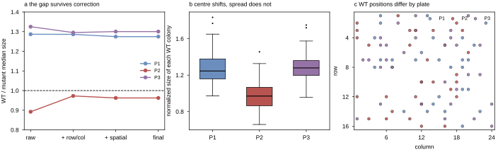

## 2026.07.27 - How do we know run-3 P2 has a wild-type reference problem?

Every number below is regenerated by a committed script reading the real result files:
`between_day_variance.py`, `p2_reference_diagnosis.py`, `verify_plate_pairing.py`,
`replication_structure.py`, `ladder_feasibility.py`.

### The observation

Fitness is scored as `median(norm | strain) / median(norm | BY4741)`, so the wild-type median
is the denominator of **every** value on a plate. Comparing the wild type against that same
plate's own mutants, in raw pixels (normalization-independent):

| plate | WT median px | mutant median px | **WT / mutant** | WT_CV |
|---|---|---|---|---|
| run2 P2 t44 | 1983 | 1584 | 1.252 | 0.111 |
| run2 P2 t50 | 233 | 199 | 1.171 | 0.083 |
| run3 P1 | 3568 | 2773 | 1.287 | 0.066 |
| **run3 P2** | **2412** | **2703** | **0.892** | 0.144 |
| run3 P3 | 3531 | 2665 | 1.325 | 0.079 |

Four plates sit at 1.17-1.33. P2 alone is below 1. (The t50 pixel counts are small because
that capture is at a different resolution; the *ratio* is scale-free, which is why the
comparison is made on a ratio.)

### Nine things it is NOT

**1. Not a plate-wide growth, imaging or exposure problem.** The mutants are the same size on
all three run-3 plates -- **2773 / 2703 / 2664 px, within 4%**. Only the wild type moves:
3568 / **2412** / 3531, so P2's WT is **32% smaller** while everything else is unchanged. Any
plate-level cause (agar batch, incubation slot, exposure, focus) would move both.

**2. Not a mis-mapped picklist.** The image-to-picklist pairing was re-derived from content
across all 3 images x 3 picklists x 4 orientations, not taken from filenames:

Blank wells landing on empty wells (max 6):

| image \ picklist | Plate1 | Plate2 | Plate3 |
|---|---|---|---|
| **P1** | **6** | 0 | 0 |
| **P2** | 0 | **6** | 1 |
| **P3** | 0 | 1 | **6** |

Kruskal-Wallis H across strain groups:

| image \ picklist | Plate1 | Plate2 | Plate3 |
|---|---|---|---|
| **P1** | **97.1** | 14.1 | 13.9 |
| **P2** | 13.7 | **146.3** | 14.7 |
| **P3** | 19.4 | 11.2 | **125.9** |

Every off-diagonal cell sits at the null (~12 for 13 groups). Total H is 369.3 for the
filename assignment against 179.6 for the next-best permutation. Critically, **P2 has the
HIGHEST H of the three plates** -- a mis-mapped plate would collapse H toward the null, not
maximize it, because every "strain" group would become a mixture of all genotypes.

**3. Not a wrong orientation.** All plates resolve to `identity` (A1 top-left), which matches
the imaging protocol (A1 top-left, agar side up) and is independently consistent with the
chamfered corners sitting at the bottom of every image.

**4. Not a dispense failure or a drained source well.** From the Echo's own transfer report:
BY4741 is drawn from source well **A1 on all three plates**, 30 transfers each, **actual
volume 5.0 nL on every one of the 1,164 transfers**, **zero short transfers**, and the WT
source well went 59.8 -> 59.3 uL, i.e. essentially undepleted. The three plates were dispensed
4-5 minutes apart (17:31:52 / 17:36:16 / 17:41:00 on 2026-07-21) from the same source.

**5. Not positional bias -- and position predicts the opposite sign.** The gap through each
normalization stage:

| plate | raw | + row/col | + spatial | final |
|---|---|---|---|---|
| P1 | 1.287 | 1.286 | 1.275 | 1.275 |
| **P2** | **0.892** | **0.973** | 0.963 | **0.963** |
| P3 | 1.325 | 1.295 | 1.300 | 1.300 |

Row/column correction recovers **+0.081**, so about a quarter of the raw gap IS positional and
the pipeline already removes it. The remaining 0.963 versus 1.275 / 1.300 is not. And the sign
runs the wrong way: edge colonies grow **larger**, and P2's wild type is the **most**
edge-weighted of the three (37% in the outer two rings, mean edge 2.60, versus 17% and 3.43 on
P1). Position predicts P2's WT should read HIGH; it reads LOW, so the non-positional deficit
is if anything *larger* than the residual.

**6. A shift, not scatter.** Positional noise widens a distribution; a bad denominator
translates it.

| plate | WT norm median | WT norm IQR |
|---|---|---|
| P1 | 1.246 | 0.219 |
| **P2** | **0.970** | 0.203 |
| P3 | 1.279 | 0.164 |

P2's centre drops ~0.28 while its spread is unchanged.

**7. Not a local agar defect or dry region.** The low half of P2's WT wells spans **10 of 16
rows** (9/16 on P1 and P3) -- the deficit is spread across the whole plate, not confined to a
patch.

**8. Not a detection artifact or a biased surviving subset.** All **30 of 30** wild-type wells
were detected and unflagged on every plate, so the WT median is computed from the full set.

**9. Not a normalization gap.** Residual positional signal after row/col + spatial correction
is `|rho| <= 0.037` against distance from the plate edge (74-96% of the raw bias removed), and
median `norm` is flat across edge rings (0.984-1.015).

### The downstream signature is internally consistent

If the denominator is depressed to roughly the median mutant, then (a) the median strain
should score ~1.0 and (b) about half the strains should exceed WT. Both hold, and only on P2:

| plate | strains above WT | median fitness |
|---|---|---|
| run3 P1 | 0 / 12 | 0.778 |
| **run3 P2** | **6 / 12** | **1.000** |
| run3 P3 | 0 / 12 | 0.771 |
| run2 P2 t44 | 0 / 12 | 0.796 |
| run2 P2 t50 | 0 / 12 | 0.861 |

A median of *exactly* 1.000 is the arithmetic fingerprint of a reference equal to the median
strain. And 6/12 above wild type is biologically impossible: across 7,738 genome-wide Costanzo
deletion strains only **2.7%** are significantly above WT (`ladder_feasibility.py`).

### Why our QC let it through

`WT_CV = 0.144` on P2 versus 0.066 and 0.079 -- clearly elevated, but under the 0.18 gate, so
the plate passed. Two sharper gates are now implemented in `between_day_variance.py`:

1. **`WT / mutant` median size ratio in raw pixels** -- 1.17-1.33 on four sound plates, 0.892
   on P2. Normalization-independent, and it names the mechanism.
2. **Fraction of deletion strains scoring above WT** -- 0/12 on four plates, 6/12 on P2,
   against a genome-wide expectation of 2.7%.

Gate 1 is the cause, gate 2 the symptom. Both should move into the main scoring path.

### Observed vs inferred vs unknown

- **Observed:** P2's wild-type colonies are ~25% smaller relative to that plate's own mutants
  than on any other plate, after full positional correction, uniformly across the plate, with
  the mutants unchanged and delivery verified identical.
- **Inferred:** something specific to the BY4741 wells on that one plate, arising *after*
  dispense -- every instrument and software explanation is excluded.
- **Unknown:** whether that was a handling event or genuine variation in that wild-type
  aliquot. One anomalous plate out of five cannot distinguish them, and the earlier
  "WT source well" guess was **withdrawn** when the Echo record contradicted it.

### Consequences

1. **P2's fitness values are unusable** -- all of them are divided by a bad denominator. Its
   *mutant colony sizes* are fine, so the plate is not worthless; only its normalization is.
2. **`sigma_plate = 0.140` is not a noise estimate.** Recomputed on the clean plates it is
   **0.028**, five times tighter. Every SE, power and design number derived from 0.140 in the
   next-round layout note is therefore built on one plate's failure and needs revisiting -- with the caveat that 0.028 rests on two plates
   (1 degree of freedom).
3. **The noise model is probably not one Gaussian** but "clean plates agree to ~0.03, and
   plates occasionally fail outright" (1 of 3 here). That changes the design goal from
   averaging noise down to **detecting failures and carrying enough plates to survive
   discarding one**.

### Figures

### Related notes

- [[experiments.019-echo-crispr-array.scripts.next_round_layout]] -- design consequences
- [[experiments.019-echo-crispr-array.scripts.ladder_feasibility]] -- the 2.7% genome-wide figure
- [[experiments.019-echo-crispr-array.next-round-sampling-design]] -- power calculations
