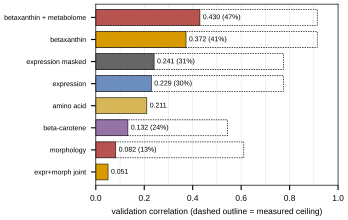
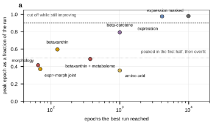

## 2026.08.26 - Retrospective across all six phenotype strands

Typeset deliverable: `notes-tex/019-simb-multimodal/main.pdf`
(`make -C notes-tex/019-simb-multimodal` to rebuild, `make check` for the gate).
This note is the working index; the PDF is the document.

### What it covers

One section per strand, all scored the same way from one leaderboard:
expression (Kemmeren + Sameith), the masked-label expression objective, morphology
(CalMorph / Ohya), the joint expression+morphology arm, betaxanthin (Cachera),
betaxanthin with a metabolome head, amino-acid pools (Mulleder), and beta-carotene
(Ozaydin).

### New measurements made for this retrospective

- **Morphology ceiling, measured for the first time: 0.611** over the 278 modeled
  CalMorph features (122 WT replicates against 4,718 mutants), with 201 of 278
  individually above 0.5. Best achieved is 0.0824, so 13.5% of ceiling.
  Script: `experiments/019-simb-multimodal/scripts/morphology_noise_ceiling.py`
  -> `results/morphology_noise_ceiling.json` + `results/morphology_feature_ceiling.csv`.
- **Morphology was only ever trained on 1,161 strains** of the 4,718 that exist,
  because every morph config sets
  `require_modalities: [expression_log2_ratio, calmorph]`. Fitness shares 4,220
  strains with morphology against expression's 1,440.
- **Amino-acid profile predicts betaxanthin at out-of-fold r = 0.298; tyrosine, the
  precursor, predicts it at 0.064** (marginal r = -0.076). About three quarters of
  the profile's power survives regressing out single-mutant fitness. See
  [[experiments.023-metabolome-betaxanthin-joint.scripts.betaxanthin_amino_acid_predictivity]].
- **The metabolome auxiliary head currently COSTS betaxanthin performance**:
  -0.0265 +- 0.0159 over the five comparable 023 grid cells, 2 of 5 positive. The
  +0.0203 that motivated the replication reproduces (+0.0192) in the one cell it
  came from.
- **Expression best is now 0.2407** (v9 run `hx8pxdic`, peak epoch 9,188 of 9,997),
  up from the 0.2044 the round retrospective recorded, and still peaking in the last
  tenth of its run. No peak has been observed at any budget.

### Artifacts

| what | where |
|---|---|
| leaderboard, all strands | `experiments/019-simb-multimodal/results/round_leaderboards.csv` |
| leaderboard summary | `results/round_leaderboards_summary.json` |
| paired bx/metabolome arms | `results/bx_aa_paired_summary.json` |
| morphology ceiling | `results/morphology_noise_ceiling.json` |
| new panels | `results/retrospective_panels.json` |
| figure option boards | `notes/assets/drawio/Fig3-options.drawio`, `Fig6-options.drawio` |

### Scripts

- [[experiments.019-simb-multimodal.scripts.pull_round_leaderboards]]
- [[experiments.019-simb-multimodal.scripts.build_retrospective_tables]]
- [[experiments.019-simb-multimodal.scripts.plot_retrospective_panels]]
- [[experiments.019-simb-multimodal.scripts.build_figure_option_boards]]
- [[experiments.019-simb-multimodal.scripts.morphology_noise_ceiling]]

### Panels

### Related

[[experiments.019-simb-multimodal.expression-round-retrospective]] ·
[[experiments.020-cachera-betaxanthin.merzbacher-comparison]] ·
[[plan.simb-2026-multimodal-cgt.2026.07.21]]

## 2026.08.27 - Revision 2, answering twelve review comments

Dispositions ledger: `notes-tex/019-simb-multimodal/review/round-1-dispositions.md`.
Comments pulled with `python notes-tex/common/zotero_comments.py 019-simb-multimodal`.

### Two claims in revision 1 were WRONG

1. **"Loss and metric point in opposite directions" was true only of the QUANTILE LOSS.**
   Measured on both long runs: val `mse` bottoms at epoch 9,175 (v9) and 3,922 (v8), i.e.
   ALONGSIDE the Pearson peaks at 9,674 and 3,921. Only `val/loss` turns early (463, 141).
   Consequence: best-by-`mse` checkpointing would have been nearly right, so checkpointing
   is a narrower problem than recorded and is not what holds the strand at 0.24.
2. **The best betaxanthin number is 0.4301, not 0.372.** 0.4301 is `betaxanthin_002` in
   `torchcell_020_betaxanthin`/`_v3` (n_train 4,235); 0.372 is `_v4` (n_train 3,698), whose
   split pins the 640 Merzbacher test genes OUT of training. The comparison uses the lower
   number on purpose.

### New this revision

- **`nmse` never returns below 1** after ~epoch 400: the model is no better than "predict
  each gene's mean" in squared error while reaching r = 0.236. Cause is calibration:
  `nmse = 1 + s^2 - 2rs`, minimized at s* = r; the run sits at s = 0.460 vs r = 0.236,
  **1.95x over-dispersed**. Post-hoc rescale by r/s: nmse 1.010 -> 0.944, no correlation
  changes. See [[experiments.019-simb-multimodal.scripts.expression_objective_diagnosis]].
- **Cost: the best expression run was 91.4 h = 3.81 DAYS** (9,999 epochs, 32.9 s/epoch).
  ~2,500 epochs/GPU-day. This sets the campaign arithmetic.
- **Masked unmasking cannot supply the pair term**: at k=0 the revealed set is empty, every
  encoded feature is exactly zero, and the forward pass is identical to the unconditioned
  model. Scoring happens at k=0. Different axis from the pair term.
- **010 uses BOTH Kuzmin papers**: 91,111 + 301,798 = **392,909** records, not 91,111.
- **Full project census**: `project_census.py` -> `results/project_census.json`.
  **28 projects, 2,187 runs.** Morphology is the only strand whose n_train never varies,
  and it never varies from 1,161 across all 397 morphology-bearing runs.
- **Coverage is now stated in the document**: per-run history covers 13 of 28 projects;
  `pull_round_leaderboards.py` is cached-per-project and resumable, rest queued.
- **New section: the expression + morphology campaign**, sized in GPU-days
  (E = 4,000 epochs justified by an arm observed to peak at 3,921; two seeds justified by a
  measured across-init sd of ~0.006).

### Still queued

`pull_round_leaderboards.py` on the 15 remaining projects. It is resumable; delete
`results/_leaderboard_cache/<project>.json` to refresh one.

## 2026.08.27 - Leaderboard pull completed to 27 of 28 projects

`pull_round_leaderboards.py` now covers **27 of 28 projects, 1,691 runs** (was 8 / 396).
Only `torchcell_019-simb-multimodal_cgt_multitask` (496 runs) is outstanding; it is the
original sniff sweep of 100-epoch small models whose best was ~0.044 under mean-collapse,
so it cannot move a maximum.

**No strand maximum moved except betaxanthin, which moved UP as expected**: 0.372 -> 0.401
(44% of ceiling) once `torchcell_020_betaxanthin` (n_train 4,235) was read. Everything else
held: expression 0.229 / masked 0.241, morphology 0.082, joint 0.059, amino acid 0.211,
beta-carotene 0.132.

### The new finding: expression score is a function of the EPOCH BUDGET

All nine expression rounds, read the same way and sorted by score, come out in almost
exactly the order of their epoch budgets:

| project | runs | best | epochs of that run |
|---|--:|--:|--:|
| expr_v9 | 16 | 0.2407 | 9,997 |
| expr_v8 | 163 | 0.2293 | 4,105 |
| expr_v7 | 295 | 0.1631 | 152 |
| expr_v6 | 158 | 0.1628 | 124 |
| expr_v2 | 120 | 0.0996 | 25 |
| expr_v3 | 60 | 0.0874 | 20 |
| expr | 26 | 0.0822 | 19 |
| expr_v5 | 35 | 0.0719 | 27 |

Those rounds varied capacity, target normalization, which compendium was included, graph
regularization, decoder family, distributional head and objective. **None of that orders the
column; the epoch budget does**, across a factor of 526 in budget and 3.35 in score. v7 and
v6, at 152 and 124 epochs, land within 0.0003 of each other. n_train moved only 10% over the
same span and does not order it.

Caveat kept in the document: `roll_max` is upward-biased with epochs run, so the scoring
rule contributes a sliver of the ordering (a few thousandths against a 0.07-0.24 spread).

**This is the strongest evidence that the binding constraint on expression has been compute,
not mechanism**, and it is what the campaign's E = 4,000 epoch budget is set against.

### Morphology confirmed across all 8 projects

Best = 0.0824 (`morph_v5`); every other morphology project is lower (0.031 to 0.063), and
every one peaked at epoch 6-27 of a run that stopped by 70.

### Tooling

Three defects found and fixed while doing this: a history request for a key a run never
logged triggers a full unsampled scan (skip via `run.summary`); `wandb.Api(timeout=)` does
not cover history pagination (added a SIGALRM hard timeout); and per-project caching plus
smallest-first ordering makes an interrupted pull resume instead of restarting. Coverage and
the two sampling resolutions (2,000 vs 500 points) are stated in the document.

## 2026.08.27 - mse/nmse added to the leaderboard, and the calibration split across strands

`pull_round_leaderboards.py` now records, per run, each error metric's minimum AND its value
at the epoch the correlation peaked (`nmse_at_primary_peak`). The second is the load-bearing
one: a minimum reached at epoch 200 says nothing about the model anyone would actually ship.

### The finding: two strands beat the mean, two do not, and it tracks the correlation

`nmse = 1` is exactly "predict each feature's training mean".

| strand | runs | nmse > 1 | best r | nmse at peak | 1 - r^2 |
|---|--:|--:|--:|--:|--:|
| betaxanthin + metabolome | 13 | 5 | 0.4275 | **0.8094** | 0.8172 |
| betaxanthin | 13 | 5 | 0.3724 | **0.9316** | 0.8613 |
| amino acid | 12 | 6 | 0.2106 | **0.9607** | 0.9556 |
| expression (masked) | 8 | **8** | 0.2407 | **1.0111** | 0.9420 |
| beta-carotene | 12 | **12** | 0.1325 | **1.2881** | 0.9824 |

**This corrects an over-general reading.** The earlier note framed "never beats the mean in
squared error" as an expression finding. It is expression AND beta-carotene; betaxanthin and
amino acid are below 1. The split tracks the achievable correlation, not the phenotype: the
lower r is, the further predictions drift above the spread that r justifies. Beta-carotene,
whose target is a hand-scored ordinal with a 0.544 ceiling, is worst at 1.288 in all 12 runs.

`1 - r^2` is where nmse lands after the free post-hoc rescale by r/s. A strand already BELOW
it (betaxanthin + metabolome, 0.8094 vs 0.8172) is not a contradiction: its predictions carry
structure beyond a single global scaling, so the rescale would not help there.

**Operational consequence:** every strand above 1 can be taken below it by post-processing,
with no retraining and no change to any correlation.

### Pull tooling

Three more fixes: `list_runs()` bounds the run-listing pass with a timeout and shrinking page
size (the 496-run project wedged there, which the history timeout did not cover);
`CACHE_SCHEMA` invalidates caches when a row gains fields; and `load_board` now merges
duplicate run ids PER COLUMN via groupby-first instead of dropping whole rows, so the CSV's
finer roll_max and the cache's newer mse/nmse both survive. That last one was silently
discarding every error metric for runs present in both sources.

## 2026.08.27 - Pull COMPLETE: 28 of 28 projects, 2,187 runs

`cgt_multitask` (496 runs) is in. Coverage table now reads "All projects are now read".

**A crash was hiding at the finish line.** All 28 projects had been fetched and cached, but
`summarize()` then died with `KeyError: nan`: `idxmax()` on an all-NaN `primary_roll_max`
returns NaN and `.loc[nan]` raises. `cgt_multitask` is exactly that case, since none of its
candidate runs log the metric under the alias the project uses, so nothing in it has history.
Guarded by dropping NaNs before `idxmax` and skipping empty groups. The cache meant the fix
cost one replay rather than another pass.

### Numbers shifted slightly, and the reason is now uniform rather than mixed

The CSV was rewritten by the schema-2 pass, so every project is read the SAME way (500
history points, candidate set 8-by-last + 5-by-length). Previously the CSV held 8 projects at
2,000 points and the cache the rest at 500. Uniform is better, and the small moves are all in
the documented direction (coarser sampling can only LOWER a roll_max):

| strand | was | now |
|---|--:|--:|
| expression (masked) | 0.2407 | **0.2382** |
| expression | 0.229 | 0.228 |
| betaxanthin + metabolome | 0.430 | 0.428 |
| amino acid | 0.211 | 0.209 |
| beta-carotene | 0.132 | **0.118** |
| expr+morph joint | 0.059 | 0.062 |
| morphology | 0.082 | 0.082 |
| betaxanthin | 0.401 | 0.401 |

All prose updated to match. Three values now exist for run `hx8pxdic` and the document says
why: 0.2382 (leaderboard, 500 points, the SCORE), 0.2362 (objective diagnosis, 4,000 points
with heavier smoothing, a LOCATOR), 0.2407 (the old mixed-resolution pass, retired).

### Calibration, final

| strand | runs | nmse>1 | best r | nmse@peak | 1-r^2 |
|---|--:|--:|--:|--:|--:|
| betaxanthin + metabolome | 13 | 5 | 0.4275 | **0.8094** | 0.8172 |
| betaxanthin | 13 | 5 | 0.3705 | **0.9316** | 0.8627 |
| amino acid | 12 | 6 | 0.2085 | **0.9607** | 0.9565 |
| expression | 9 | 8 | 0.2276 | **1.0348** | 0.9482 |
| expression (masked) | 8 | 8 | 0.2382 | **1.0111** | 0.9432 |
| beta-carotene | 12 | 12 | 0.1184 | **1.2881** | 0.9860 |

Six strands. Both expression rounds and beta-carotene lose to the mean; betaxanthin and
amino acid beat it. The split tracks r, not the phenotype.

## 2026.08.27 - Graph-prior probe BUILT and run: the prior is at chance

Tier-0 item 1 is done. See
[[experiments.019-simb-multimodal.scripts.graph_prior_probe]] for the full table.

**Graph proximity does not predict which reporters respond to a deletion**, on any of the
nine graphs, in the orientation the model uses. AUC 0.4961-0.5057 against degree-preserving
controls; largest excess **+0.0046**. Longer walks make it worse. Three graphs are silent on
most deletions (29-75% of deleted genes have any edge).

**But direction carries real signal, and the mask deletes it.** tflink TF→target = **0.5508**
(control 0.5017); regulatory_interaction = **0.5239** (control 0.5009).
`_build_attention_mask` sets both `head_mask[i,j]` and `head_mask[j,i]`, so symmetrizing
averages the informative direction with the uninformative one back to chance.

**Campaign consequences (§9 updated):** `P_graph` is DROPPED - it would have built a
network-distance pair term on a network that does not carry the relationship. Phase B goes
from four arms to three, plus a new free-the-heads arm `P_free`. The evidence-backed repair
is to stop symmetrizing the two directed relations, which is a mask-builder change.
