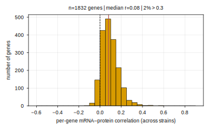
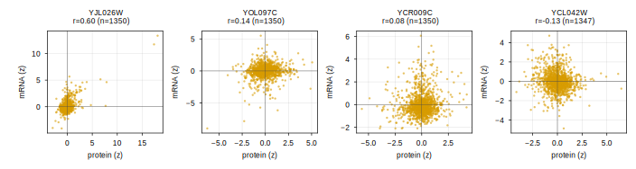

Proteome <-> expression EDA for the SIMB-2026 Fig-3 proteome strand. Before
spending GPU on joint proteome + expression training, quantify whether the
Messner YKO **proteome** carries signal ORTHOGONAL to the Kemmeren YKO
**expression**, and how well one maps linearly to the other.

Related:

- Script: [[experiments.019-simb-multimodal.scripts.proteome_expression_eda]]
- Fig-3 expression experiments: [[experiments.019-simb-multimodal.fig3-expression-experiments]]
- Roadmap: `plan.simb-2026-multimodal-cgt.2026.07.21` (memory `simb2026-multimodal-cgt-plan`)
- Loaders: `torchcell/datasets/scerevisiae/messner2023.py`,
  `torchcell/datasets/scerevisiae/kemmeren2014.py`

## 2026.07.22 - Proteome carries little linear overlap with expression (media-confounded)

### Setup

Both datasets are **single-gene-deletion** collections on the same S288C
background, so a strain is identified by its one perturbed systematic gene and
the two modalities align strain-by-strain and gene-by-gene.

- **Proteome** `ProteomeMessner2023Dataset` -- `protein_abundance` =
  {systematic_gene: abundance}; media **SM** (synthetic minimal), 30 C. The
  loader maps UniProt -> systematic ORF, so protein ids are already systematic
  gene names (no extra mapping).
- **Expression** `MicroarrayKemmeren2014Dataset` -- `expression_log2_ratio` =
  {systematic_gene: log2(deletion/WT)}; media **SC** (synthetic complete), 30 C.

Pulled from the served DB (read-only,
`neo4j+s://torchcell-database.ncsa.illinois.edu:7687`, db `torchcell`); the
per-strain vector is a JSON string on the phenotype node, KO gene is
`Genotype.systematic_gene_names` (a plain string for single-KO). Proteome is
absolute abundance, expression is a log2-ratio, so each gene is **z-scored
across strains** before correlating; the linear map standardizes per gene on the
TRAIN split only.

### Overlap

| quantity | value |
|---|---|
| proteome unique KO strains | 4549 |
| expression unique KO strains | 1484 |
| **shared KO strains** | **1350** |
| proteome measured genes (union) | 1850 |
| expression measured genes (union) | 6169 |
| **shared measured genes** (protein ∩ expression) | **1832** |
| dense genes for linear map (≥90% strain coverage) | 1630 |

Kemmeren KO strains are ~a subset of Messner (1350 / 1484 = 91% shared);
essentially every Messner protein (1832 / 1850) maps to a Kemmeren-measured gene.
Expression is dense across shared strains; proteome has mild missingness (785
genes measured in ALL 1350 strains, 1630 at ≥90%).

### Per-gene mRNA↔protein correlation (across strains)

For each of 1832 shared genes, correlate its z-scored expression vector vs its
z-scored protein vector over the shared strains (≥30 strains measured in both).

- **median r = 0.08**, IQR **[0.037, 0.139]**, mean 0.09
- **only 1.7% of genes have r > 0.3**; 8.9% are negative; max 0.60, min -0.13

The distribution is a narrow lump barely off zero (see histogram). The few
high-r genes are dominated by the strain in which that gene is itself deleted
(self-KO drives both its mRNA and protein toward zero, e.g. YJL026W r=0.60).

Representative genes (best / upper-quartile / median / worst):

### Per-strain correlation (across genes)

For each shared strain, correlate its z-scored protein vs mRNA profile across
the shared genes.

- **median r = 0.04**, IQR **[-0.02, 0.12]**; **33% of strains negative**; range
  -0.44 to 0.63

Within a strain, the genome-wide protein deviation pattern barely tracks the mRNA
deviation pattern.

### Linear map (held-out R²)

Ridge (RidgeCV, chosen α=1e4), 80/20 strain split (1080 train / 270 test), 1630
dense genes both as features and targets, per-gene standardized on train. Baseline
= predict the per-gene train mean (= 0 after standardization).

| map | held-out R² (uniform avg) | var-weighted | baseline |
|---|---|---|---|
| proteome → expression | **0.035** | 0.035 | -0.004 |
| expression → proteome | **0.024** | 0.027 | -0.004 |

A regularized linear map recovers only ~2-3.5% of held-out variance in either
direction. It beats the trivial baseline (so the overlap is real, not zero) but
the overwhelming majority of each modality's variance is **not** linearly
predictable from the other.

### Media confound (SM proteome vs SC expression)

The two modalities were measured in **different nutrient conditions** -- proteome
in synthetic minimal (SM), expression in synthetic complete (SC). A deletion can
perturb protein and mRNA of the same gene through partly condition-specific
routes (amino-acid biosynthesis, nutrient signaling, translation load all differ
between SM and SC). This is a real confound that **attenuates** every number
above: some of the observed decoupling is the media difference, not intrinsic
mRNA↔protein independence. This EDA therefore **cannot certify** the orthogonal
variance as clean biological signal; it caps how strong a "proteome helps
expression" claim can be until a same-media proteome+expression pair exists to
deconfound.

### Verdict: complementary / orthogonal, but media-confounded -- NOT redundant, NOT certified

- **Not redundant.** You cannot reconstruct one modality from the other: linear
  R² ~0.02-0.035. Proteome adds axes expression does not carry.
- **Not cleanly complementary-certified.** median per-gene r = 0.08 and 33% of
  per-strain correlations negative is exactly the low-agreement regime the SM/SC
  media confound predicts, so the orthogonal variance is a mix of genuine
  post-transcriptional biology AND condition-driven / measurement noise that this
  data cannot separate.

**Recommendation for GPU joint training:** proteome is non-redundant, so joint
modeling is *plausibly* worthwhile -- but the payoff is bounded and the media
confound is the dominant caveat. Prefer a **bounded** joint-training probe (does
adding the proteome head measurably move held-out expression on the 1350 shared
strains?) over an open-ended investment; the strongest justification would come
from a same-media proteome+expression anchor, which does not exist in the current
DB. Verdict for the plan: **orthogonal/complementary (worth a bounded joint
experiment), media-confounded -- not redundant, not a slam-dunk.**

### Artifacts

- Script: `experiments/019-simb-multimodal/scripts/proteome_expression_eda.py`
- Results JSON: `experiments/019-simb-multimodal/results/proteome_expression_eda.json`
- Figures: `notes/assets/images/019-simb-multimodal/proteome_expression_*`
  (per-gene correlation histogram, representative-gene scatters, linear-map R²
  summary; png + true-size svg each)
