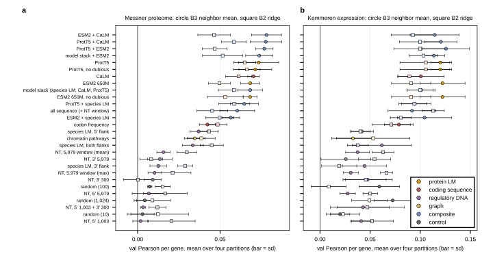

## 2026.09.16 - Every gene representation as the baseline's perturbation input

Script: `experiments/019-simb-multimodal/scripts/baselines_embedding_study.py`. Reads the full embedding study written by `expression_baselines_split.py --embedding-set full` (GilaHyper jobs 2264 proteome, 2268 expression; four split partitions each) and writes the document table `notes-tex/019-simb-multimodal-expression/tables/baselines_embedding_study.tex`, a summary JSON, and the figure below. Twenty-eight representations: protein language models (ProtT5, ESM2 650M, each with and without dubious ORFs), coding sequence (CaLM, codon frequency), regulatory DNA (the species-aware fungal transformer over the 5' and 3' flanks; the Nucleotide Transformer over six windows), the chromatin-pathway graph vector, random controls at widths 10, 100 and 1,024, and eight composites including the four-embedding stack the trained model consumes.

Findings are written in the expression document, section on the linear and neighbor baselines ([[experiments.019-simb-multimodal.expression-strand-retrospective]]).

Findings (four partitions each; B3 neighbor mean on validation unless stated). Proteome: ESM2+CaLM and ProtT5+CaLM 0.078, ProtT5+ESM2 0.077, ProtT5 0.073, CaLM 0.070, ESM2 0.068; codon frequency 0.042, species LM both flanks 0.033, chromatin pathways 0.035, every Nucleotide Transformer window 0.002 to 0.016 against random controls 0.003 to 0.007. Expression: ProtT5 0.120 val / 0.118 test, ESM2 0.122 / 0.093, ProtT5+ESM2 0.126 / 0.107, CaLM 0.101 / 0.100; regulatory DNA 0.03 to 0.06 val and 0.01 to 0.05 test, random_1024 0.073 val / 0.018 test (the selection optimism of the neighbor rule). No protein language model beats ProtT5; composites sit within 0.005 of their best member; the four-embedding model stack is not a better perturbation representation than ProtT5 alone; DNA models are at the random floor on both panels.
