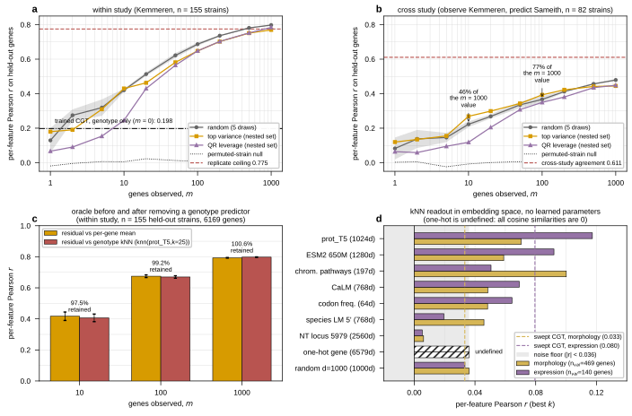

## 2026.08.30 - How Few Genes the Conditioning Oracle Needs, and Whether Choosing Them Helps

Scripts: `experiments/019-simb-multimodal/scripts/conditioning_gene_budget.py` (measurement),
`experiments/019-simb-multimodal/scripts/plot_imputation_oracle_and_knn.py` (figure)
Results: `experiments/019-simb-multimodal/results/conditioning_gene_budget.json`
Figure: `notes/assets/images/019-simb-multimodal/imputation_oracle_and_knn_probe.svg`

### Why this exists

The published oracle runs evaluated only m = 10 / 100 / 1000 observed genes, all drawn
uniformly at random, and the headline was taken at m = 1000. Measuring a thousand
transcripts is an expensive capability, so two things had to be measured before the
imputation framing could be defended: the shape of the curve below m = 100, and whether a
CHOSEN observed set beats a random one at the same m.

### Method

Estimator, split protocol and metric are unchanged from `masked_conditioning_oracle.py` and
`cross_study_conditioning_oracle.py` (conditional mean of a ridge-regularized Gaussian
residual model, ridge tuned on an inner train split, `per_feature_pearson` on the held-out
genes). What is new is the m grid (1, 2, 5, 10, 20, 50, 100, 200, 500, 1000), the two
non-random selection rules, and a single split that carries a within-study validation set
and the 82 cross-study strains at once.

Split, from the raw Kemmeren LMDB (1,484 strains) and the Sameith single-mutant LMDB (82
strains), 6,169 complete-case reporter genes: 1,092 train (mu and Sigma) / 155 tune (ridge)
/ 155 within-study val / 82 shared deletions for the cross-study arms.

Selection rules, all computed from TRAIN residuals only:

- `random`, m genes uniformly without replacement, 5 draws. The published rule.
- `variance`, the m genes with the largest across-strain train-residual variance. Nested.
- `qr_leverage`, column-pivoted QR on the top 1,000 right singular vectors of the train
  residual, i.e. column-subset selection for spanning the dominant residual subspace.
  Nested.

Selection by ease of measurement was NOT run: no measurement-cost annotation exists in the
repo, so any such ranking would be invented rather than sourced. Greedy forward selection
scored on the tune split was also not run (O(F) solves per added gene).

### The cheap end is most of the result

Random observed sets, as a fraction of the same rule's m = 1000 score:

| m | within study (n = 155) | % of m = 1000 | cross study Kem -> Sam (n = 82) | % of m = 1000 |
| --- | --- | --- | --- | --- |
| 1 | 0.1293 | 16% | 0.0825 | 17% |
| 2 | 0.2747 | 34% | 0.1377 | 29% |
| 5 | 0.3191 | 40% | 0.1460 | 30% |
| 10 | 0.4201 | 53% | 0.2229 | 46% |
| 20 | 0.5135 | 64% | 0.2684 | 56% |
| 50 | 0.6221 | 78% | 0.3353 | 70% |
| 100 | 0.6869 | 86% | 0.3668 | 77% |
| 200 | 0.7360 | 92% | 0.4124 | 86% |
| 500 | 0.7812 | 98% | 0.4567 | 95% |
| 1000 | 0.7977 | 100% | 0.4793 | 100% |

The random arm reproduces the two published runs on a different split (published within
study 0.4084 / 0.6756 / 0.7932 at m = 10 / 100 / 1000, here 0.4201 / 0.6869 / 0.7977;
published cross study 0.2335 / 0.3815 / 0.4838, here 0.2229 / 0.3668 / 0.4793).

### A chosen set helps at the cheap end, cross study only

Top-variance minus random on the cross-study arm, in units of the random mean's standard
error over 5 draws: m = 10 +0.0461 (6.3 SE), m = 20 +0.0306 (5.6 SE), m = 100 +0.0264
(3.1 SE), m = 200 +0.0101 (6.0 SE); it LOSES at m = 500 (-0.0148) and m = 1000 (-0.0345).
On the within-study arm top variance loses nearly everywhere. QR leverage is below random
almost everywhere and is much worse below m = 20.

Measured alongside it: the fraction of the within-study score that survives the study swap
is much higher for a variance-chosen set than for a random one, 0.76 vs 0.49 at m = 10 and
0.68 vs 0.56 at m = 100. Hypothesis (untested): high-variance genes carry a larger share of
biological amplitude relative to per-array technical amplitude, so choosing them shifts the
mix toward what transfers. Nothing here measures that mechanism.

Caveat on the comparison: `variance` and `qr_leverage` are deterministic, so each is ONE
set and has no across-set spread. The standard errors above are the random arm's only, and
the difference is not a paired test.

### Cross study is the number to quote

Every within-study value conditions on genes read off the same array as the target, and
the within-study curve crosses the 0.775 replicate ceiling. The cross-study arm cannot do
that: its own ceiling is the two studies' agreement on the identical held-out genes,
0.611. At m = 100 the cross-study oracle reaches 0.3668, which is 60% of that ceiling.
