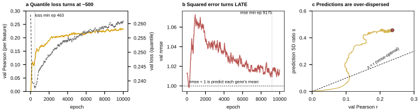

## 2026.08.27 - The expression objective is fighting itself, and it is not MSE

Script: `experiments/019-simb-multimodal/scripts/expression_objective_diagnosis.py`
Results: `experiments/019-simb-multimodal/results/expression_objective_diagnosis.json`
plus per-run curve CSVs.

### Correction to the earlier claim

The round retrospective said loss and metric "point in opposite directions" on expression.
That is true of the QUANTILE LOSS and false of squared error. Measured on the two longest
runs:

| quantity | v9 `hx8pxdic` (masked) | v8 `b50f93ju` (pair rank 64) |
|---|---|---|
| val `loss` min (quantile) | 0.2376 @ **463** | 0.2610 @ **141** |
| val `mse` min | 0.0391 @ **9,175** | 0.0397 @ **3,922** |
| val Pearson max | 0.2362 @ **9,674** | 0.2274 @ **3,921** |
| val `nmse` min | 0.9981 @ 213 | 0.9925 @ 145 |
| val `nmse` at the Pearson peak | 1.0100 | 1.0395 |
| run length | 9,999 epochs | 4,106 epochs |
| wall clock | **91.4 h = 3.81 days** | 47.9 h = 2.00 days |
| s/epoch | 32.9 | 42.0 |

So MSE and Pearson improve TOGETHER, late. Only the quantile loss turns early. Consequence:
best-by-`mse` checkpointing would have picked within 500 epochs (v9) or 1 epoch (v8) of the
right model, so the checkpoint problem is narrower than recorded and is not what holds the
strand at 0.24.

### The sharper finding: `nmse` never gets below 1

`nmse = 1` is exactly "predict each gene's training mean". The model dips barely under 1 at
epoch ~213 and is back above from ~epoch 400 on, reading 1.010 (v9) and 1.040 (v8) at the
Pearson peaks. It reaches r = 0.236 while being no better than the mean in squared error.

That is arithmetic. With s = `pred_sd_ratio` and r the correlation,

    nmse = 1 + s^2 - 2 r s,  minimized at s* = r, value 1 - r^2.

The identity reproduces the logged `nmse` to within 0.016 on both runs. At its peak v9 sits
at s = 0.460 against r = 0.236, so predictions are **1.95x** more spread out than the
correlation justifies (v8: 2.21x).

**Free consequence:** multiplying predictions by r/s changes NO correlation and moves `nmse`
from 1.010 to 1 - r^2 = 0.944 (v9), 1.040 to 0.949 (v8). Worth applying to the existing best
checkpoint before the figure is drawn.

Context: [[experiments.019-simb-multimodal.phenotype-strand-retrospective]] ·
[[experiments.019-simb-multimodal.expression-round-retrospective]]
